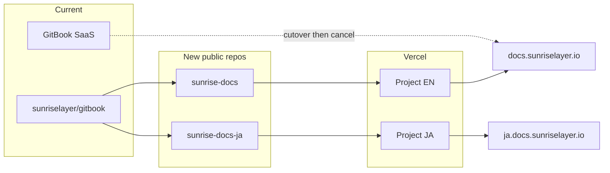

# GitBook から Astro Starlight への移行

## 決定事項

- 公開リポジトリ 2 つ: [sunriselayer/sunrise-docs](https://github.com/sunriselayer)（英語）と [sunriselayer/sunrise-docs-ja](https://github.com/sunriselayer)（日本語）
- ローカル作業ディレクトリは `sunrise-zone` 配下（GitHub org は `sunriselayer`）
- ホスティング: Vercel（[d6e-docs](https://github.com/d6e-ai/d6e-docs) と同じ。静的出力。ロケール用 Edge middleware は使わない）
- ドメインは現状維持: [docs.sunriselayer.io](https://docs.sunriselayer.io/) と [ja.docs.sunriselayer.io](https://ja.docs.sunriselayer.io/)
- 移行対象は SUMMARY.md / ja/SUMMARY.md に載っている公開ページのみ（言語あたり約 54 ページ）。`deprecated-ununifi/`、`gluon-node/`、`build/quick-start.md`、`learn/sunrise/deprecated/`、SUMMARY に無い重複ファイルは対象外
- DNS 付け替えと GitBook 解約はユーザー作業（Squarespace）。こちらは Vercel の CNAME 値を渡す
- トラッキング Issue は現行正本 [sunriselayer/gitbook](https://github.com/sunriselayer/gitbook) に作成し、実装 PR から `Closes sunriselayer/gitbook#N` で閉じる
- `main` には README のみを置き、本体は PR で出す（Bugbot / Fixooly 用）

## アーキテクチャ

d6e-docs から踏襲するもの: Astro 7 + Starlight 0.41、`astro-mermaid`、`starlight-llms-txt`、`vercel.json`、Starlight `editLink`、Node 22。

d6e-docs から外すもの: `/en-US/` `/ja-JP/` の i18n、`middleware.ts`、`@vercel/edge`、splash 型ホームページ。Sunrise はドメインが言語ごとに分かれているため、パスは現行どおり `/learn/sunrise` のままにする。

## サイト構成（各リポジトリ）

英語例。日本語も `site` / `title` / `lang` 以外は同じ。

- `astro.config.mjs`: Starlight、`site: 'https://docs.sunriselayer.io'`、`trailingSlash: 'never'`（GitBook のパスに合わせる）
- サイドバー: SUMMARY.md の階層をそのまま（Home / Learn / Build / Run a Sunrise Node / 外部 Links）
- `src/content/docs/**/*.md`: GitBook の `README.md` は Starlight の `index.md` に変換し、URL を `/learn/sunrise` のように保つ
- `src/styles/custom.css`: アクセントはブランドキットの青 `#6495ed` と金 `#edbc64`
- ロゴ: [sunriselayer/brand-kit](https://github.com/sunriselayer/brand-kit)
- 言語切替: 同一パスを他方ドメインへリンクする

数式は `remark-math` + `rehype-katex`。Mermaid は `astro-mermaid` を Starlight より前に登録する。

## コンテンツ変換

SUMMARY.md をソース・オブ・トゥルースにする。

- `` を Starlight aside（`:::note` / `:::caution` / `:::tip`）へ
- GitBook frontmatter の `cover` / `coverY` は捨て、先頭 H1 を Starlight の `title` にする
- 内部リンクの `.md` を外し、サイトルートからのパスにする
- 画像は brand-kit と公開 GitBook から取得して `public/images/` に置く
- 本文のリライトはしない

## URL 互換

- `/:path*.md` を `/:path` へ 308
- `/home` と `/home/readme` を `/` へ 308
- 末尾スラッシュ付きを無しへ（`trailingSlash: 'never'`）

## 実装手順（README first）

1. 各リポジトリの `main` には README だけを置く
2. 本体は feature branch の PR で出す
3. Bugbot 修正コミットは作らず、Fixooly が直すまで待つ

ローカル作業ディレクトリ:

- `/Volumes/Samsung980_1TB/github.com/sunrise-zone/sunrise-docs`
- `/Volumes/Samsung980_1TB/github.com/sunrise-zone/sunrise-docs-ja`

## デプロイとカットオーバー

1. 英語 PR → 日本語 PR
2. Vercel プロジェクト 2 つを GitHub 連携し、プレビュー URL で確認
3. Squarespace で CNAME を Vercel 指定値へ変更
4. GitBook のカスタムドメイン切断と課金停止
5. `sunriselayer/gitbook` の README を新リポジトリへ誘導
