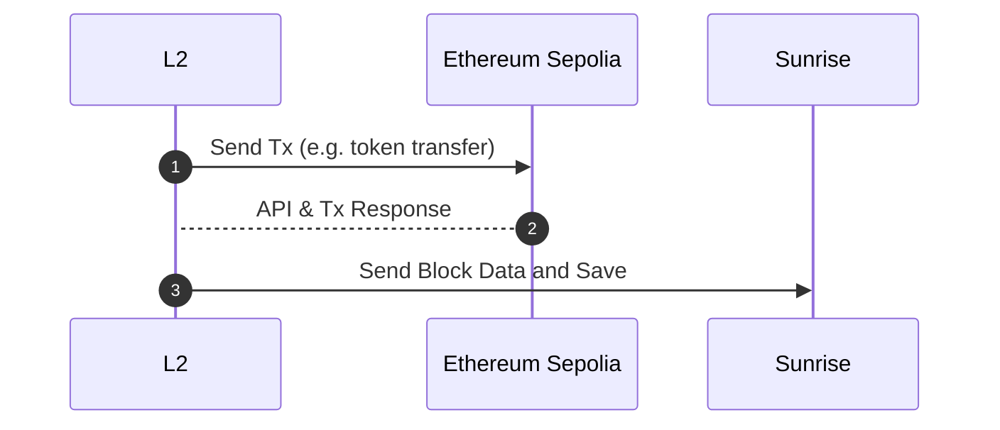

# OP-Stack + Sunrise OP DA Server

Sunrise's Data Availability Layer supports Layer 2 blockchains created using [OP Stack](https://github.com/ethereum-optimism/optimism)
This is a guide to connecting an L2 chain created using OP Stack to Sunrise chain with [Sunrise OP DA Server](https://docs.sunriselayer.io/build-l2-blockchains/op-stack/op-da-server). Data Availability layer is supported in Sunrise v0.3.0 and later.

## How to set up OP Stack

As an example, here is how to use OP Stack to create an L2 chain for the Ethereum Sepolia testnet and run it on the Sunrise's Data Availability Layer.



### Dependencies

Dependencies and general installation instructions for Ubuntu 22.04.

- node

  ```bash
    curl -fsSL https://deb.nodesource.com/setup_20.x | sudo -E bash - && sudo apt-get install -y nodejs
  ```

- [pnpm](https://pnpm.io/ja/installation)

  ```bash
    curl -fsSL https://get.pnpm.io/install.sh | sh -
  ```

- [foundry](https://book.getfoundry.sh/getting-started/installation)

  ```bash
    curl -L https://foundry.paradigm.xyz | bash
  ```

- just

  ```bash
    wget -qO - 'https://proget.makedeb.org/debian-feeds/prebuilt-mpr.pub' | gpg --dearmor | sudo tee /usr/share/keyrings/prebuilt-mpr-archive-keyring.gpg 1> /dev/null
    echo "deb [arch=all,$(dpkg --print-architecture) signed-by=/usr/share/keyrings/prebuilt-mpr-archive-keyring.gpg] https://proget.makedeb.org prebuilt-mpr $(lsb_release -cs)" | sudo tee /etc/apt/sources.list.d/prebuilt-mpr.list
    sudo apt update
    sudo apt install just
  ```

### Set up Optimism Rollup Testnet

### Optimism

1. **Clone the optimism repo**

   ```bash
   git clone https://github.com/ethereum-optimism/optimism.git
   ```

1. **Check out the correct branch**

   ```bash
   cd optimism
   git checkout v1.9.1
   ```

1. **Run the following to check you have all dependencies**

   ```bash
   ./packages/contracts-bedrock/scripts/getting-started/versions.sh
   ```

1. **Build all packages associated with Optimism**

   ```bash
   make op-node op-batcher op-proposer
   ```

   If you are having issues with this step, make sure your versions match those in the optimism docs. Specifically, you may have to downgrade your go version to 1.21

1. **Clone and build op-geth**

   ```bash
   cd ~
   git clone https://github.com/ethereum-optimism/op-geth.git
   cd op-geth
   make geth
   ```

1. **Fill out environment variables**

   ```bash
   cd ~/optimism
   cp .envrc.example .envrc
   ```

   Run the script to generate addresses with the following command in the optimism repo:
   `./packages/contracts-bedrock/scripts/getting-started/wallets.sh`

   The output will look like the following which will you need to paste into the environment file as well:

   ```bash
   ##################################################
   #                 Getting Started                #
   ##################################################

   # Admin account
   export GS_ADMIN_ADDRESS=0x82eeB61600f290ce3F9400d345aAEcBe5faF7AEB
   export GS_ADMIN_PRIVATE_KEY=0x7c726817d047ee62cbb060312fe2620ba5462495e34f7e8279ba22faa96bca20

   # Batcher account
   export GS_BATCHER_ADDRESS=0x7BECbC4C747922d92e4F917951D9D8c3Ada7eb60
   export GS_BATCHER_PRIVATE_KEY=0xc7dfaa7b8449f00480196377da50d29318b2397fd0296d0ab4f11d48ee3cf723

   # Proposer account
   export GS_PROPOSER_ADDRESS=0x773F4527fECc889d6DD3Cd7d044F4AC1Ad765a31
   export GS_PROPOSER_PRIVATE_KEY=0xed6029a5928e83c5d2a28d9574304bae9a825e19f7f18a50d34edc13b505afed

   # Sequencer account
   export GS_SEQUENCER_ADDRESS=0x2B43c41FCbabc5437A6E1B97F47cA085a4B16f61
   export GS_SEQUENCER_PRIVATE_KEY=0x0a7d4ce467fe4d00b8930215c98335e06c16db34cd501c8c3f3173015487662e

   ##################################################
   #                Chain Information               #
   ##################################################

   # L1 chain information
   export L1_CHAIN_ID=11155111
   export L1_BLOCK_TIME=12

   # L2 chain information
   export L2_CHAIN_ID=42069
   export L2_BLOCK_TIME=2

   ##################################################
   #              op-node Configuration             #
   ##################################################

   # The kind of RPC provider, used to inform optimal transactions receipts
   # fetching. Valid options: alchemy, quicknode, infura, parity, nethermind,
   # debug_geth, erigon, basic, any.
   export L1_RPC_KIND=infura

   ##################################################
   #               Contract Deployment              #
   ##################################################

   # RPC URL for the L1 network to interact with
   export L1_RPC_URL=https://sepolia.infura.io/v3/xxxxxxxxxxxxxxxxxxxxxxxxxxxxxxxxxxxxx
   ```

   API key for RPC URL can be found in [Infura](https://www.infura.io/) or other providers.

1. **Fund the addresses with enough Sepolia ETH, the optimism docs recommend the following:**

   - Admin — 0.5 Sepolia ETH
   - Proposer — 0.2 Sepolia ETH
   - Batcher — 0.1 Sepolia ETH

   Ref: [Sepolia PoW Faucet](https://sepolia-faucet.pk910.de/)

1. **Load environment variables with direnv**
   `direnv allow`
   You should see something similar to this after:

   ```bash
       direnv: loading ~/optimism/.envrc                                                            direnv: export +DEPLOYMENT_CONTEXT +ETHERSCAN_API_KEY +GS_ADMIN_ADDRESS +GS_ADMIN_PRIVATE_KEY +GS_BATCHER_ADDRESS +GS_BATCHER_PRIVATE_KEY +GS_PROPOSER_ADDRESS +GS_PROPOSER_PRIVATE_KEY +GS_SEQUENCER_ADDRESS +GS_SEQUENCER_PRIVATE_KEY +IMPL_SALT +L1_RPC_KIND +L1_RPC_URL +PRIVATE_KEY +TENDERLY_PROJECT +TENDERLY_USERNAME
   ```

   If you do not see any output, try

   `nano ~/.zshrc`

   `nano ~/.bashrc`

   Add the following line depending on whether you use bash or zsh

   ```bash
   eval "$(direnv hook zsh)"
   ```

   ```bash
   eval "$(direnv hook bash)"
   ```

   Save the changes with

   `source ~/.zshrc`

   `source ~/.bashrc`

1. **Configure the network**

   ```bash

   cd ~/optimism/packages/contracts-bedrock
   ./scripts/getting-started/config.sh
   ```

   You can view the config in the **`deploy-config/getting-started.json`** file
   Add the following at the bottom of the config generated

   ```bash
   nano **deploy-config/getting-started.json**
   ```

   ```json
   ...
     "preimageOracleMinProposalSize": 1800000,
     "preimageOracleChallengePeriod": 300,

     "useAltDA": true,
     "daCommitmentType": "GenericCommitment",
     "daChallengeWindow": 160,
     "daResolveWindow": 160,
     "daBondSize": 1000000,
     "daResolverRefundPercentage": 0
   }
   ```

1. **Deploy the L1 contracts**

   ```bash
   just install
   DEPLOYMENT_OUTFILE=deployments/artifact.json \
   DEPLOY_CONFIG_PATH=deploy-config/getting-started.json \
   forge script scripts/deploy/Deploy.s.sol:Deploy \
   --broadcast --private-key $GS_ADMIN_PRIVATE_KEY \
   --rpc-url $L1_RPC_URL --slow

   CONTRACT_ADDRESSES_PATH=deployments/artifact.json \
   DEPLOY_CONFIG_PATH=deploy-config/getting-started.json \
   STATE_DUMP_PATH=deploy-config/statedump.json \
   forge script scripts/L2Genesis.s.sol:L2Genesis \
   --sig 'runWithStateDump()' \
   --chain 42069
   ## YOUR_L2_CHAINID
   ```

   > If you see a nondescript error that includes `EvmError: Revert` and `Script failed` then you likely need to change the `IMPL_SALT` environment variable. This variable determines the addresses of various smart contracts that are deployed via [CREATE2(opens in a new tab)](https://eips.ethereum.org/EIPS/eip-1014). If the same `IMPL_SALT` is used to deploy the same contracts twice, the second deployment will fail. **You can generate a new `IMPL_SALT` by running `direnv allow` anywhere in the Optimism Monorepo.**

1. **Generate the L2 config files**

   ```bash
   cd ~/optimism/op-node
   ./bin/op-node genesis l2 \
     --deploy-config ../packages/contracts-bedrock/deploy-config/getting-started.json \
     --l1-deployments ../packages/contracts-bedrock/deployments/artifact.json \
     --outfile.l2 genesis.json \
     --outfile.rollup rollup.json \
     --l1-rpc $L1_RPC_URL \
     --l2-allocs ../packages/contracts-bedrock/deploy-config/statedump.json
   ```

   Check the end of the generated `rollup.json`

   ```json
    "alt_da": {
       "da_challenge_contract_address": "0x0000000000000000000000000000000000000000",
       "da_commitment_type": "GenericCommitment",
       "da_challenge_window": 160,
       "da_resolve_window": 160
     }
   ```

1. **Create an authentication key**

   ```bash
   openssl rand -hex 32 > jwt.txt
   ```

1. **Copy genesis files into op-geth directory**

   ```bash
   cp genesis.json ~/op-geth
   cp jwt.txt ~/op-geth
   ```

1. **Initialize `op-geth`**

   ```bash
   cd ~/op-geth
   mkdir datadir
   make geth
   build/bin/geth init --datadir=datadir genesis.json
   ```

## Start L2

**Before optimism start, set up sunrise & sunrise-op-da-server, etc.**

[**Sunrise OP DA Server**](./op-da-server.md)

1. **Start `op-geth`**

   ```bash
   ./build/bin/geth \
     --datadir ./datadir \
     --http \
     --http.corsdomain="*" \
     --http.vhosts="*" \
     --http.addr=0.0.0.0 \
     --http.port=9545 \
     --http.api=web3,debug,eth,txpool,net,engine \
     --ws \
     --ws.addr=0.0.0.0 \
     --ws.port=9546 \
     --ws.origins="*" \
     --ws.api=debug,eth,txpool,net,engine \
     --syncmode=full \
     --nodiscover \
     --maxpeers=0 \
     --networkid=42069 \
     --authrpc.vhosts="*" \
     --authrpc.addr=0.0.0.0 \
     --authrpc.port=9551 \
     --authrpc.jwtsecret=./jwt.txt \
     --rollup.disabletxpoolgossip=true
   ```

2. **Start `op-node`**

   ```bash
   cd ~/optimism/op-node
   ./bin/op-node \
     --l2=http://localhost:9551 \
     --l2.jwt-secret=./jwt.txt \
     --sequencer.enabled \
     --sequencer.l1-confs=5 \
     --verifier.l1-confs=4 \
     --rollup.config=./rollup.json \
     --rpc.addr=0.0.0.0 \
     --rpc.port=8547 \
     --p2p.disable \
     --rpc.enable-admin \
     --p2p.sequencer.key=$GS_SEQUENCER_PRIVATE_KEY \
     --l1=$L1_RPC_URL \
     --l1.rpckind=$L1_RPC_KIND \
     --altda.enabled=true \
     --altda.da-server=http://localhost:8000 \
     --altda.da-service=true \
     --l1.beacon.ignore=true
   ```

   --altda.da-server is your da-serer’s http URL

3. **Start `op-batcher`**

   ```bash
   cd ~/optimism/op-batcher
   ./bin/op-batcher \
     --l2-eth-rpc=http://localhost:9545 \
     --rollup-rpc=http://localhost:8547 \
     --poll-interval=1s \
     --sub-safety-margin=6 \
     --num-confirmations=1 \
     --safe-abort-nonce-too-low-count=3 \
     --resubmission-timeout=30s \
     --rpc.addr=0.0.0.0 \
     --rpc.port=8548 \
     --rpc.enable-admin \
     --max-channel-duration=1 \
     --l1-eth-rpc=$L1_RPC_URL \
     --private-key=$GS_BATCHER_PRIVATE_KEY \
     --altda.enabled=true \
     --altda.da-service=true \
     --altda.da-server=http://localhost:8000
   ```

4. **Start `op-proposer`**

   ```bash
   cd ~/optimism/op-proposer
   ./bin/op-proposer \
     --poll-interval=12s \
     --rpc.port=9560 \
     --rollup-rpc=http://localhost:8547 \
     --l2oo-address=$(cat ../packages/contracts-bedrock/deployments/42069-deploy.json | jq -r .L2OutputOracleProxy) \
     --private-key=$GS_PROPOSER_PRIVATE_KEY \
     --l1-eth-rpc=$L1_RPC_URL
   ```

5. **Work**
