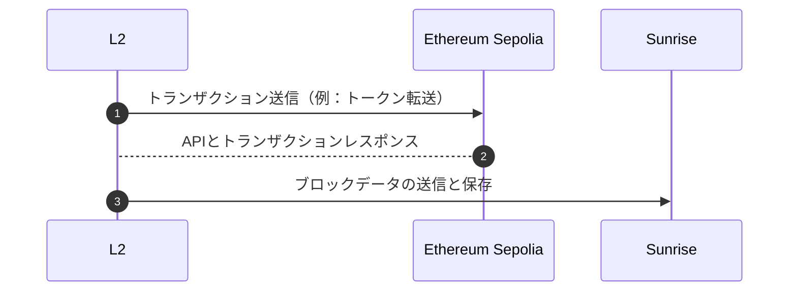

I'll help you translate the OP Stack L2 Chain document into Japanese.

# OP Stack L2チェーン

SunriseのデータDA可用性レイヤーは、[OP Stack](https://github.com/ethereum-optimism/optimism)を使用して作成されたレイヤー2ブロックチェーンをサポートしています。
これは、OP Stackを使用して作成したL2チェーンを[Sunrise Data](./sunrise-data.md)を通じてSunriseチェーンに接続するためのガイドです。データ可用性レイヤーはSunrise v0.3.0以降でサポートされています。

このバージョンのOP Stackは、操作のためにL1 EVMチェーンを必要とします。テストネットまたはローカルチェーンを使用してください。

## OP Stackのセットアップ方法

例として、OP Stackを使用してL2チェーンを作成し、SunriseのデータDA可用性レイヤー上で実行する方法を紹介します。

このガイドでは、OP Stackの要件を満たすためにEthereum Sepoliaテストネットを使用していますが、ローカルのEVMチェーンも同様に機能します。



### 依存関係

Ubuntu 22.04向けの依存関係と一般的なインストール手順です。

- node

  ```bash
    curl -fsSL https://deb.nodesource.com/setup_20.x | sudo -E bash - && sudo apt-get install -y nodejs
  ```

- [pnpm](https://pnpm.io/ja/installation)

  ```bash
    curl -fsSL https://get.pnpm.io/install.sh | sh -
  ```

- [foundry](https://book.getfoundry.sh/getting-started/installation)

  ```bash
    curl -L https://foundry.paradigm.xyz | bash
  ```

- just

  ```bash
    wget -qO - 'https://proget.makedeb.org/debian-feeds/prebuilt-mpr.pub' | gpg --dearmor | sudo tee /usr/share/keyrings/prebuilt-mpr-archive-keyring.gpg 1> /dev/null
    echo "deb [arch=all,$(dpkg --print-architecture) signed-by=/usr/share/keyrings/prebuilt-mpr-archive-keyring.gpg] https://proget.makedeb.org prebuilt-mpr $(lsb_release -cs)" | sudo tee /etc/apt/sources.list.d/prebuilt-mpr.list
    sudo apt update
    sudo apt install just
  ```

### Optimism Rollupテストネットのセットアップ

### Optimism

1. **optimismリポジトリのクローン**

   ```bash
   git clone https://github.com/ethereum-optimism/optimism.git
   ```

1. 正しいブランチをチェックアウト

   ```bash
   cd optimism
   git checkout v1.9.1
   ```

　ドキュメント更新時点での最新バージョンでの動作を確認しています。他のバージョンを使用する場合は、違いを確認してください。

1. **すべての依存関係があることを確認するために以下を実行**

   ```bash
   ./packages/contracts-bedrock/scripts/getting-started/versions.sh
   ```

1. Optimismに関連するすべてのパッケージをビルド

   ```bash
   make op-node op-batcher op-proposer
   ```

   このステップで問題が発生している場合は、バージョンがoptimismドキュメントのものと一致していることを確認してください。特に、goバージョンをダウングレードする必要があるかもしれません。

1. op-gethのクローンとビルド

   ```bash
   cd ~
   git clone https://github.com/ethereum-optimism/op-geth.git
   cd op-geth
   make geth
   ```

　 サポートされている`op-geth`の詳細については、optimismリポジトリの[Production Releases](https://github.com/ethereum-optimism/optimism/tree/v1.12.0?tab=readme-ov-file#production-releases)をご確認ください。

1. 環境変数の設定

   ```bash
   cd ~/optimism
   cp .envrc.example .envrc
   ```

   optimismリポジトリで以下のコマンドを実行してアドレスを生成するスクリプトを実行します：
   `./packages/contracts-bedrock/scripts/getting-started/wallets.sh`

   出力は以下のようになり、これを環境ファイルに貼り付ける必要があります：

   ```bash
   ##################################################
   #                 Getting Started                #
   ##################################################

   # Admin account
   export GS_ADMIN_ADDRESS=0x82eeB61600f290ce3F9400d345aAEcBe5faF7AEB
   export GS_ADMIN_PRIVATE_KEY=0x7c726817d047ee62cbb060312fe2620ba5462495e34f7e8279ba22faa96bca20

   # Batcher account
   export GS_BATCHER_ADDRESS=0x7BECbC4C747922d92e4F917951D9D8c3Ada7eb60
   export GS_BATCHER_PRIVATE_KEY=0xc7dfaa7b8449f00480196377da50d29318b2397fd0296d0ab4f11d48ee3cf723

   # Proposer account
   export GS_PROPOSER_ADDRESS=0x773F4527fECc889d6DD3Cd7d044F4AC1Ad765a31
   export GS_PROPOSER_PRIVATE_KEY=0xed6029a5928e83c5d2a28d9574304bae9a825e19f7f18a50d34edc13b505afed

   # Sequencer account
   export GS_SEQUENCER_ADDRESS=0x2B43c41FCbabc5437A6E1B97F47cA085a4B16f61
   export GS_SEQUENCER_PRIVATE_KEY=0x0a7d4ce467fe4d00b8930215c98335e06c16db34cd501c8c3f3173015487662e

   ##################################################
   #                Chain Information               #
   ##################################################

   # L1 chain information
   export L1_CHAIN_ID=11155111
   export L1_BLOCK_TIME=12

   # L2 chain information
   export L2_CHAIN_ID=42069
   export L2_BLOCK_TIME=2

   ##################################################
   #              op-node Configuration             #
   ##################################################

   # The kind of RPC provider, used to inform optimal transactions receipts
   # fetching. Valid options: alchemy, quicknode, infura, parity, nethermind,
   # debug_geth, erigon, basic, any.
   export L1_RPC_KIND=infura

   ##################################################
   #               Contract Deployment              #
   ##################################################

   # RPC URL for the L1 network to interact with
   export L1_RPC_URL=https://sepolia.infura.io/v3/xxxxxxxxxxxxxxxxxxxxxxxxxxxxxxxxxxxxx
   ```

   RPC URLのAPIキーは[Infura](https://www.infura.io/)または他のプロバイダーで見つけることができます。

1. アドレスに十分なSepolia ETHを入金します。optimismのドキュメントでは以下を推奨しています：

   - Admin — 0.5 Sepolia ETH
   - Proposer — 0.2 Sepolia ETH
   - Batcher — 0.1 Sepolia ETH

   参照: [Sepolia PoW Faucet](https://sepolia-faucet.pk910.de/)

1. direnvで環境変数を読み込む
   `direnv allow`
   実行後、以下のような出力が表示されるはずです：

   ```bash
       direnv: loading ~/optimism/.envrc                                                            direnv: export +DEPLOYMENT_CONTEXT +ETHERSCAN_API_KEY +GS_ADMIN_ADDRESS +GS_ADMIN_PRIVATE_KEY +GS_BATCHER_ADDRESS +GS_BATCHER_PRIVATE_KEY +GS_PROPOSER_ADDRESS +GS_PROPOSER_PRIVATE_KEY +GS_SEQUENCER_ADDRESS +GS_SEQUENCER_PRIVATE_KEY +IMPL_SALT +L1_RPC_KIND +L1_RPC_URL +PRIVATE_KEY +TENDERLY_PROJECT +TENDERLY_USERNAME
   ```

   出力が表示されない場合は、以下を試してください

   `nano ~/.zshrc`

   `nano ~/.bashrc`

   bashとzshのどちらを使用しているかに応じて以下の行を追加します

   ```bash
   eval "$(direnv hook zsh)"
   ```

   ```bash
   eval "$(direnv hook bash)"
   ```

   以下で変更を保存します

   `source ~/.zshrc`

   `source ~/.bashrc`

1. ネットワークの設定

   ```bash

   cd ~/optimism/packages/contracts-bedrock
   ./scripts/getting-started/config.sh
   ```

   **`deploy-config/getting-started.json`**ファイルで設定を確認できます
   生成された設定ファイルの末尾に以下を追加します

   ```bash
   nano deploy-config/getting-started.json
   ```

   ```json
   ...
     "preimageOracleMinProposalSize": 1800000,
     "preimageOracleChallengePeriod": 300,

     "useAltDA": true,
     "daCommitmentType": "GenericCommitment",
     "daChallengeWindow": 160,
     "daResolveWindow": 160,
     "daBondSize": 1000000,
     "daResolverRefundPercentage": 0
   }
   ```

1. L1コントラクトのデプロイ

   ```bash
   just install
   DEPLOYMENT_OUTFILE=deployments/artifact.json \
   DEPLOY_CONFIG_PATH=deploy-config/getting-started.json \
   forge script scripts/deploy/Deploy.s.sol:Deploy \
   --broadcast --private-key $GS_ADMIN_PRIVATE_KEY \
   --rpc-url $L1_RPC_URL --slow
   ```

   L2 Allocs

   ```bash
   CONTRACT_ADDRESSES_PATH=deployments/artifact.json \
   DEPLOY_CONFIG_PATH=deploy-config/getting-started.json \
   STATE_DUMP_PATH=deploy-config/statedump.json \
   forge script scripts/L2Genesis.s.sol:L2Genesis \
   --sig 'runWithStateDump()' \
   --chain 42069
   ```

   `--chain`にはあなたのL2チェーンIDを使用してください。

   > `EvmError: Revert`と`Script failed`を含む説明のないエラーが表示される場合は、`IMPL_SALT`環境変数を変更する必要がある可能性があります。この変数は、[CREATE2](https://eips.ethereum.org/EIPS/eip-1014)を介してデプロイされる様々なスマートコントラクトのアドレスを決定します。同じ`IMPL_SALT`を使って同じコントラクトを2回デプロイすると、2回目のデプロイは失敗します。**Optimism Monorepoのどこかで`direnv allow`を実行することで、新しい`IMPL_SALT`を生成できます。**

1. L2設定ファイルの生成

   ```bash
   cd ~/optimism/op-node
   ./bin/op-node genesis l2 \
     --deploy-config ../packages/contracts-bedrock/deploy-config/getting-started.json \
     --l1-deployments ../packages/contracts-bedrock/deployments/artifact.json \
     --outfile.l2 genesis.json \
     --outfile.rollup rollup.json \
     --l1-rpc $L1_RPC_URL \
     --l2-allocs ../packages/contracts-bedrock/deploy-config/statedump.json
   ```

   生成された`rollup.json`の末尾を確認します

   ```json
    "alt_da": {
       "da_challenge_contract_address": "0x0000000000000000000000000000000000000000",
       "da_commitment_type": "GenericCommitment",
       "da_challenge_window": 160,
       "da_resolve_window": 160
     }
   ```

1. 認証キーの作成

   ```bash
   openssl rand -hex 32 > jwt.txt
   ```

1. genesisファイルをop-gethディレクトリにコピー

   ```bash
   cp genesis.json ~/op-geth
   cp jwt.txt ~/op-geth
   ```

1. `op-geth`の初期化

   ```bash
   cd ~/op-geth
   mkdir datadir
   make geth
   build/bin/geth init --datadir=datadir genesis.json
   ```

## L2の起動

**optimismを起動する前に、`sunrised`と`sunrise-data`などをセットアップしてください。**

[**Sunrise Data**](./sunrise-data.md)

1. `op-geth`の起動

   ```bash
   ./build/bin/geth \
     --datadir ./datadir \
     --http \
     --http.corsdomain="*" \
     --http.vhosts="*" \
     --http.addr=0.0.0.0 \
     --http.port=9545 \
     --http.api=web3,debug,eth,txpool,net,engine \
     --ws \
     --ws.addr=0.0.0.0 \
     --ws.port=9546 \
     --ws.origins="*" \
     --ws.api=debug,eth,txpool,net,engine \
     --syncmode=full \
     --nodiscover \
     --maxpeers=0 \
     --networkid=42069 \
     --authrpc.vhosts="*" \
     --authrpc.addr=0.0.0.0 \
     --authrpc.port=9551 \
     --authrpc.jwtsecret=./jwt.txt \
     --rollup.disabletxpoolgossip=true
   ```

2. `op-node`の起動

   ```bash
   cd ~/optimism/op-node
   ./bin/op-node \
     --l2=http://localhost:9551 \
     --l2.jwt-secret=./jwt.txt \
     --sequencer.enabled \
     --sequencer.l1-confs=5 \
     --verifier.l1-confs=4 \
     --rollup.config=./rollup.json \
     --rpc.addr=0.0.0.0 \
     --rpc.port=8547 \
     --p2p.disable \
     --rpc.enable-admin \
     --p2p.sequencer.key=$GS_SEQUENCER_PRIVATE_KEY \
     --l1=$L1_RPC_URL \
     --l1.rpckind=$L1_RPC_KIND \
     --altda.enabled=true \
     --altda.da-server=http://localhost:3100 \
     --altda.da-service=true \
     --l1.beacon.ignore=true
   ```

   --altda.da-serverはあなたのDAサーバーのhttp URLです

3. `op-batcher`の起動

   ```bash
   cd ~/optimism/op-batcher
   ./bin/op-batcher \
     --l2-eth-rpc=http://localhost:9545 \
     --rollup-rpc=http://localhost:8547 \
     --poll-interval=1s \
     --sub-safety-margin=6 \
     --num-confirmations=1 \
     --safe-abort-nonce-too-low-count=3 \
     --resubmission-timeout=30s \
     --rpc.addr=0.0.0.0 \
     --rpc.port=8548 \
     --rpc.enable-admin \
     --max-channel-duration=1 \
     --l1-eth-rpc=$L1_RPC_URL \
     --private-key=$GS_BATCHER_PRIVATE_KEY \
     --altda.enabled=true \
     --altda.da-service=true \
     --altda.da-server=http://localhost:3100
   ```

4. `op-proposer`の起動

   ```bash
   cd ~/optimism/op-proposer
   ./bin/op-proposer \
     --poll-interval=12s \
     --rpc.port=9560 \
     --rollup-rpc=http://localhost:8547 \
     --l2oo-address=$(cat ../packages/contracts-bedrock/deployments/42069-deploy.json | jq -r .L2OutputOracleProxy) \
     --private-key=$GS_PROPOSER_PRIVATE_KEY \
     --l1-eth-rpc=$L1_RPC_URL
   ```

5. 動作確認