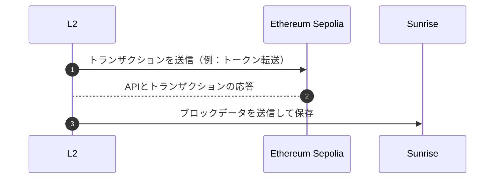

# OPスタック L2チェーン

Sunriseのデータ可用性レイヤーは、[OP Stack](https://github.com/ethereum-optimism/optimism)を使用して作成されたレイヤー2ブロックチェーンをサポートしています。
これは、OP Stackを使用して作成されたL2チェーンを[Sunrise Data](./sunrise-data.md)でSunriseチェーンに接続するためのガイドです。データ可用性レイヤーは、Sunrise v0.3.0以降でサポートされています。

このバージョンのOPスタックでは、L1 EVMチェーンの運用が必要です。何らかのテストネットまたはローカルチェーンを使用してください。

## OPスタックの設定方法

例として、OP Stackを使用してL2チェーンを作成し、Sunriseのデータ可用性レイヤーで実行する方法を以下に示します。

このガイドでは、OPスタックの要件を満たすためにEthereum Sepoliaテストネットを使用していますが、ローカルEVMチェーンでも動作します。



### 依存関係

Ubuntu 22.04の依存関係と一般的なインストール手順。

- node

  ```bash
    curl -fsSL https://deb.nodesource.com/setup_20.x | sudo -E bash - && sudo apt-get install -y nodejs
  ```

- [pnpm](https://pnpm.io/ja/installation)

  ```bash
    curl -fsSL https://get.pnpm.io/install.sh | sh -
  ```

- [foundry](https://book.getfoundry.sh/getting-started/installation)

  ```bash
    curl -L https://foundry.paradigm.xyz | bash
  ```

- just

  ```bash
    wget -qO - 'https://proget.makedeb.org/debian-feeds/prebuilt-mpr.pub' | gpg --dearmor | sudo tee /usr/share/keyrings/prebuilt-mpr-archive-keyring.gpg 1> /dev/null
    echo "deb [arch=all,$(dpkg --print-architecture) signed-by=/usr/share/keyrings/prebuilt-mpr-archive-keyring.gpg] https://proget.makedeb.org prebuilt-mpr $(lsb_release -cs)" | sudo tee /etc/apt/sources.list.d/prebuilt-mpr.list
    sudo apt update
    sudo apt install just
  ```

### Optimismロールアップテストネットの設定

### Optimism

1. **optimismリポジトリをクローンします**

   ```bash
   git clone https://github.com/ethereum-optimism/optimism.git
   ```

1. 正しいブランチをチェックアウトします

   ```bash
   cd optimism
   git checkout v1.9.1
   ```

ドキュメント更新時点で最新バージョンでの動作を確認しています。他のバージョンを使用する場合は、差異を確認してください。

1. **すべての依存関係があることを確認するために以下を実行します**

   ```bash
   ./packages/contracts-bedrock/scripts/getting-started/versions.sh
   ```

1. Optimismに関連するすべてのパッケージをビルドします

   ```bash
   make op-node op-batcher op-proposer
   ```

   この手順で問題が発生した場合は、バージョンがoptimismのドキュメントと一致していることを確認してください。具体的には、goのバージョンをダウングレードする必要がある場合があります。

1. op-gethをクローンしてビルドします

   ```bash
   cd ~
   git clone https://github.com/ethereum-optimism/op-geth.git
   cd op-geth
   make geth
   ```

サポートされている`op-geth`の詳細については、optimismリポジトリの[Production Releases](https://github.com/ethereum-optimism/optimism/tree/v1.12.0?tab=readme-ov-file#production-releases)を確認してください。

1. 環境変数を入力します

   ```bash
   cd ~/optimism
   cp .envrc.example .envrc
   ```

   optimismリポジトリで次のコマンドを使用してアドレスを生成するスクリプトを実行します：
   `./packages/contracts-bedrock/scripts/getting-started/wallets.sh`

   出力は次のようになり、これを環境ファイルに貼り付ける必要があります：

   ```bash
   ##################################################
   #                 はじめに                #
   ##################################################

   # 管理者アカウント
   export GS_ADMIN_ADDRESS=0x82eeB61600f290ce3F9400d345aAEcBe5faF7AEB
   export GS_ADMIN_PRIVATE_KEY=0x7c726817d047ee62cbb060312fe2620ba5462495e34f7e8279ba22faa96bca20

   # バッチャーアカウント
   export GS_BATCHER_ADDRESS=0x7BECbC4C747922d92e4F917951D9D8c3Ada7eb60
   export GS_BATCHER_PRIVATE_KEY=0xc7dfaa7b8449f00480196377da50d29318b2397fd0296d0ab4f11d48ee3cf723

   # 提案者アカウント
   export GS_PROPOSER_ADDRESS=0x773F4527fECc889d6DD3Cd7d044F4AC1Ad765a31
   export GS_PROPOSER_PRIVATE_KEY=0xed6029a5928e83c5d2a28d9574304bae9a825e19f7f18a50d34edc13b505afed

   # シーケンサーアカウント
   export GS_SEQUENCER_ADDRESS=0x2B43c41FCbabc5437A6E1B97F47cA085a4B16f61
   export GS_SEQUENCER_PRIVATE_KEY=0x0a7d4ce467fe4d00b8930215c98335e06c16db34cd501c8c3f3173015487662e

   ##################################################
   #                チェーン情報               #
   ##################################################

   # L1チェーン情報
   export L1_CHAIN_ID=11155111
   export L1_BLOCK_TIME=12

   # L2チェーン情報
   export L2_CHAIN_ID=42069
   export L2_BLOCK_TIME=2

   ##################################################
   #              op-node設定             #
   ##################################################

   # RPCプロバイダーの種類。最適なトランザクションレシートの
   # 取得方法を通知するために使用されます。有効なオプション：alchemy、quicknode、infura、parity、nethermind、
   # debug_geth、erigon、basic、any。
   export L1_RPC_KIND=infura

   ##################################################
   #               コントラクトのデプロイ              #
   ##################################################

   # 対話するL1ネットワークのRPC URL
   export L1_RPC_URL=https://sepolia.infura.io/v3/xxxxxxxxxxxxxxxxxxxxxxxxxxxxxxxxxxxxx
   ```

   RPC URLのAPIキーは[Infura](https://www.infura.io/)または他のプロバイダーで見つけることができます。

1. 十分なSepolia ETHでアドレスに資金を供給します。optimismのドキュメントでは以下を推奨しています：

   - 管理者 — 0.5 Sepolia ETH
   - 提案者 — 0.2 Sepolia ETH
   - バッチャー — 0.1 Sepolia ETH

   参照：[Sepolia PoW Faucet](https://sepolia-faucet.pk910.de/)

1. direnvで環境変数をロードします
   `direnv allow`
   その後、次のようなものが表示されるはずです：

   ```bash
       direnv: loading ~/optimism/.envrc                                                            direnv: export +DEPLOYMENT_CONTEXT +ETHERSCAN_API_KEY +GS_ADMIN_ADDRESS +GS_ADMIN_PRIVATE_KEY +GS_BATCHER_ADDRESS +GS_BATCHER_PRIVATE_KEY +GS_PROPOSER_ADDRESS +GS_PROPOSER_PRIVATE_KEY +GS_SEQUENCER_ADDRESS +GS_SEQUENCER_PRIVATE_KEY +IMPL_SALT +L1_RPC_KIND +L1_RPC_URL +PRIVATE_KEY +TENDERLY_PROJECT +TENDERLY_USERNAME
   ```

   何も出力されない場合は、試してください

   `nano ~/.zshrc`

   `nano ~/.bashrc`

   bashとzshのどちらを使用するかに応じて、次の行を追加します

   ```bash
   eval "$(direnv hook zsh)"
   ```

   ```bash
   eval "$(direnv hook bash)"
   ```

   変更を保存します

   `source ~/.zshrc`

   `source ~/.bashrc`

1. ネットワークを設定します

   ```bash

   cd ~/optimism/packages/contracts-bedrock
   ./scripts/getting-started/config.sh
   ```

   **`deploy-config/getting-started.json`**ファイルで設定を表示できます
   生成された設定の末尾に以下を追加します

   ```bash
   nano deploy-config/getting-started.json
   ```

   ```json
   ...
     "preimageOracleMinProposalSize": 1800000,
     "preimageOracleChallengePeriod": 300,

     "useAltDA": true,
     "daCommitmentType": "GenericCommitment",
     "daChallengeWindow": 160,
     "daResolveWindow": 160,
     "daBondSize": 1000000,
     "daResolverRefundPercentage": 0
   }
   ```

1. L1コントラクトをデプロイします

   ```bash
   just install
   DEPLOYMENT_OUTFILE=deployments/artifact.json \
   DEPLOY_CONFIG_PATH=deploy-config/getting-started.json \
   forge script scripts/deploy/Deploy.s.sol:Deploy \
   --broadcast --private-key $GS_ADMIN_PRIVATE_KEY \
   --rpc-url $L1_RPC_URL --slow
   ```

   L2 Allocs

   ```bash
   CONTRACT_ADDRESSES_PATH=deployments/artifact.json \
   DEPLOY_CONFIG_PATH=deploy-config/getting-started.json \
   STATE_DUMP_PATH=deploy-config/statedump.json \
   forge script scripts/L2Genesis.s.sol:L2Genesis \
   --sig 'runWithStateDump()' \
   --chain 42069
   ```

   `--chain`にL2チェーンIDを使用してください。

   > `EvmError: Revert`と`Script failed`を含む不明なエラーが表示された場合は、`IMPL_SALT`環境変数を変更する必要がある可能性があります。この変数は、[CREATE2(新しいタブで開く)](https://eips.ethereum.org/EIPS/eip-1014)を介してデプロイされるさまざまなスマートコントラクトのアドレスを決定します。同じ`IMPL_SALT`を使用して同じコントラクトを2回デプロイすると、2回目のデプロイは失敗します。**Optimism Monorepoのどこでも`direnv allow`を実行することで、新しい`IMPL_SALT`を生成できます。**

1. L2設定ファイルを生成します

   ```bash
   cd ~/optimism/op-node
   ./bin/op-node genesis l2 \
     --deploy-config ../packages/contracts-bedrock/deploy-config/getting-started.json \
     --l1-deployments ../packages/contracts-bedrock/deployments/artifact.json \
     --outfile.l2 genesis.json \
     --outfile.rollup rollup.json \
     --l1-rpc $L1_RPC_URL \
     --l2-allocs ../packages/contracts-bedrock/deploy-config/statedump.json
   ```

   生成された`rollup.json`の末尾を確認します

   ```json
    "alt_da": {
       "da_challenge_contract_address": "0x0000000000000000000000000000000000000000",
       "da_commitment_type": "GenericCommitment",
       "da_challenge_window": 160,
       "da_resolve_window": 160
     }
   ```

1. 認証キーを作成します

   ```bash
   openssl rand -hex 32 > jwt.txt
   ```

1. genesisファイルをop-gethディレクトリにコピーします

   ```bash
   cp genesis.json ~/op-geth
   cp jwt.txt ~/op-geth
   ```

1. `op-geth`を初期化します

   ```bash
   cd ~/op-geth
   mkdir datadir
   make geth
   build/bin/geth init --datadir=datadir genesis.json
   ```

## L2を開始

**optimismを開始する前に、`sunrised`と`sunrise-data`などを設定してください。**

[**Sunrise Data**](./sunrise-data.md)

1. `op-geth`を開始します

   ```bash
   ./build/bin/geth \
     --datadir ./datadir \
     --http \
     --http.corsdomain="*" \
     --http.vhosts="*" \
     --http.addr=0.0.0.0 \
     --http.port=9545 \
     --http.api=web3,debug,eth,txpool,net,engine \
     --ws \
     --ws.addr=0.0.0.0 \
     --ws.port=9546 \
     --ws.origins="*" \
     --ws.api=debug,eth,txpool,net,engine \
     --syncmode=full \
     --nodiscover \
     --maxpeers=0 \
     --networkid=42069 \
     --authrpc.vhosts="*" \
     --authrpc.addr=0.0.0.0 \
     --authrpc.port=9551 \
     --authrpc.jwtsecret=./jwt.txt \
     --rollup.disabletxpoolgossip=true
   ```

2. `op-node`を開始します

   ```bash
   cd ~/optimism/op-node
   ./bin/op-node \
     --l2=http://localhost:9551 \
     --l2.jwt-secret=./jwt.txt \
     --sequencer.enabled \
     --sequencer.l1-confs=5 \
     --verifier.l1-confs=4 \
     --rollup.config=./rollup.json \
     --rpc.addr=0.0.0.0 \
     --rpc.port=8547 \
     --p2p.disable \
     --rpc.enable-admin \
     --p2p.sequencer.key=$GS_SEQUENCER_PRIVATE_KEY \
     --l1=$L1_RPC_URL \
     --l1.rpckind=$L1_RPC_KIND \
     --altda.enabled=true \
     --altda.da-server=http://localhost:3100 \
     --altda.da-service=true \
     --l1.beacon.ignore=true
   ```

   --altda.da-serverは、da-sererのhttp URLです

3. `op-batcher`を開始します

   ```bash
   cd ~/optimism/op-batcher
   ./bin/op-batcher \
     --l2-eth-rpc=http://localhost:9545 \
     --rollup-rpc=http://localhost:8547 \
     --poll-interval=1s \
     --sub-safety-margin=6 \
     --num-confirmations=1 \
     --safe-abort-nonce-too-low-count=3 \
     --resubmission-timeout=30s \
     --rpc.addr=0.0.0.0 \
     --rpc.port=8548 \
     --rpc.enable-admin \
     --max-channel-duration=1 \
     --l1-eth-rpc=$L1_RPC_URL \
     --private-key=$GS_BATCHER_PRIVATE_KEY \
     --altda.enabled=true \
     --altda.da-service=true \
     --altda.da-server=http://localhost:3100
   ```

4. `op-proposer`を開始します

   ```bash
   cd ~/optimism/op-proposer
   ./bin/op-proposer \
     --poll-interval=12s \
     --rpc.port=9560 \
     --rollup-rpc=http://localhost:8547 \
     --l2oo-address=$(cat ../packages/contracts-bedrock/deployments/42069-deploy.json | jq -r .L2OutputOracleProxy) \
     --private-key=$GS_PROPOSER_PRIVATE_KEY \
     --l1-eth-rpc=$L1_RPC_URL
   ```

5. 動作
