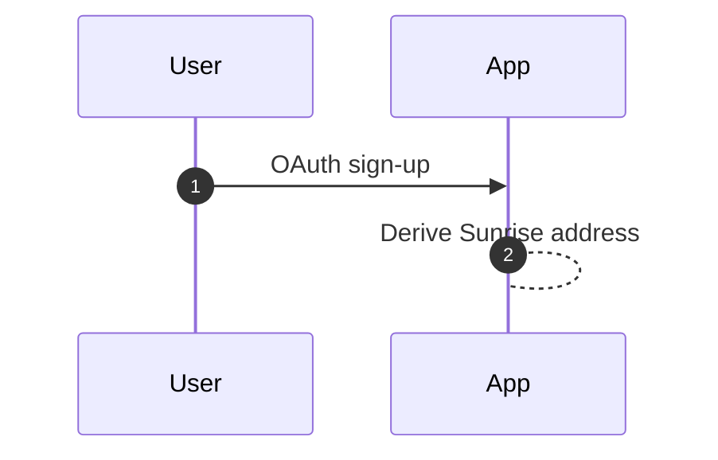
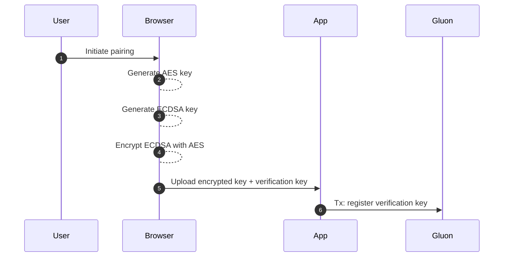
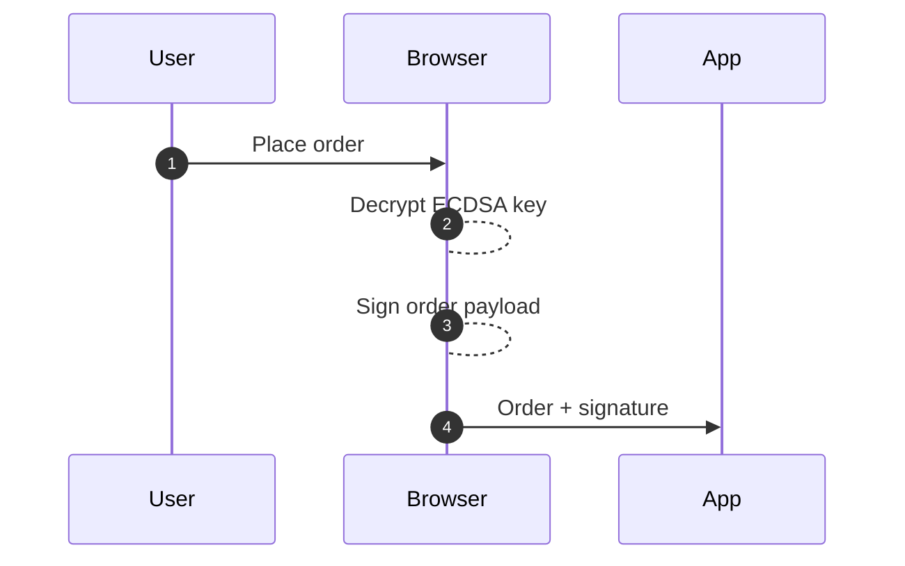
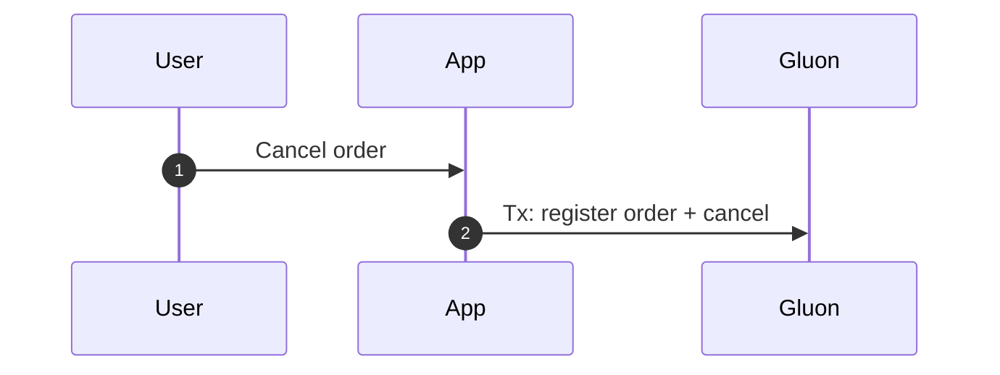
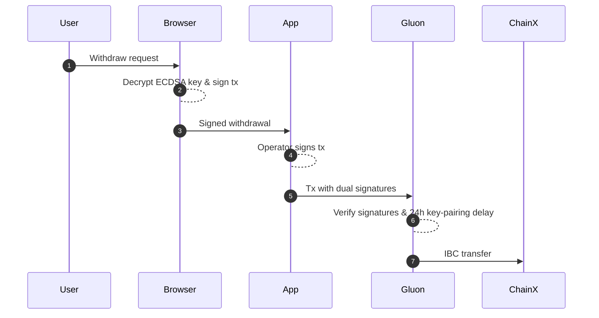

# 🏦 Gluon

Gluonは、[Rollkit](https://rollkit.dev/)で構築され、次世代L1であるSunriseによってセキュリティが確保されたオーダーブック型レイヤー2ブロックチェーンです。Sunriseは、データの可用性と流動性を兼ね備えています。\
Interliquid Networksのベースレイヤーです。\
このロールアップは、SunriseのProof-of-Liquidity (PoL)を実装し、IBCを活用してシームレスな資産移動を実現します。

***

## 主な特徴

| カテゴリ | 説明 |
| -------------------------- | ------------------------------------------------------------------------------------------------------ |
| **オーダーブックDEX** | 決定論的なマッチングロジック、価格優先・時間優先、オンチェーンでの決済。 |
| **Web2スタイルのオンボーディング** | OAuth登録により秘密鍵管理を抽象化。ユーザーの鍵はクライアントデバイスから出ません。 |
| **オフチェーンでのマッチング** | 高スループットのマッチングエンジンが、オンチェーンで最終決定する前に取引をバッチ処理します。 |
| **二重署名モデル** | すべての資金移動トランザクションには、ユーザーとオペレーターの両方の署名が必要で、一方的な引き出しを防ぎます。 |
| **IBCによる入出金** | ネイティブIBCチャネルがGluonを外部のCosmos-SDKチェーンに接続し、信頼性を最小限に抑えた送金を実現します。 |

***

## 開発者概要

* **ソースコード:** [https://github.com/sunriselayer/gluon](https://github.com/sunriselayer/gluon)
* **Sunrise Rollkitアダプター:** [https://github.com/sunriselayer/sunrise-rollkit](https://github.com/sunriselayer/sunrise-rollkit)
* **使用モジュール:** `x/order`、`x/perp`、`x/customauth`（protobuf定義を参照）。

***

## 認証と鍵管理

Gluonは、ウェブで生成されたECDSAキーとオンチェーンアカウントをペアにする_CustomAuth_フローを導入しています。

1. **OAuthサインアップ** → サーバーが決定論的にユーザーアドレスを導出します。
2. **デバイスペアリング** → ブラウザがAESキーとECDSAキーを生成し、後者はAES暗号化されてサーバー側に保存されます。
3. **検証キー**がチェーン上で提出されます（ペアリングトランザクション）。

### サインアップフロー

サインアッププロセスは、意図的にシンプルでユーザーフレンドリーになるように設計されています。

* ユーザーは、使い慣れたOAuthプロバイダー（Google、GitHubなど）を使用してサインアップできます。
* アプリケーションは、ユーザーのSunriseアドレスを自動的に導出します。
* 手動でのウォレット設定やシードフレーズの管理は不要です。



この合理化されたプロセスにより、ユーザーはブロックチェーンの複雑さなしに迅速に取引を開始できます。

### デバイスペアリングフロー

デバイスペアリングプロセスでは、いくつかのセキュリティ対策が実装されています。

* デバイスごとに一意の暗号化キーを生成します。
* 機密性の高いECDSAキーを暗号化して安全に保ちます。
* 将来のトランザクションのための検証メカニズムを確立します。



この複数ステップのプロセスにより、ユーザーのコントロールを維持しながら、安全なキー管理が保証されます。

### 注文作成（オフチェーン）

オフチェーンでの注文作成プロセスにより、高性能な取引が可能になります。

* 注文は、ユーザーの暗号化されたキーを使用してローカルで署名されます。
* 署名は、受け入れられる前に検証されます。
* 注文は、マッチングのためにバッチ処理されるまでオフチェーンのままです。



このアプローチにより、セキュリティを維持しながら、1秒未満での注文発注が可能になります。

### 注文キャンセル（オンチェーン）

キャンセルプロセスは、注文の整合性を保証します。

* キャンセルは、透明性のためにオンチェーンで記録されます。
* 古い署名のリプレイ攻撃を防ぎます。
* キャンセルの不変の証明を提供します。



このオンチェーンレコードは、オーダーブックの整合性を維持するために不可欠です。

### 出金（IBC）

出金プロセスでは、複数のセキュリティレイヤーが実装されています。

* ユーザーとオペレーターの両方からの二重署名が必要です。
* 新しいキーペアには24時間のセキュリティ遅延を実装しています。
* 信頼性を最小限に抑えたクロスチェーン転送にIBCを使用します。



この多層的なアプローチにより、チェーン間で安全で信頼性の高い資産移転が保証されます。

> 外部ウォレット（例：MetaMask）は不要です。キーはクライアント側に残り、オンチェーンで失効可能です。

## 取引ライフサイクル

### 注文作成（オフチェーン）

注文は、最初のマッチングトランザクションでバッチ処理されるまでオフチェーンに存在し、1秒未満のUXを実現します。


### 注文キャンセル（オンチェーン）

オンチェーンレコードは、オペレーターが古いユーザー署名をリプレイするのを防ぎます。


### 出金（IBC）

キーペアリングと資金移動の間に24時間の遅延を設けることで、オペレーターキーの漏洩リスクを軽減します。


## 注文モジュール（protobuf）

注文サブシステムは`gluon/order/*`で定義されています。コアタイプ：

`BaseOrder`メッセージは、システム内のすべての注文の基本構造を定義します。

* 各注文は、特定のユーザーアドレスと取引ペアに関連付けられています。
* 注文は、指値注文（指定価格あり）または成行注文のいずれかです。
* 有効期限のタイムスタンプは、リプレイ攻撃を防ぎ、注文の鮮度を保証します。
* 金額と価格は、任意の精度を処理するために文字列として保存されます。

```go
message BaseOrder {
  string         address      = 1;  // bech32ユーザーアドレス
  string         denom_base   = 2;  // 例：「uatom」
  string         denom_quote  = 3;  // 例：「uusdc」
  OrderDirection direction    = 4;  // BUY / SELL
  string         amount       = 5;  // 基本金額
  string         limit_price  = 6;  // オプション
  google.protobuf.Timestamp expiry = 7;  // リプレイ攻撃対策
}

enum OrderDirection {
  ORDER_DIRECTION_UNSPECIFIED = 0;
  ORDER_DIRECTION_BUY         = 1;
  ORDER_DIRECTION_SELL        = 2;
}
```

`OrderDirection` enumは、注文サイドをタイプセーフに指定する方法を提供します。

* UNSPECIFIEDをデフォルトとする標準的なprotobuf enum規則を使用します。
* 買い注文と売り注文を明確に区別します。
* コンパイル時のチェックにより、注文サイド関連のバグを防ぐのに役立ちます。
