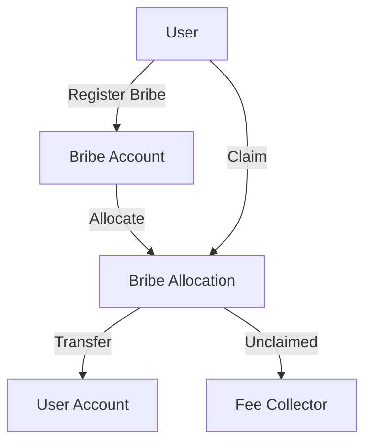

# Bribes (賄賂)

`x/liquidityincentive`モジュールは、アプリケーションがvRISE保有者に対して特定のプールへの投票を促すために報酬を与えることを可能にするプロトコルレベルのメカニズムを実装しています。これにより、賄賂ベースのインセンティブシステムを通じて、流動性配分のための効率的な市場が創出されます。

## 主な特徴

1. **プロトコルレベルの賄賂:**
   - アプリケーションは、特定のプールに流動性を引き付けるために賄賂を提供できます。
   - vRISE保有者は、より高い賄賂のあるプールに投票を向けるインセンティブを得ます。
   - 流動性配分のための効率的な市場を創出します。

2. **エポックベースのシステム:**
   - 賄賂は特定のエポックに関連付けられます。
   - システムは期限切れのエポックを追跡します。
   - 期限切れのエポックから未請求の賄賂は処理され、手数料徴収者に送られます。

3. **ウェイトベースの分配:**
   - 投票の重みに基づく公正な配分。
   - 二重請求を防止します。
   - オンチェーンで透明性があり、検証可能です。

4. **経済的効率性:**
   - 流動性配分のための市場を創出します。
   - vRISE保有者は、投票を向けることで収益を最大化できます。
   - 未請求の報酬は手数料徴収者にリサイクルされます。

## コア機能

> **注:** 次のセクションでは、経験豊富なユーザーまたは開発者向けの高度なトピックについて説明します。

### 賄賂の管理

**各賄賂は、いくつかのパラメータによって定義されます:**

- `id`: 賄賂の一意の識別子
- `epoch_id`: 賄賂が有効なエポック
- `pool_id`: 賄賂が適用されるプール
- `address`: 送信者のアドレス
- `amount`: 賄賂の総額
- `claimed_amount`: すでに有権者によって請求された額

### 賄賂の配分

システムは、賄賂が有権者にどのように配分されるかを追跡します:

- `address`: 有権者のアドレス
- `epoch_id`: 配分が有効なエポック
- `pool_id`: 配分が適用されるプール
- `weight`: 有権者の投票の重み
- `claimed_bribe_ids`: すでに請求された賄賂IDのリスト

---

## 賄賂システムのアーキテクチャとフロー

### 主要コンポーネントとフロー

#### 賄賂の登録

- **ユーザーは、流動性インセンティブモジュールの賄賂アカウントにコインを送ることで賄賂を登録します。**
- システムは**賄賂レコードを作成します**（一意のID、エポック、プール、金額、請求額を含む）。
- エポックが始まると、そのエポックのプールに対する投票の重みに基づいて、有権者に対して**賄賂の配分**が作成されます。

#### 賄賂の請求

- **ユーザーは、自分の賄賂配分の請求を開始します。**
- システムは:
  - 賄賂が存在し、エポック/プールに対して有効であることを確認します。
  - ユーザーの配分を確認し、賄賂がまだ請求されていないことを保証します。
  - ユーザーの投票の重みに基づいて請求可能な金額を計算します。
  - 適切な金額を賄賂アカウントからユーザーに送金します。
  - 請求額と配分レコードを更新します。

#### 手数料処理

- 期限切れのエポックから未請求の賄賂は**手数料徴収者に返還されます**。
- 手数料は次のように処理されます:
  - 手数料徴収者からモジュールアカウントに送金されます。
  - 必要に応じて、債券のデノミネーションに変換されます。
  - インセンティブとして流動性プールに分配されます。

#### クリーンアップ（未請求の賄賂）

- 各エポックの終わりに、システムは:
  - 期限切れのエポックを処理します。
  - 未請求の賄賂額を計算します。
  - 未請求の資金を手数料徴収者に返還します。
  - 期限切れの賄賂と配分レコードをクリーンアップします。

#### 状態遷移

- **賄賂:** 作成 → アクティブ → 請求済み/期限切れ
- **配分:** 作成 → アクティブ → 請求済み/期限切れ
- **資金:** ユーザー → 賄賂アカウント → ユーザー/手数料徴収者

---

### 賄賂システムのフローチャート

**フローの説明:**

1. ユーザーは賄賂を登録し、賄賂アカウントに入金されます。
2. システムは、投票の重みに基づいて、対象となる有権者に賄賂のシェアを配分します。
3. ユーザーは、配分された賄賂の報酬を賄賂配分から請求できます。
4. 請求された報酬はユーザーのアカウントに送金されます。
5. 請求期間後に未請求の賄賂は、再分配または焼却のために手数料徴収者に送られます。

---

## 統合ポイント

賄賂モジュールは、他のいくつかのモジュールと統合されています:

- コイン送金のためのBankモジュール
- アドレス処理のためのAccountモジュール
- vRISE保有者のためのStakingモジュール
- パラメータ更新のためのGovernanceモジュール

システムの詳細については、[流動性インセンティブ](./liquidity-incentive.md)を参照してください。
