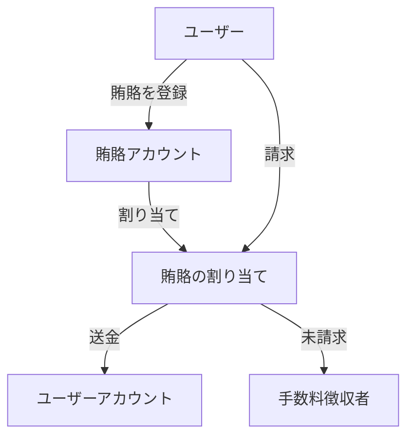

# 賄賂

`x/liquidityincentive`モジュールは、vRISE保有者が特定のプールに投票を誘導することでアプリケーションが報酬を与えられるようにする、プロトコルレベルのメカニズムを実装しています。これにより、賄賂ベースのインセンティブシステムを通じて、流動性配分の効率的な市場が創出されます。

## 主な特徴

1. **プロトコルレベルの賄賂:**
   - アプリケーションは、特定のプールに流動性を引き付けるために賄賂を提供できます。
   - vRISE保有者は、より高い賄賂のあるプールに投票を誘導するインセンティブが与えられます。
   - 流動性配分の効率的な市場を創出します。

2. **エポックベースのシステム:**
   - 賄賂は特定のエポックに関連付けられています。
   - システムは期限切れのエポックを追跡します。
   - 期限切れのエポックからの未請求の賄賂は処理され、手数料徴収者に送られます。

3. **加重ベースの分配:**
   - 投票の重みに基づく公正な配分。
   - 二重請求を防止します。
   - オンチェーンで透明かつ検証可能です。

4. **経済的効率性:**
   - 流動性配分のための市場を創出します。
   - vRISE保有者は、投票を誘導することで収益を最大化できます。
   - 未請求の報酬は、手数料徴収者にリサイクルされます。

## コア機能

> **注意:** 次のセクションでは、経験豊富なユーザーまたは開発者向けの高度なトピックについて説明します。

### 賄賂の管理

**各賄賂は、いくつかのパラメータによって定義されます:**

- `id`: 賄賂の一意の識別子
- `epoch_id`: 賄賂が有効なエポック
- `pool_id`: 賄賂が適用されるプール
- `address`: 送信者のアドレス
- `amount`: 賄賂の総額
- `claimed_amount`: 投票者によってすでに請求された金額

### 賄賂の割り当て

システムは、賄賂が投票者にどのように割り当てられるかを追跡します。

- `address`: 投票者のアドレス
- `epoch_id`: 割り当てが有効なエポック
- `pool_id`: 割り当てが適用されるプール
- `weight`: 投票者の投票の重み
- `claimed_bribe_ids`: すでに請求された賄賂IDのリスト

---

## 賄賂システムのアーキテクチャとフロー

### 主要なコンポーネントとフロー

#### 賄賂の登録

- **ユーザーは、流動性インセンティブモジュールの賄賂アカウントにコインを送ることで賄賂を登録します。**
- システムは**賄賂レコードを作成します**（一意のID、エポック、プール、金額、請求額を含む）。
- エポックが始まると、そのエポックのプールに対する投票の重みに基づいて、投票者のために**賄賂の割り当て**が作成されます。

#### 賄賂の請求

- **ユーザーは、賄賂の割り当ての請求を開始します。**
- システムは：
  - 賄賂が存在し、エポック/プールに対して有効であることを確認します。
  - ユーザーの割り当てをチェックし、賄賂がまだ請求されていないことを確認します。
  - ユーザーの投票の重みに基づいて請求可能な金額を計算します。
  - 賄賂アカウントからユーザーに適切な金額を送金します。
  - 請求額と割り当てレコードを更新します。

#### 手数料の処理

- 期限切れのエポックからの未請求の賄賂は、**手数料徴収者に返還されます**。
- 手数料は次のように処理されます：
  - 手数料徴収者からモジュールアカウントに送金されます。
  - 必要に応じて、債券デノミネーションに変換されます。
  - インセンティブとして流動性プールに分配されます。

#### クリーンアップ（未請求の賄賂）

- 各エポックの終わりに、システムは：
  - 期限切れのエポックを処理します。
  - 未請求の賄賂の金額を計算します。
  - 未請求の資金を手数料徴収者に返還します。
  - 期限切れの賄賂と割り当てレコードをクリーンアップします。

#### 状態遷移

- **賄賂:** 作成済み → アクティブ → 請求済み/期限切れ
- **割り当て:** 作成済み → アクティブ → 請求済み/期限切れ
- **資金:** ユーザー → 賄賂アカウント → ユーザー/手数料徴収者

---

### 賄賂システムのフローチャート

**フローの説明:**

1. ユーザーが賄賂を登録すると、賄賂アカウントに入金されます。
2. システムは、投票の重みに基づいて、対象となる投票者に賄賂のシェアを割り当てます。
3. ユーザーは、割り当てられた賄賂の報酬を賄賂の割り当てから請求できます。
4. 請求された報酬は、ユーザーのアカウントに送金されます。
5. 請求期間後に未請求の賄賂は、再分配または焼却のために手数料徴収者に送られます。

---

## 統合ポイント

賄賂モジュールは、他のいくつかのモジュールと統合されています。

- コイン送金のためのBankモジュール
- アドレス処理のためのAccountモジュール
- vRISE保有者のためのStakingモジュール
- パラメータ更新のためのGovernanceモジュール

システムの詳細については、[流動性インセンティブ](./liquidity-incentive.md)を参照してください。
