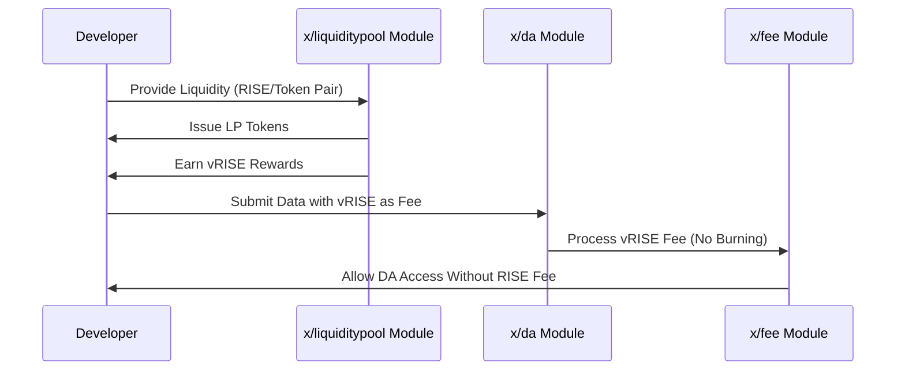

# DA Fee Abstraction

Sunriseは「DA Fee Abstraction（DAフィー抽象化）」を導入します。これは開発者が直接手数料を支払うことなくSunrise上のblobスペースにアクセスできるメカニズムです。代わりに、開発者はSunriseの流動性プールに流動性を提供することでデータ可用性サービスへのアクセスを得ることができます。この革新的なアプローチにより、ネットワークの経済的持続可能性を維持しながら、開発者の参入障壁を低減します。

## 主な特徴


**レベル1: アプリ開発者向け**


1. **流動性ベースのアクセス:**

   - 開発者は`x/liquiditypool`モジュールのプールに流動性を提供します。
   - この貢献はネットワーク全体の流動性と安定性をサポートします。


2. **報酬メカニズム（`$vRISE`）:**

   - 流動性提供者は報酬として`$vRISE`トークンを受け取ります。
   - これらのトークンはデータ可用性トランザクションの支払いに使用できます。


3. **手数料の分離:**

   - データ可用性トランザクションでは`$vRISE`トークンを使用できます。
   - その他のトランザクションタイプでは、手数料に`$RISE`トークンが引き続き必要です。


4. **経済的持続可能性:**

   - 直接的な手数料収入なしでもSunriseがデータ可用性サービスを提供できるようにします。
   - ネットワークと開発者の両方に利益をもたらす代替経済モデルを作成します。

## 主要機能


**レベル2: 上級ユーザー向け**


### 流動性提供とDAアクセス

**開発者がデータ可用性サービスにアクセスしたい場合:**

- `x/liquiditypool`モジュールの選択されたプールに流動性を提供します。
- プールのシェアを表すLPトークンを受け取ります。
- 流動性マイニングを通じて`$vRISE`トークンを獲得します。
- これらの`$vRISE`トークンはデータ可用性トランザクションの支払いに使用できます。

## ワークフロー: DA Fee Abstractionプロセス


**レベル2: 上級ユーザー向け**


以下はDA Fee Abstractionの仕組みを示すシーケンス図です:



## 利点


**レベル1: アプリ開発者向け**


1. **参入障壁の低減:**

   - 開発者は前払いトークンコストなしでデータ可用性サービスにアクセスできます。
   - Sunriseのデータ可用性層のより広範な採用を促進します。


2. **流動性の向上:**

   - 開発者にネットワークへの流動性提供を奨励します。
   - 全体的な市場の深さを改善し、スリッページを減少させます。


3. **持続可能な経済性:**

   - DAの使用が流動性を促進する好循環を生み出します。
   - 流動性提供者は`$vRISE`報酬によってインセンティブを得ます。

## 使用例


**レベル1: アプリ開発者向け**


**流動性の提供とDAの使用**

```javascript
import { SunriseClient } from "@sunriselayer/client";
import { MsgCreatePosition } from "@sunriselayer/client/types";

async function provideLiquidityAndUseDA() {
   // Sunriseに接続
   const client = await SunriseClient.connect("https://sunrise-rpc.example.com");

   // ステップ1: プールに流動性を提供
   const msgCreatePosition = {
      sender: "sunrise1...",
      poolId: 1,
      tokenBase: { denom: "urise", amount: "1000000" },
      tokenQuote: { denom: "uusdc", amount: "1000000" },
      lowerTick: "-10000",
      upperTick: "10000"
   };

   // ステップ2: vRISEを手数料としてDAデータを送信
   const msgPublishData = {
      sender: "sunrise1...",
      data: "0x...", // 公開するデータ
      fee: { denom: "uvRISE", amount: "100000" }
   };

   // トランザクションを実行
   const result = await client.executeTransactions([msgCreatePosition, msgPublishData]);
   console.log("流動性が提供され、DAにアクセスされました:", result);
}
```

詳細や実装の仕様については、[GitHubリポジトリ](https://github.com/sunriselayer/sunrise/tree/liquidstaking/x/liquiditypool)を参照してください。