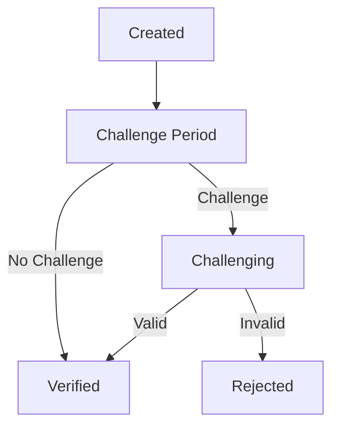
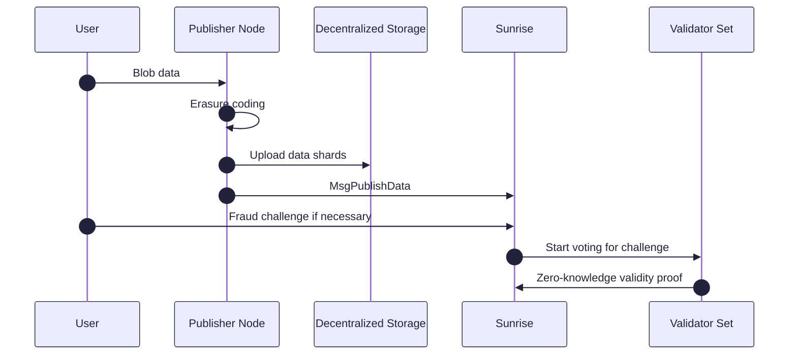

# データ可用性

Sunriseデータ可用性レイヤーは、高スループットのデータ可用性のために設計されており、アプリケーションに強化されたスケーラビリティと柔軟性を提供します。これを達成するために、SunriseはオフチェーンのBLOBデータを採用し、ブロックデータ全体ではなく、各Blobデータに対してErasure Codingを実行します。

`x/da`モジュールはこれらの機能を提供します。

## 主な特徴

SunriseのオフチェーンDA設計は、オンチェーンのセキュリティを犠牲にすることなく、比類のないスループットとコスト効率を実現します。

1. **オフチェーンのイレージャーエンコーディング**
   バリデーターの計算とストレージを劇的に削減します。オンチェーンには、これらのイレージャーコーディングされたデータ共有を指すメタデータURIのみがあり、完全なデータ再構築はオフチェーンで行われます。
2. **オフチェーンストレージ統合**
   IPFSやArweaveなどの分散型ストレージソリューションを利用して、データシャードは外部に保存されます。MsgPublishDataには、これらのイレージャーコーディングされたデータ共有を指すメタデータURIのみが含まれ、ブロブトランザクションのオンチェーンブロックサイズ要件を削減し、スケーラビリティを向上させます。

## DAの比較

| | Sunrise | Avail DA | Celestia | EigenDA | Ethereum (EIP-4844) |
| ------------------------ | --------------------------------- | --------------------- | --------------------- | ----------------- | --------------------- |
| アーキテクチャ | オフチェーンブロブを持つL1 | L1ブロックチェーン | L1ブロックチェーン | DAサービス | L1ブロックチェーン（ブロブ） |
| スループット | 5+ MB/s | 0.2 MB/s (4MB/ブロック) | 1.33 MB/s (8MB/ブロック) | 15 MB/s | 0.064 MB/s |
| ファイナリティまでの時間 | 約4分 (7秒+240秒) | 40秒 | 6秒 + 10分 | 12分 | 12分 |
| データストレージ | オフチェーンブロブ | オンチェーン | オンチェーン | 委員会ストレージ | オンチェーンブロブ |
| 証明メカニズム | オフチェーンストレージによる楽観的証明 | 有効性証明 (KZG) | 不正証明 | 有効性証明 | 有効性証明 |
| 長期的な検索可能性 | シームレス | ネイティブではない | ネイティブではない | ネイティブではない | ネイティブではない |
| コストモデル | 流動性による手数料の抽象化 | 直接手数料 | 直接手数料 | 委員会手数料 | オンチェーンガス手数料 |
| コンセンサス | プルーフ・オブ・リクイディティ | Babe & Grandpa (NPoS) | Tendermint | N/A | Ghost & Casper |

## 設計概要

### 他のDAレイヤーの設計パターン

1. **データ可用性委員会**

    データ可用性委員会（DAC）は、低コストで代替のデータ可用性レイヤーを構築するための従来の方法です。

    しかし、DACでは、クライアントが委員会によって証明されたデータ可用性が真か偽かを、ブロブデータ全体をダウンロードせずに検証することは不可能です。

2. **データ可用性サンプリング**

    データ可用性サンプリング（DAS）を採用するデータ可用性レイヤーでは、ブロックデータはイレージャーコーディングのために処理されます。その後、クライアントはブロックデータの一部をダウンロードするだけでデータ可用性を検証でき、マークルツリー構造を使用してブロック内のブロブデータの包含を検証できます。

    一般的なDASのセットアップでは、フルノードはmempool内のトランザクションデータを転送およびダウンロードする必要があります。

    ブロブデータのサイズが大きくなるにつれて、ネットワークのスループットはこれらのトランザクション転送によって制限される可能性があり、大きなブロブデータを扱うアプリケーションにとって課題となります。

### Sunriseの設計

DACとDASにおけるこれらの問題に対処するために、Sunriseは次の解決策を実装しています。

1. **オフチェーンのイレージャーエンコーディング**
   バリデーターの負荷を軽減するために、ブロブデータはオフチェーンプログラムでイレージャーコーディングのために処理されます。
2. **ブロブデータのシャーディング**
   ブロックデータ全体ではなく、各ブロブがイレージャーコーディングのために処理されます。クライアントは、データ全体をダウンロードすることなく、シャードのダウンロードを繰り返すだけで各ブロブのデータ可用性を検証できます。クライアントはまた、マークルツリー構造を使用してブロック内のブロブの包含を検証できます。
3. **外部ストレージ**
   ブロブデータは、IPFSやArweaveなどの分散型ストレージプラットフォームに保存されます。ブロブデータをオンチェーンに含む代わりに、MsgPublishDataはイレージャーコーディングされたデータ共有を指すメタデータURIを保持します。

    ```protobuf
    message MsgPublishData {
      option (cosmos.msg.v1.signer) = "sender";
      string sender = 1 [(cosmos_proto.scalar) = "cosmos.AddressString"];
      string metadata_uri = 2;
      uint64 parity_shard_count = 3;
      repeated bytes shard_double_hashes = 4;
      string data_source_info = 5;
    }
    ```

    データ可用性は楽観的な方法で証明されます。Sunriseネットワークに十分な無効性の異議が提出された場合、バリデーターは二重ハッシュ化されたシャードデータ（`shard_double_hashes`）を使用してゼロ知識証明（ZKP）を提出し、バリデーターがシャードデータを明らかにすることなくその存在を検証できるようにします。

### 証明のライフサイクル

提出されたデータは、次のいずれかのステータスになります。

- **作成済み** → **異議申し立て期間** → **異議申し立て中** → **検証済み** / **拒否済み**

- **異議申し立て期間:** 提出後、データはこのステータスで一定期間維持されます。十分な無効性の異議が提出された場合、「異議申し立て中」に移行します。それ以外の場合は、「検証済み」になります。
- **異議申し立て中:** バリデーターはデータを検証し、証明を提出します。検証されたシャードが基準を満たす場合、「検証済み」になります。そうでない場合は、「拒否済み」になります。
- **検証済み:** メタデータURIがブロックに含まれ、外部から参照できます。
- **拒否済み:** データは無効と判断され、ブロックには含まれません。



### 証明の流れ



## ゼロ知識証明システム

### 用語と表記

- ハッシュ関数: $$H$$
- バリデーターのセット: $$ V $$
- データシャードのセット: $$ S_d $$
- パリティシャードのセット: $$ S_p $$
- シャードのセット: $$ S $$

$$
  S = S_d \cup S_p
$$

### 概要

このシステムは、$$ H(s_i) $$を公開せずにデータシャードハッシュ$$ H(s_i) $$の所有を検証します。
この回路は、1つのシャード$ s \in S $用です。

1. 公開入力
  
    $$ H\_{\text{public}}^2(s)$$

2. プライベート入力

    $$ H\_{\text{private}}(s) $$

3. 回路制約

    $$
      H_{\text{public}}^2(s) = H(H_{\text{private}}(s))
    $$

## データ可用性の条件

### 表記

- レプリケーション係数（データシャードのみに基づく）: $$ r $$
- レプリケーション係数（パリティシャードを含む場合に基づく）: $$ r_p $$

$$
  r_p = r \frac{|S_d|}{|S_d| + |S_p|}
$$

- 各バリデーターが関与するシャードの数: $$ n $$

$$
  n = \text{ceil}\left( r_p \frac{|S_d| + |S_p|}{|V|} \right) = \text{ceil} \left( r\frac{|S_d|}{|V|} \right)
$$

### 各シャードがデータ可用性を証明するための要件

- このシャードに関与するバリデーターからのシャード`s`の有効な証明のセット: $$ Z_s $$

$$
  \frac{|Z_s|}{r_p} \ge \frac{2}{3}
$$

- この条件を満たすシャードのセット: $$ S^\text{available} $$

### データ可用性を証明するための集計の要件

$$
\begin{aligned}
  \frac{|S^\text{available}|}{|S|} &\ge \frac{|S_d|}{|S_d| + |S_p|} \\
\Rightarrow |S^\text{available}| &\ge |S_d|
\end{aligned}
$$

#### パラメータの例

- 10人のバリデーター: $$ v_1 , ..., v_{10} $$
- 20個のシャード: $$ s_1, ..., s_{20} $$
  - 10個のデータシャード
  - 10個のパリティシャード
- $$ r = 6 $$
- $$ r_p = 6 \times \frac{10}{10 + 10} = 3 $$
- 各バリデーターは6つのシャード証明を提出します
  - $$ 3 \times \frac{20}{10} = 6 $$

#### ケースA：有効なシャード`s_1`

- バリデーター$$ v_1 $$, $$ v_3 $$および$$ v_9 $$の証明には、シャード$$ s_1 $$と他の5つのシャードが含まれます
- バリデーター$$ v_3 $$は、証明にシャード$$ s_1 $$の有効性を含めることに失敗しました
- しかし、バリデーター$$ v_1 $$と$$ v_9 $$は証明にシャード$$ s_1 $$の有効性を含めることに成功したため、
  - $$ |Z\_{s_1}| = 2 $$
  - $$ \frac{|Z\_{s_1}|}{r_p} \ge \frac{2}{3} $$を満たします

#### ケースB：無効なシャード`s_2`

- バリデーター$$ v_2 $$, $$ v_4 $$および$$ v_{10} $$の証明には、シャード$$ s_2 $$と他の5つのシャードが含まれます
- バリデーター$$ v_2 $$と$$ v_4 $$は、証明にシャード$$ s_2 $$の有効性を含めることに失敗しました
- バリデーター$$ v_{10} $$のみが証明にシャード$$ s_2 $$の有効性を含めることに成功したため、
  - $$ |Z\_{s_2}| = 1 $$
  - $$ \frac{|Z\_{s_2}|}{r_p} \ge \frac{2}{3} $$を満たしません

#### ケースX：シャードs_1、s_3-s_11は上記の条件で有効です

- $$ |S^\text{available}| = 10 $$
- $$ |S_d| = 10 $$
- $$ |S^\text{available}| \ge |S_d| $$を満たします

#### ケースY：上記の条件で有効なのはシャードs_1、s_3のみです

- $$ |S^\text{available}| = 2 $$
- $$ |S_d| = 10 $$
- $$ |S^\text{available}| \ge |S_d| $$を満たしません

## パラメータ

| パラメータ | デフォルト | 単位 | 説明 |
| --------------------- | ---------- | ------ | --------------------------------------------------------------------- |
| publish_data_gas | 1,000,000 | gas | データ公開のガス代 |
| challenge_threshold | 0.33 | 比率 | チャレンジ期間に入るために必要な無効性チャレンジのしきい値 |
| replication_factor | 5.0 | コピー | データシャードのレプリカ数 |
| slash_epoch | 120,960 | ブロック | スラッシュ判断のエポック期間（約1週間） |
| slash_fault_threshold | 0.5 | 比率 | バリデーターのスラッシュを引き起こす無効な証明のしきい値 |
| slash_fraction | 0.001 | 比率 | スラッシュ中の投票力の削減率 |
| challenge_period | 4分 | 時間 | データ公開後のチャレンジ期間 |
| proof_period | 10分 | 時間 | チャレンジ後の証明提出期間 |

## メッセージ

このモジュールは、さまざまなメッセージタイプを提供します。

- MsgUpdateParams：モジュールパラメータの更新（ガバナンス操作）
- MsgPublishData：メタデータURIとシャード情報を含むデータを公開
- MsgSubmitInvalidity：特定のインデックスのデータの無効性を報告
- MsgSubmitValidityProof：バリデーターから有効性証明を提出
- MsgRegisterProofDeputy：バリデーターの証明代理人を登録
- MsgUnregisterProofDeputy：証明代理人の登録を解除

## クエリ

このモジュールは、さまざまなクエリエンドポイントを提供します。

- Params：モジュールパラメータのクエリ
- PublishedData：特定のメタデータURIの公開データの詳細を取得
- AllPublishedData：すべての公開データを一覧表示
- ValidityProof：特定のバリデーターから有効性証明を取得
- AllValidityProofs：特定のメタデータURIのすべての有効性証明を一覧表示
- Invalidity：特定のメタデータURIと送信者の無効性レポートを取得
- AllInvalidity：特定のメタデータURIのすべての無効性レポートを一覧表示
- ValidatorShardIndices：特定のバリデーターのシャードインデックスを取得
- ZkpProofThreshold：特定のシャード数のZKP証明のしきい値を取得
- ProofDeputy：特定のバリデーターの証明代理人を取得

詳細については、[Github](https://github.com/sunriselayer/sunrise/tree/main/x/da)を参照してください。
