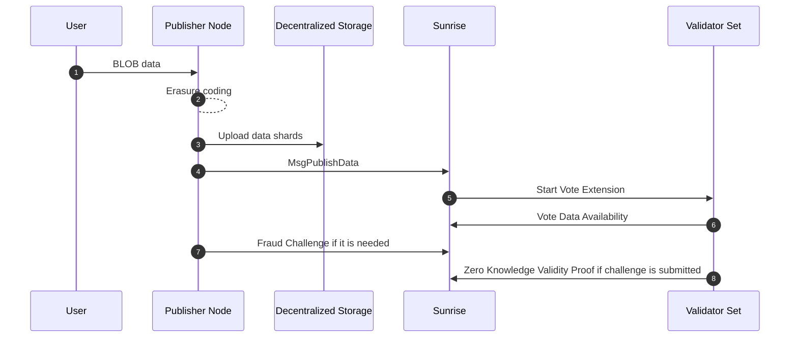

# Blob

非推奨となった`x/blob`モジュールは、Sunrise の Celestia 互換モジュールです。

このモジュールにより、L2 オペレーターは Sunrise ネットワークにデータをポストすることができます。データは L2 のトランザクションが L1 ブロックチェーンで Finalize（確定）されるまで Sunrise ネットワークに保存されます。

## Off Chain Blob Data (Data Availability v2)

Proof of Liquidity に特化した DA Layer として Sunrise v1 の立ち上げに成功した後、Sunrise v2 で Blob 機能をアップグレードし、フルオンチェーン AI やゲーム、ソーシャルなどのユースケースに対応した Data Availability を実現します。Gluon が Sunrise DA を使用して、最初にフルオンチェーン AI を実現する場となります。

詳細は [Github](https://github.com/sunriselayer/sunrise/tree/main/x/da) をご覧ください。

Sunrise v1 のアーキテクチャでは、`data_hash`が 2-dimension Reed Solomon encoding（2 次元リード・ソロモン符号化による消失訂正データ）のマークルルートに置き換えられています。ここでのデータとは、ブロック内のトランザクションデータを指します。Data Availability Sampling（DAS: データ可用性サンプリング）技術は、ライトノードがブロック全体のデータをダウンロードすることなくデータ可用性を検証できるようにすることで、大きなブロックを持つフルノードの運用コストを軽減する役割を果たします。

[`CometBFT types.proto`](https://github.com/cometbft/cometbft/blob/main/proto/cometbft/types/v1/types.proto)

```protobuf
// Header defines the structure of a block header.
message Header {
  // basic block info
  cometbft.version.v1.Consensus version  = 1 [(gogoproto.nullable) = false];
  string                        chain_id = 2 [(gogoproto.customname) = "ChainID"];
  int64                         height   = 3;
  google.protobuf.Timestamp     time     = 4 [(gogoproto.nullable) = false, (gogoproto.stdtime) = true];

  // prev block info
  BlockID last_block_id = 5 [(gogoproto.nullable) = false];

  // hashes of block data
  bytes last_commit_hash = 6;  // commit from validators from the last block
  bytes data_hash        = 7;  // transactions

  // hashes from the app output from the prev block
  bytes validators_hash      = 8;   // validators for the current block
  bytes next_validators_hash = 9;   // validators for the next block
  bytes consensus_hash       = 10;  // consensus params for current block
  bytes app_hash             = 11;  // state after txs from the previous block
  bytes last_results_hash    = 12;  // root hash of all results from the txs from the previous block

  // consensus info
  bytes evidence_hash    = 13;  // evidence included in the block
  bytes proposer_address = 14;  // original proposer of the block
}
```

この設計では、すべてのフルノードが mempool にあるトランザクションデータを転送しダウンロードする必要があります。`BlobTx`のサイズが大きくなると、ネットワークのスループットは mempool 内のトランザクション転送によって制限されます。これは、フルオンチェーン AI、ゲーム、ソーシャルなど、分散型アプリケーション上で大規模な BLOB データを使用するための DA 技術の適用の障害となります。

この問題を軽減するために、以下の対策を行います：

1. 消失訂正された BLOB データを生成するための Erasure Encoding（消失訂正符号化）のオフチェーン実行
2. IPFS や Arweave などのオフチェーン分散型ファイル転送システム/ストレージの使用

この新しい設計では、`MsgPublishData`に消失訂正されたデータシェアの URI を含むメタデータの URI が含まれます。この値は、IPFS `"ipfs://[ipfs-cid]"` や Arweave `"ar://[hash]"` などの分散型ストレージ/ファイル転送システムの URI であることが想定されます。これは`BlobTx`に含まれないため、blob データは Sunrise のオンチェーンには存在しません。

コンセンサスネットワークでは、もはや消失訂正符号化は実行されません。消失訂正されたシャードデータのダブルハッシュのみが`MsgPublishData`に含まれます。

```protobuf
message MsgPublishData {
  option (cosmos.msg.v1.signer) = "sender";
  string sender = 1;
  string metadata_uri = 2;
  repeated bytes shard_double_hashes = 3;
}

message Metadata {
  uint64 shard_size = 1;
  uint64 shard_count = 2;
  repeated string shard_uris = 3;
}
```

データ可用性はゼロ知識証明を使用して証明されます。具体的には、`shard_double_hashed` を用いて、バリデーターがシャードデータを開示せずにそのハッシュを知ることができることを証明します。
現在、この処理は [Vote Extension of ABCI 2.0](https://docs.cosmos.network/main/build/abci/vote-extensions)で行われることが想定されています。
この設計では、IPFS や Arweave などの外部ストレージ/ファイルシステムを使用することで、「長期的なデータ取得可能性」の制御が容易になります。一方で、データ可用性を提供する他のエコシステムでは長期的なデータ取得可能性が保証されていません。これは、Optimistic Rollups の Fraud Proofs（不正証明）のチャレンジ期間後や、ZK Rollups の Validity Proofs（有効性証明）の提出後には、トランザクションデータを保持する必要がないためです。
結論として、以下の利点があります：

- ブロックサイズの増加によりネットワークのスループットが向上します
- 長期的なデータ取得可能性を容易に制御できます
  - フルオンチェーン AI、ゲーム、ソーシャルなどのアプリケーションが実現可能になります
- ネットワークの分散化が改善されます



## ゼロ知識証明の仕様

### 用語と表記法

- The hash function: $$H$$
- Set of validators: $$ V $$
- Set of data shards: $$ S_d $$
- Set of parity shards: $$ S_p $$
- Set of shards: $$ S $$

$$
  S = S_d \cup S_p
$$

### 概要

このシステムは、データシャードのハッシュ$$ H(s_i) $$を公開することなく、$$ H(s_i) $$の所有を検証します。

### ゼロ知識証明システム

この回路は 1 つのシャード $$ s \in S $$ に対するものです。

#### 公開入力

- $$ H\_{\text{public}}^2(s)$$

#### プライベート入力

- $$ H\_{\text{private}}(s) $$

#### 回路の制約条件

$$
  H_{\text{public}}^2(s) = H(H_{\text{private}}(s))
$$

## データ可用性の条件

### 表記法

- データシャードのみに基づくレプリケーション係数: $$ r $$
- パリティシャードを含むレプリケーション係数: $$ r_p $$

  $$
    r_p = r \frac{|S_d|}{|S_d| + |S_p|}
  $$

- バリデータ `v` によって提出された証明の集合: $$ Z_v $$

  $$
    \forall v \in V, \ |Z_v| = r_p \frac{|S_d| + |S_p|}{|V|} = r\frac{|S_d|}{|V|}
  $$

シャード s の Valid Proof の集合: $$ Z_s $$

### データ可用性を証明するための各シャードの要件

$$
  \frac{|Z_s|}{r_p} \ge \frac{2}{3}
$$

次の条件を満たすシャードの集合は以下のようになります:

$$
  S^\text{available}
$$

### データ可用性を証明するための集計の要件

$$
\begin{aligned}
  \frac{|S^\text{available}|}{|S|} &\ge \frac{|S_d|}{|S_d| + |S_p|} \\
\Rightarrow |S^\text{available}| &\ge |S_d|
\end{aligned}
$$

#### パラメーター例

- 10 validators: $$ v*1 , ..., v*{10} $$
- 20 shards: $$ s*1, ..., s*{20} $$
  - 10 data shards
  - 10 parity shards
- $$ r = 6 $$
- $$ r_p = 6 \times \frac{10}{10 + 10} = 3 $$
- Each validator submits 6 shards proofs
  - $$ 3 \times \frac{20}{10} = 6 $$

#### ケース A: 有効なシャード s_1

- バリデータ $$ v_1 $$、$$ v_3 $$ および $$ v_9 $$ の証明には、シャード $$ s_1 $$ と他の 5 つのシャードが含まれている
- バリデータ $$ v_3 $$ はその証明にシャード $$ s_1 $$ の有効性を含めることに失敗した
- しかし、バリデータ $$ v_1 $$ と $$ v_9 $$ はその証明にシャード $$ s_1 $$ の有効性を含めることに成功した場合、

- Validator $$ v_1 $$, $$ v_3 $$ and $$ v_9 $$ 's proof contain shard $$ s_1 $$ and other 5 shards
- Validator $$ v_3 $$ failed to contain the validity of shard $$ s_1 $$ in its proof
- However validator $$ v_1 $$ and $$ v_9 $$ succeeded to contain the validity of shard $$ s_1 $$ in its proof, then
  - $$ |Z\_{s_1}| = 2 $$
  - It satisfies $$ \frac{|Z\_{s_1}|}{r_p} \ge \frac{2}{3} $$

#### ケース B: 無効なシャード `s_2`

- バリデータ $$ v*2 $$、$$ v_4 $$ および $$ v*{10} $$ の証明には、シャード $$ s_2 $$ と他の 5 つのシャードが含まれている
- バリデータ $$ v_2 $$ と $$ v_4 $$ はその証明にシャード $$ s_2 $$ の有効性を含めることに失敗した
- バリデータ $$ v\_{10} $$ のみがその証明にシャード $$ s_2 $$ の有効性を含めることに成功した場合、
  - $$ |Z\_{s_2}| = 1 $$
  - It doesn't satisfy $$ \frac{|Z\_{s_2}|}{r_p} \ge \frac{2}{3} $$

#### ケース X: シャード s_1、s_3-s_11 が上記の条件で有効である場合

- $$ |S^\text{available}| = 10 $$
- $$ |S_d| = 10 $$
- これは $$ |S^\text{available}| \ge |S_d| $$ を満たす

#### ケース Y: 上記の条件で有効なシャードが s_1、s_3 のみの場合

- $$ |S^\text{available}| = 2 $$
- $$ |S_d| = 10 $$
- これは $$ |S^\text{available}| \ge |S_d| $$を満たさない

## ## オンチェーン DA 認証 と オフチェーン DA 認証 の比較

|                                          | On-chain DA attestation              | Off-chain DA attestation |
| ---------------------------------------- | ------------------------------------ | ------------------------ |
| Data Corruption Durability               | 〇                                   | 〇                       |
| Tx Mempool Scalability                   | ×                                    | 〇                       |
| Data Retrievability Control              | ×                                    | 〇                       |
| Validators Load Mitigation               | ×                                    | 〇                       |
| False-Positive DA Attestation Resistance | 〇                                   | 〇※                      |
| Examples                                 | Celestia, Avail, EigenDA, Sunrise V1 | Sunrise V2, Walrus, 0G   |

### Data Corruption Durability（データ破損耐久性）

### Tx Mempool Scalability（トランザクションメムプールのスケーラビリティ）

### Data Retrievability Control（データ取得可能性の制御）

### Validators Load Mitigation（バリデータの負荷軽減）

### False-Positive DA Attestation Resistance（偽陽性 DA アテステーションへの耐性）
