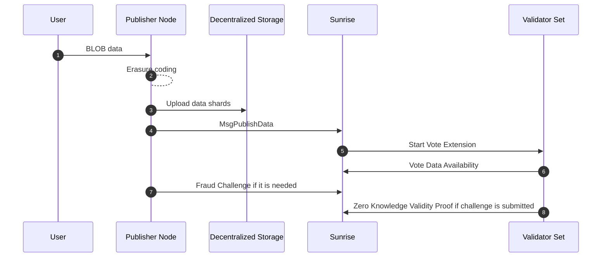

# Blob

`x/blob`モジュールは、Sunrise の非推奨となった Celestia 互換モジュールです。

このモジュールにより、L2 オペレーターは Sunrise ネットワークにデータを投稿できます。データは L1 ブロックチェーンで L2 トランザクションが Finalize（確定）するまで、Sunrise ネットワークに保存されます。

## Off Chain Blob Data（ブロックチェーン外部ブロブデータの公開検証性） (Data Availability v2)

Proof of Liquidity のための特殊な Data Availability Layer（ブロックチェーンのデータ可用性レイヤー）として Sunrise v1 の立ち上げに成功した後、Sunrise v2 で BLOB 機能のアップグレードを導入し、フルオンチェーンの AI やゲーム、ソーシャルサービスなどのデータ可用性のユースケースを実現します。Gluon が Sunrise DA を使用してフルオンチェーン AI を最初に実現する場所となります。

Sunrise v1 のアーキテクチャでは、`data_hash`が 2-dimension Reed Solomon encoding（2 次元リードソロモン符号化）による erasure-coded data（消失訂正符号化データ）のマークルルートに置き換えられます。ここでのデータはブロック内のトランザクションデータを指します。Data Availability Sampling technology（データ可用性サンプリング技術）により、ライトノードがブロック全体をダウンロードせずにデータ可用性を検証できるようになり、大きなブロックを持つフルノードの運用コストを軽減します。

[`CometBFT types.proto`](https://github.com/cometbft/cometbft/blob/main/proto/cometbft/types/v1/types.proto)

```protobuf
// Header defines the structure of a block header.
message Header {
  // basic block info
  cometbft.version.v1.Consensus version  = 1 [(gogoproto.nullable) = false];
  string                        chain_id = 2 [(gogoproto.customname) = "ChainID"];
  int64                         height   = 3;
  google.protobuf.Timestamp     time     = 4 [(gogoproto.nullable) = false, (gogoproto.stdtime) = true];

  // prev block info
  BlockID last_block_id = 5 [(gogoproto.nullable) = false];

  // hashes of block data
  bytes last_commit_hash = 6;  // commit from validators from the last block
  bytes data_hash        = 7;  // transactions

  // hashes from the app output from the prev block
  bytes validators_hash      = 8;   // validators for the current block
  bytes next_validators_hash = 9;   // validators for the next block
  bytes consensus_hash       = 10;  // consensus params for current block
  bytes app_hash             = 11;  // state after txs from the previous block
  bytes last_results_hash    = 12;  // root hash of all results from the txs from the previous block

  // consensus info
  bytes evidence_hash    = 13;  // evidence included in the block
  bytes proposer_address = 14;  // original proposer of the block
}
```

この設計では、すべてのフルノードが単純に mempool（メモリプール）内のトランザクションデータを転送およびダウンロードする必要があります。`BlobTx`（Blob トランザクション）のサイズが大きくなると、ネットワークのスループットは mempool（メモリプール）内のトランザクション転送によって制限されます。これは、完全オンチェーンの AI、ゲーム、ソーシャルなど、分散アプリケーションでの大規模 BLOB データの使用にデータ可用性技術を適用する際の障害となります。

このボトルネックを緩和するために、以下の対策を行います：

1. erasure-coded BLOB data（消失訂正符号化 BLOB データ）を生成するための erasure encoding（消失訂正符号化）のオフチェーン実行
2. IPFS や Arweave などのオフチェーン分散ファイル転送システム/ストレージの使用

この新しい設計では、`MsgPublishData`は消失訂正符号化されたデータシェアの URI を持つメタデータの URI を含みます。この値は IPS の`"ipfs://[ipfs-cid]"`や Arweave の`"ar://[hash]"`などの分散ストレージ/ファイル転送システムの URI であると想定され、`BlobTx`には含まれないため、blob データは Sunrise のオンチェーンには存在しません。

```protobuf
message MsgPublishData {
  option (cosmos.msg.v1.signer) = "sender";
  string sender = 1;
  string metadata_uri = 2;
  repeated bytes shard_double_hashes = 3;
}

message Metadata {
  uint64 shard_size = 1;
  uint64 shard_count = 2;
  repeated string shard_uris = 3;
}
```

データ可用性はゼロ知識証明を使用して証明されます。具体的には、`shard_double_hashed` を用いて、バリデーターがシャードデータを開示せずにそのハッシュを知ることができることを証明します。
現在、この処理は [Vote Extension of ABCI 2.0](https://docs.cosmos.network/main/build/abci/vote-extensions)で行われることが想定されています。
この設計では、IPFS や Arweave などの外部ストレージ/ファイルシステムを使用することで、「長期的なデータ取得可能性」("long term Data Retrievability")を簡単に制御できます。一方で、他のデータ可用性を提供するエコシステムでは長期的なデータ取得可能性が保証されていません。これは、Optimistic Rollups の 不正証明(fraud proofs)のチャレンジ期間後や、ZK Rollups の有効性証明(validity proofs)の提出後には、トランザクションデータを保持する必要がないためです。
結論として、以下の利点があります：

- ブロックサイズの増加によりネットワークのスループットが向上します
- 長期的なデータ取得可能性を容易に制御できます
  - フルオンチェーン AI、ゲーム、ソーシャルなどのアプリケーションが実現可能になります
- ネットワークの分散化が改善されます



## Specification for Zero-Knowledge Proof（ゼロ知識証明の仕様）

### Terms and Notation（用語と表記法）

- The hash function: $$H$$
- Set of validators: $$ V $$
- Set of data shards: $$ S_d $$
- Set of parity shards: $$ S_p $$
- Set of shards: $$ S $$

$$
  S = S_d \cup S_p
$$

### 概要

このシステムは、データシャードのハッシュ$$ H(s_i) $$を公開することなく、$$ H(s_i) $$の所有を検証します。

### Zero-Knowledge Proof System

この回路は 1 つのシャード $$ s \in S $$ に対するものです。

#### Public Inputs（公開入力）

- $$ H\_{\text{public}}^2(s)$$

#### Private Inputs（秘密入力）

- $$ H\_{\text{private}}(s) $$

#### Circuit Constraints（回路の制約条件）

$$
  H_{\text{public}}^2(s) = H(H_{\text{private}}(s))
$$

## The condition of Data Availability（データ可用性の条件）

### Notations（表記法）

- Replication Factor (Based only on data shards): $$ r $$
- Replication Factor (Based on including parity shards): $$ r_p $$

$$
  r_p = r \frac{|S_d|}{|S_d| + |S_p|}
$$

- Set of proofs submitted by a validator `v`: $$ Z_v $$

$$
  \forall v \in V, \ |Z_v| = r_p \frac{|S_d| + |S_p|}{|V|} = r\frac{|S_d|}{|V|}
$$

- Set of valid proofs for a shard `s`: $$ Z_s $$

### Requirements for each shard to prove Data Availability

$$
  \frac{|Z_s|}{r_p} \ge \frac{2}{3}
$$

Set of shards which satisfy this condition will be

$$
  S^\text{available}
$$

### Requirements for tally to prove Data Availability

$$
\begin{aligned}
  \frac{|S^\text{available}|}{|S|} &\ge \frac{|S_d|}{|S_d| + |S_p|} \\
\Rightarrow |S^\text{available}| &\ge |S_d|
\end{aligned}
$$

#### Example parameters

- 10 validators: $$ v*1 , ..., v*{10} $$
- 20 shards: $$ s*1, ..., s*{20} $$
  - 10 data shards
  - 10 parity shards
- $$ r = 6 $$
- $$ r_p = 6 \times \frac{10}{10 + 10} = 3 $$
- Each validator submits 6 shards proofs
  - $$ 3 \times \frac{20}{10} = 6 $$

#### Case A: valid shard `s_1`

- Validator $$ v_1 $$, $$ v_3 $$ and $$ v_9 $$ 's proof contain shard $$ s_1 $$ and other 5 shards
- Validator $$ v_3 $$ failed to contain the validity of shard $$ s_1 $$ in its proof
- However validator $$ v_1 $$ and $$ v_9 $$ succeeded to contain the validity of shard $$ s_1 $$ in its proof, then
  - $$ |Z\_{s_1}| = 2 $$
  - It satisfies $$ \frac{|Z\_{s_1}|}{r_p} \ge \frac{2}{3} $$

#### Case B: invalid shard `s_2`

- Validator $$ v_2 $$, $$ v_4 $$ and $$ v_10 $$ 's proof contain shard $$ s_2 $$ and other 5 shards
- Validator $$ v_2 $$ and $$ v_4 $$ failed to contain the validity of shard $$ s_2 $$ in its proof
- Only validator $$ v_10 $$ succeeded to contain the validity of shard $$ s_2 $$ in its proof, then
  - $$ |Z\_{s_2}| = 1 $$
  - It doesn't satisfy $$ \frac{|Z\_{s_2}|}{r_p} \ge \frac{2}{3} $$

#### Case X: shard s_1, s_3-s_11 are valid with the condition above

- $$ |S^\text{available}| = 10 $$
- $$ |S_d| = 10 $$
- It satisfies $$ |S^\text{available}| \ge |S_d| $$

#### Case Y: Only shard s_1, s_3 are valid with the condition above

- $$ |S^\text{available}| = 2 $$
- $$ |S_d| = 10 $$
- It doesn't satisfy $$ |S^\text{available}| \ge |S_d| $$

## Comparison Between On-chain DA attestation and Off-chain DA attestation

|                                          | On-chain DA attestation              | Off-chain DA attestation |
| ---------------------------------------- | ------------------------------------ | ------------------------ |
| Data Corruption Durability               | 〇                                   | 〇                       |
| Tx Mempool Scalability                   | ×                                    | 〇                       |
| Data Retrievability Control              | ×                                    | 〇                       |
| Validators Load Mitigation               | ×                                    | 〇                       |
| False-Positive DA Attestation Resistance | 〇                                   | 〇※                      |
| Examples                                 | Celestia, Avail, EigenDA, Sunrise V1 | Sunrise V2, Walrus, 0G   |

### Data Corruption Durability

### Tx Mempool Scalability

### Data Retrievability Control

### Validators Load Mitigation

### False-Positive DA Attestation Resistance
