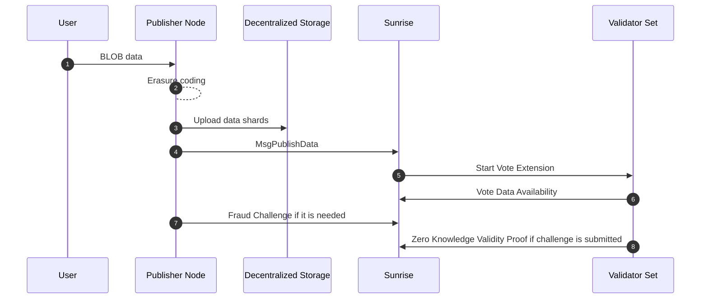

# データ可用性

Sunrise v2は高スループットのデータ可用性のために設計され、アプリケーションに向上したスケーラビリティと柔軟性を提供します。これを達成するために、Sunrise v2はオフチェーンのBLOBデータを採用し、ブロック全体のデータではなく各Blobデータに対してErasure Codingを実行します。

## Sunrise v2の主な特徴

Sunrise v2のいくつかの強化により、スループット、分散化、長期的なデータ取得可能性が向上します：

- **オフチェーンイレージャーエンコーディング:** BLOBデータはオフチェーンでイレージャーコード化され、バリデーターの計算負荷とストレージ負荷を最小限に抑えます。

- **オフチェーンストレージ統合:** IPFSやArweaveなどの分散型ストレージソリューションを活用し、データシャードは外部に保存されます。MsgPublishDataにはこれらのイレージャーコード化されたデータシェアを指すメタデータURIのみが含まれ、Blobトランザクションのオンチェーンブロックサイズ要件を削減し、スケーラビリティを向上させます。

## 他のDAレイヤーの設計パターン

### データ可用性委員会

データ可用性委員会（DAC）は、低コストで代替データ可用性レイヤーを構築する従来の方法です。

しかし、DACでは、クライアントがBLOBデータ全体をダウンロードせずに、委員会によって証明されたデータ可用性が真実か偽りかを検証することは不可能です。

### データ可用性サンプリング

データ可用性サンプリング（DAS）を採用したデータ可用性レイヤーでは、ブロックデータがイレージャーコーディングのために処理されます。そして、クライアントはブロックデータの一部のみをダウンロードすることでデータ可用性を検証でき、マークルツリー構造を使用してブロック内のBLOBデータの包含を検証できます。

典型的なDASセットアップでは、フルノードはメンプール内のトランザクションデータを転送しダウンロードする必要があります。

BLOBデータサイズが大きくなるにつれて、ネットワークのスループットはこれらのトランザクション転送によって制限される可能性があり、大きなBLOBデータを扱うアプリケーションに課題を生じさせます。

### Sunriseの設計

DACとDASのこれらの問題に対処するために、Sunrise v2は次のソリューションを実装しています：

1. オフチェーンイレージャーエンコーディング：Blobデータはバリデーターの負荷を軽減するためにオフチェーンプログラムでイレージャーコーディングのために処理されます。
1. BLOBデータシャーディング：ブロック全体のデータではなく各BLOBデータがイレージャーコーディングのために処理されます。クライアントはデータ全体をダウンロードすることなく、シャードをダウンロードする作業を繰り返すだけで各BLOBデータのデータ可用性を検証できます。クライアントはまた、マークルツリー構造を使用してブロック内のBLOBの包含を検証できます。
1. 外部ストレージ：Blobデータは、IPFSやArweaveなどの分散型ストレージプラットフォームに保存されます。オンチェーンにblobデータを含めるのではなく、MsgPublishDataはイレージャーコード化されたデータシェアを指すメタデータURIを保持します。

```protobuf
message MsgPublishData {
  option (cosmos.msg.v1.signer) = "sender";
  string sender = 1 [(cosmos_proto.scalar) = "cosmos.AddressString"];
  string metadata_uri = 2;
  uint64 parity_shard_count = 3;
  repeated bytes shard_double_hashes = 4;
  string data_source_info = 5;
}
```

データ可用性は楽観的な方法で証明されます。不正証明がSunriseネットワークに提出された場合、バリデーターはダブルハッシュされたシャードデータ（`shard_double_hashes`）を使用してゼロ知識証明（ZKP）を提出し、それを明らかにすることなくシャードデータの存在を検証できます。この統合は[ABCI 2.0の投票拡張](https://docs.cosmos.network/main/build/abci/vote-extensions)を通じて行われます。

### 証明のフロー

提出されたデータは次のいずれかのステータスを持ちます

1. CHALLENGE_PERIOD
1. CHALLENGING
1. VERIFIED
1. REJECTED

- CHALLENGE_PERIOD
提出された後、一定期間このステータスのままとなります。閾値を超える`MsgInvalidity`でシャードが提出された場合、`CHALLENGING`に変わります。そうでなければ、`VERIFIED`になります。
- CHALLENGING
データが無効である可能性があります。バリデーターはデータが有効であることを検証し、証明を提出します。検証されたシャードが基準を満たせば`VERIFIED`になり、そうでなければ`REJECTED`になります。
タリー方法は[ゼロ知識証明の仕様](#ゼロ知識証明の仕様)で説明されています。
- VERIFIED
データのMetadataUriはブロックに取り込まれ、外部から参照できるようになります。
- REJECTED
データはバリデーターの検証の結果、無効であると判断されました。データはブロックに取り込まれません。

### Sunrise v2の利点

- **ネットワークスループットの向上：** オンチェーンストレージの必要性を減らすことで、より大きなブロックサイズが達成可能になります。
- **データ取得可能性の向上：** データをオフチェーンに保存することで、柔軟で長期的なデータ保持が可能になります。
- **ネットワーク分散化の改善：** バリデーターの負荷を軽減することで、Sunriseはより分散化されたネットワーク構造をサポートします。



## ゼロ知識証明の仕様

### 用語と表記

- ハッシュ関数: $$H$$
- バリデーターの集合: $$ V $$
- データシャードの集合: $$ S_d $$
- パリティシャードの集合: $$ S_p $$
- シャードの集合: $$ S $$

$$
  S = S_d \cup S_p
$$

### 概要

このシステムは $$ H(s_i) $$ を露出することなく、データシャードハッシュ $$ H(s_i) $$ の所有を検証します

### ゼロ知識証明システム

回路は1つのシャード $$ s \in S $$ に対するものです。

#### 公開入力

- $$ H\_{\text{public}}^2(s)$$

#### 秘密入力

- $$ H\_{\text{private}}(s) $$

#### 回路制約

$$
  H_{\text{public}}^2(s) = H(H_{\text{private}}(s))
$$

## データ可用性の条件

### 表記

- レプリケーション係数（データシャードのみに基づく）: $$ r $$
- レプリケーション係数（パリティシャードを含む）: $$ r_p $$

$$
  r_p = r \frac{|S_d|}{|S_d| + |S_p|}
$$

- 各バリデーターが関与するシャードの数: $$ n $$

$$
  n = \text{ceil}\left( r_p \frac{|S_d| + |S_p|}{|V|} \right) = \text{ceil} \left( r\frac{|S_d|}{|V|} \right)
$$

### 各シャードがデータ可用性を証明するための要件

- このシャードに関与するバリデーターからのシャード `s` に対する有効な証明の集合: $$ Z_s $$

$$
  \frac{|Z_s|}{r_p} \ge \frac{2}{3}
$$

- この条件を満たすシャードの集合: $$ S^\text{available} $$

### データ可用性を証明するための集計要件

$$
\begin{aligned}
  \frac{|S^\text{available}|}{|S|} &\ge \frac{|S_d|}{|S_d| + |S_p|} \\
\Rightarrow |S^\text{available}| &\ge |S_d|
\end{aligned}
$$

#### パラメータ例

- 10バリデーター: $$ v*1 , ..., v*{10} $$
- 20シャード: $$ s*1, ..., s*{20} $$
  - 10データシャード
  - 10パリティシャード
- $$ r = 6 $$
- $$ r_p = 6 \times \frac{10}{10 + 10} = 3 $$
- 各バリデーターは6シャードの証明を提出します
  - $$ 3 \times \frac{20}{10} = 6 $$

#### ケースA: 有効なシャード `s_1`

- バリデーター $$ v_1 $$、$$ v_3 $$ および $$ v_9 $$ の証明にはシャード $$ s_1 $$ と他の5シャードが含まれています
- バリデーター $$ v_3 $$ はその証明内でシャード $$ s_1 $$ の有効性を含めることに失敗しました
- しかしバリデーター $$ v_1 $$ と $$ v_9 $$ はその証明内でシャード $$ s_1 $$ の有効性を含めることに成功しました、そのため
  - $$ |Z\_{s_1}| = 2 $$
  - これは $$ \frac{|Z\_{s_1}|}{r_p} \ge \frac{2}{3} $$ を満たします

#### ケースB: 無効なシャード `s_2`

- バリデーター $$ v*2 $$、$$ v_4 $$ および $$ v*{10} $$ の証明にはシャード $$ s_2 $$ と他の5シャードが含まれています
- バリデーター $$ v_2 $$ と $$ v_4 $$ はその証明内でシャード $$ s_2 $$ の有効性を含めることに失敗しました
- バリデーター $$ v\_{10} $$ だけがその証明内でシャード $$ s_2 $$ の有効性を含めることに成功しました、そのため
  - $$ |Z\_{s_2}| = 1 $$
  - これは $$ \frac{|Z\_{s_2}|}{r_p} \ge \frac{2}{3} $$ を満たしません

#### ケースX: シャード s_1、s_3-s_11 は上記の条件で有効

- $$ |S^\text{available}| = 10 $$
- $$ |S_d| = 10 $$
- これは $$ |S^\text{available}| \ge |S_d| $$ を満たします

#### ケースY: シャード s_1、s_3 のみが上記の条件で有効

- $$ |S^\text{available}| = 2 $$
- $$ |S_d| = 10 $$
- これは $$ |S^\text{available}| \ge |S_d| $$ を満たしません

### 各バリデーターに対するスラッシング条件

- 関与するシャードに対するバリデーター `v` からの有効な証明の集合: $$ Z_v $$

## オンチェーンDA証明とオフチェーンDA証明の比較

|                                  | オンチェーンDA証明              | オフチェーンDA証明 |
| -------------------------------- | ------------------------------ | ------------------ |
| データ破損耐久性                 | 〇                             | 〇                 |
| Txメンプールスケーラビリティ     | ×                              | 〇                 |
| データ取得可能性制御             | ×                              | 〇                 |
| バリデーター負荷軽減             | ×                              | 〇                 |
| 偽陽性DA証明耐性                 | 〇                             | 〇※                |
| 例                               | Celestia、Avail、EigenDA、Sunrise V1 | Sunrise V2、Walrus、0G |

### データ破損耐久性

オンチェーンとオフチェーンの両方のDA証明において、_データ破損耐久性_はシステムがデータの破損を検出および防止する能力を指します。

**CelestiaやSunrise V1**のようなオンチェーン証明は、データが直接オンチェーンに保存されるため、データの耐久的な可用性を確保し、データの改ざんや損失はバリデーターによって即座に検出されます。

オフチェーン証明（例えば、**Sunrise V2**）は外部システム（**IPFSやArweave**など）に依存しますが、**イレージャーコーディング**と**ゼロ知識証明**を通じてデータの整合性を検証することで、同様の耐久性を達成することができます。

### Txメンプールスケーラビリティ

_トランザクションメンプールスケーラビリティ_はオンチェーンDAシステムにおける主要な制限です。BLOBデータのサイズが大きくなるにつれて、一時的に保留中のトランザクションを保持するトランザクションメンプールが過負荷になり、スループットとスケーラビリティを制限する可能性があります。

オフチェーンDAシステムでは、大量のデータを外部に保存し、必要なハッシュやメタデータのみをオンチェーンに保存することで、この制限が軽減されます。これにより、メンプールを混雑させることなく**より大きなスケーラビリティ**と大量のデータを処理する能力が可能になります。

### データ取得可能性制御

オンチェーンDAシステムでは、_データ取得可能性_はしばしばコンセンサスメカニズムに結びついており、これはデータがコンセンサス（例えば、不正証明や有効性証明）に必要な限り利用可能である必要があることを意味します。しかし、コンセンサスが確定すると、長期的なデータ取得可能性は常に保証されるわけではありません。

**Sunrise V2**のようなオフチェーンDAシステムは、データが分散型ストレージシステム（**IPFSやArweave**など）に保存されるため、データ取得可能性に対してより柔軟な制御を提供します。これにより、**データのより長期的な保持**とデータがアクセス可能である期間の制御が向上します。

### バリデーター負荷軽減

オンチェーンDA証明は、バリデーターが直接オンチェーンでデータ可用性を検証する責任を負うため、バリデーターに_より重い負荷_をかけます。トランザクションサイズが大きくなるにつれて、バリデーターの計算およびストレージ要求が増加し、分散化を制限する可能性があります。

対照的に、オフチェーンDA証明は、データストレージと取得を外部システムに**アウトソーシング**することで、バリデーターの負荷を大幅に軽減します。バリデーターは**イレージャーコーディング**と**ゼロ知識証明**を通じてデータシャードの可用性を検証するだけでよく、これにより処理とストレージの要件が軽減されます。

### 偽陽性DA証明耐性

_偽陽性DA証明_とは、実際にはデータが利用可能でない場合に、システムが誤ってデータが利用可能であると証明する状況を指します。

**CelestiaやSunrise V1**のようなシステムで使用されるオンチェーンDA証明は、すべてのデータが直接オンチェーンに保存され検証されるため、データが利用可能でない場合に誤って主張することが困難であり、偽陽性に対する強い耐性を持っています。

**Sunrise V2**などのオフチェーンDA証明では、**ゼロ知識証明**や**イレージャーコーディング**などの暗号学的コミットメントの使用により、偽陽性耐性が維持されます。シャードデータのダブルハッシュ値を検証することで、バリデーターはデータセット全体を保存または直接アクセスする必要なく、データが確かに利用可能であることを確保できます。

ただし、_オフチェーンストレージソリューション_や_ネットワークレイテンシー_が偽陽性証明の機会を導入する可能性があるエッジケースが存在する可能性がありますが、これらは慎重な設計と検証プロセスの冗長性によって最小化されます。