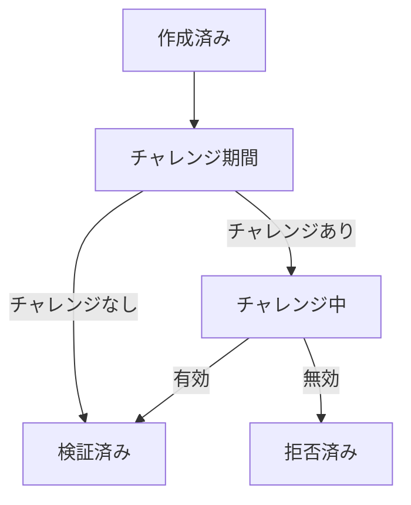
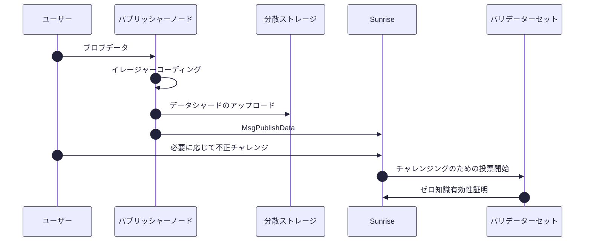

# データ可用性

> **Sunrise v2 DAの概要**
>
> - 超高速：4MBブロック、5MB/sの持続スループット、14.2秒のファイナリティ（30バリデーター）
> - 比類のないスケーラビリティを実現するオフチェーンのイレージャーコーディングとブロブ伝播
> - サブ秒単位の証明検証と即時のチャレンジ解決を実現するKZGコミットメント
> - 柔軟なストレージ：IPFS（ホット）、Arweave（パーマ）、Filecoin（シールド）

## 超高速なデータ可用性

SunriseのオフチェーンDA設計は、オンチェーンのセキュリティを犠牲にすることなく、比類のないスループットとコスト効率を実現します。

1. **オフチェーンのイレージャーコーディング**
   バリデーターの計算とストレージを劇的に削減：コード化されたシャードのみがオンチェーンに存在し、完全なデータ再構築はオフチェーンで行われます。
2. **オフチェーンのブロブ伝播**
   mempoolを軽量に保ち、**5MB/s以上**にスケールアップします。バリデーターは可用性をサンプリングし、ノードは要求に応じてブロブを取得またはプルーニングします。
3. **KZGコミットメント**
   オンチェーンの暗号学的アンカーにより、サブ秒単位の証明検証と即時のチャレンジ解決が可能になります。

## データ可用性の特徴

Sunriseは、重いデータ作業をオフチェーンに移動させながら、オンチェーンの証明を軽量で検証可能に保ちます。

1. **オフチェーンのイレージャーコーディング**
   - ブロブデータは、チェーン外で分割され、リード・ソロモン符号化されます。
   - バリデーターは、シャードごとに32バイトのダブルハッシュのみを保存し、ディスクI/Oとメモリのオーバーヘッドを削減します。
2. **オフチェーンのブロブ伝播**
   - トランザクションは、メタデータ（シャードハッシュ）のみをmempoolに運びます。
   - 完全なブロブペイロードは、ブロブネットワークを介してP2Pで配布され、持続的な**5MB/s**のスループットをサポートします。
   - ノードは要求に応じてブロブを取得またはプルーニングし、ローカルストレージを制御できます。
3. **KZG多項式コミットメント**
   - 単一のオンチェーンKZGコミットメントがすべてのシャードをバインドします。
   - 検証者は、定数サイズの証明（約48バイト）で**O(log n)**時間で包含をチェックします。
   - 迅速なチャレンジ/レスポンスサイクル（1秒未満）がデータ可用性の保証を確実にします。

## オンチェーンDA vs オフチェーンDA：比較

| | オンチェーンDAアテステーション | オフチェーンDAアテステーション（Sunrise v2） |
| --- | --- | --- |
| データ破損耐久性 | 〇 | 〇 |
| Tx Mempoolスケーラビリティ | × | 〇 |
| データ検索可能性制御 | × | 〇 |
| バリデーター負荷軽減 | × | 〇 |
| 偽陽性DAアテステーション耐性 | 〇 | 〇※ |
| 例 | Celestia、Avail、EigenDA、Sunrise V1 | Sunrise V2、Walrus、0G |

## 設計概要

### Sunrise v2の主な特徴

Sunrise v2のいくつかの機能強化により、スループット、分散化、および長期的なデータ検索可能性が向上します。

- **オフチェーンのイレージャーエンコーディング:** ブロブデータはオフチェーンでイレージャーコーディングされ、バリデーターの計算およびストレージ負荷を最小限に抑えます。
- **オフチェーンのストレージ統合:** IPFSやArweaveなどの分散型ストレージソリューションを活用し、データシャードは外部に保存されます。MsgPublishDataには、これらのイレージャーコーディングされたデータ共有を指すメタデータURIのみが含まれ、ブロブトランザクションのオンチェーンブロックサイズ要件を削減し、スケーラビリティを向上させます。

### 他のDAレイヤーの設計パターン

**1. データ可用性委員会**

データ可用性委員会（DAC）は、低コストで代替のデータ可用性レイヤーを構築するための従来の方法です。

ただし、DACでは、クライアントがブロブデータ全体をダウンロードせずに、委員会によって証明されたデータ可用性が真か偽かを検証することは不可能です。

**2. データ可用性サンプリング**

データ可用性サンプリング（DAS）を採用するデータ可用性レイヤーでは、ブロックデータはイレージャーコーディングのために処理されます。その後、クライアントはブロックデータの一部をダウンロードするだけでデータ可用性を検証でき、マークルツリー構造を使用してブロック内のブロブデータの包含を検証できます。

典型的なDASセットアップでは、フルノードはmempool内でトランザクションデータを転送およびダウンロードする必要があります。

ブロブデータのサイズが大きくなるにつれて、ネットワークのスループットはこれらのトランザクション転送によって制限される可能性があり、大きなブロブデータを扱うアプリケーションにとって課題となります。

### Sunriseの設計

DACおよびDASにおけるこれらの問題に対処するため、Sunrise v2は以下のソリューションを実装しています。

1. **オフチェーンのイレージャーエンコーディング:** バリデーターの負荷を軽減するために、ブロブデータはオフチェーンプログラムでイレージャーコーディングのために処理されます。
2. **ブロブデータのシャーディング:** ブロックデータ全体ではなく、各ブロブがイレージャーコーディングのために処理されます。クライアントは、データ全体をダウンロードすることなく、シャードのダウンロードを繰り返すだけで各ブロブのデータ可用性を検証できます。クライアントは、マークルツリー構造を使用してブロック内のブロブの包含を検証することもできます。
3. **外部ストレージ:** ブロブデータは、IPFSやArweaveなどの分散型ストレージプラットフォームに保存されます。ブロブデータをオンチェーンに含むのではなく、MsgPublishDataは、イレージャーコーディングされたデータ共有を指すメタデータURIを保持します。

## 正式な仕様

### MsgPublishData ABI

```protobuf
message MsgPublishData {
  option (cosmos.msg.v1.signer) = "sender";
  string sender = 1 [(cosmos_proto.scalar) = "cosmos.AddressString"];
  string metadata_uri = 2;
  uint64 parity_shard_count = 3;
  repeated bytes shard_double_hashes = 4;
  string data_source_info = 5;
}
```

### 証明のライフサイクル

提出されたデータには、以下のいずれかのステータスが付与されます。

- **作成済み** → **チャレンジ期間** → **チャレンジ中** → **検証済み** / **拒否済み**

- **チャレンジ期間:** 提出後、データはこのステータスで一定期間維持されます。無効性チャレンジが十分に提出されると、チャレンジ中に移行します。それ以外の場合は、検証済みになります。
- **チャレンジ中:** バリデーターはデータを検証し、証明を提出します。検証されたシャードが基準を満たす場合、検証済みになります。そうでない場合は、拒否済みになります。
- **検証済み:** メタデータURIがブロックに含まれ、外部から参照できます。
- **拒否済み:** データが無効であると判断され、ブロックに含まれません。



### 証明の流れ



### ゼロ知識証明システム

1. **回路制約:**

$$
  H_{\text{public}}^2(s) = H(H_{\text{private}}(s))
$$

2. **証明サイズ式:**

$$
\text{proof\_size} = 48\text{B} + 32\text{B} \times \lceil \log_2(n_{\text{shards}}) \rceil
$$

### スラッシングルール

バリデーター$v$について：

$$
\frac{|Z_v|}{n} < 0.67 \implies \text{slash}(v, \text{slash\_ratio})
$$

### パラメータ表

| パラメータ | デフォルト | 単位 | 説明 |
| --- | --- | --- | --- |
| publish_data_gas | 1,000,000 | gas | データ公開のガス代 |
| challenge_threshold | 0.33 | 比率 | チャレンジ期間に入るために必要な無効性チャレンジのしきい値 |
| replication_factor | 5.0 | コピー | データシャードレプリカの数 |
| slash_epoch | 120,960 | ブロック | スラッシュ判断のエポック期間（約1週間） |
| slash_fault_threshold | 0.5 | 比率 | バリデータースラッシングを引き起こす無効な証明のしきい値 |
| slash_fraction | 0.001 | 比率 | スラッシング中の投票力削減率 |
| challenge_period | 4分 | 時間 | データ公開後のチャレンジ期間 |
| proof_period | 10分 | 時間 | チャレンジ後の証明提出期間 |

## 運用詳細

### パフォーマンスメトリクス

- 4MBブロック、5MB/sの持続スループット、30バリデーターで14.2秒のファイナリティ（合成ベンチマーク）

### セキュリティストーリー

- バリデーターは有効な証明を提供できない場合スラッシュされます（上記のスラッシングルールを参照）
- DoS耐性：軽量なオンチェーン証明、オフチェーンでの重い処理
- ライトクライアント証明：定数サイズ、O(log n)の検証

### ストレージバックエンド

| バックエンド | ユースケース | 保持期間 | 注意事項 |
| --- | --- | --- | --- |
| IPFS | ホットストレージ | 短期 | 高速検索、永続的ではない |
| Arweave | 永続 | 長期 | パーマウェブ、一度払い |
| Filecoin | シールド/コールド | 中期 | シールドディール、低速アクセス |

### APIの例

```json
{
  "sender": "sunrise18...",
  "metadata_uri": "ipfs://bafybeigd...",
  "parity_shard_count": 10,
  "shard_double_hashes": ["0x4e3d...", "0xa1b2..."],
  "data_source_info": "app=gluon,blob=orderbook_batch_4711"
}
```

**REST公開の例:**

```bash
curl -X POST $NODE/api/da/v1/publish \
  -d '{
        "sender": "sunrise18...",
        "metadata_uri": "ipfs://bafybeigd...",
        "parity_shard_count": 10,
        "shard_double_hashes": [
          "0x4e3d...",
          "0xa1b2..."
        ],
        "data_source_info": "app=gluon,blob=orderbook_batch_4711"
      }'
```

### ライトクライアント検証フロー

1. ヘッダーの取得
2. KZGコミットメントの抽出
3. ランダムなシャードのサンプリング
4. シャードと証明の取得
5. KZG証明の検証、十分なシャードがあれば再構築

**擬似コード:**

```python
header = rpc.fetch_header(height)
commit  = header.kzg_commitment
samples = sample_indices(k=25, seed=header.rand)
for i in samples:
    shard, proof = rpc.get_shard(i)
    assert verify_kzg(commit, shard, proof)
```
