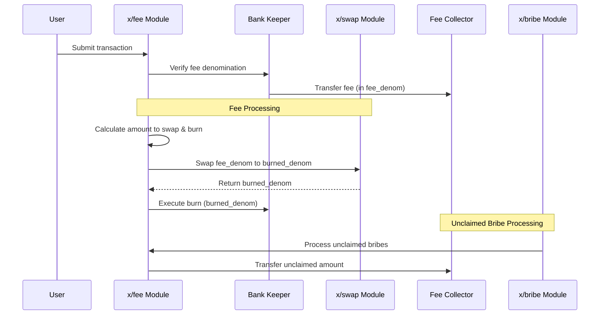

# 手数料

`x/fee`モジュールは、Sunriseブロックチェーンのコアコンポーネントであり、取引手数料の管理を担当します。指定されたステーブルコイン（`fee_denom`）で手数料を徴収し、これらの手数料の一部を$RISE（`burned_denom`）にスワップして焼却します。このモジュールは、$RISEのデフレ型トークノミクスをサポートしつつ、ユーザーに安定した手数料体系を維持します。

## `x/fee`の主な特徴

1. **焼却メカニズム:**

   - 徴収された手数料（`fee_denom`）の一部は、$RISE（`burned_denom`）にスワップされて焼却され、循環供給量を削減します。
   - 焼却率は`burn_ratio`パラメータによって決定されます（デフォルト：50%）。
   - スワップと焼却の操作はアトミックであり、オンチェーンで検証されます。

2. **手数料のデノミネーション（`fee_denom`）:**

   - 取引手数料に必要なデノミネーションを指定します（デフォルト：**`"uusdrise"`**）。
   - バイパスされない限り、取引はこのデノミネーションで手数料を支払う必要があります。
   - 手数料のデノミネーションの厳密な検証が強制されます。

3. **動的なパラメータ設定:**
   - 開発者は、モジュールによって強制される検証付きで、パラメータを動的に設定できます。
   - パラメータは、ガバナンス提案を通じて更新できます。

## コア機能

### 手数料の徴収と処理

**手数料徴収プロセス:**

1. 手数料は、`FeeCollector`モジュールアカウントを通じて`fee_denom`で徴収されます。
2. システムは以下を検証します：
   - トランザクションごとに1つの手数料デノミネーションのみ。
   - 手数料デノミネーションが、設定された`fee_denom`と一致すること。
   - 手数料額が有効で、ゼロでないこと。

**手数料処理フロー:**

1. `burn_ratio`によって決定される、徴収された手数料の一部が焼却用に指定されます。
2. この部分は、`x/swap`モジュールを介して`fee_denom`から`burned_denom`にスワップされます。
3. 結果として得られた`burned_denom`トークンは、供給から焼却されます。
4. 残りの`fee_denom`（焼却用に指定されなかった部分）は、他のプロトコル用途のために`FeeCollector`アカウントに残ります。

## パラメータ設定

> **注意:** 次のセクションでは、経験豊富なユーザーまたは開発者向けの高度なトピックについて説明します。

| パラメータ | 説明 | デフォルト値 | 制約 |
| -------------- | ------------------------------------------------------- | ------------- | ---------------------------- |
| `fee_denom` | 取引手数料に必要なデノミネーション | `"uusdrise"` | 有効なデノミネーションである必要があります |
| `burned_denom` | 手数料決済時に焼却されるデノミネーション | `"urise"` | 有効なデノミネーションである必要があります |
| `burn_ratio` | 焼却する手数料の割合 | `0.5` | 0から1の間である必要があります |

## ワークフロー：手数料処理

> **注意:** 次のセクションでは、経験豊富なユーザーまたは開発者向けの高度なトピックについて説明します。

詳細および実装の詳細については、[GitHubリポジトリ](https://github.com/sunriselayer/sunrise/tree/main/x/fee)を参照してください。
