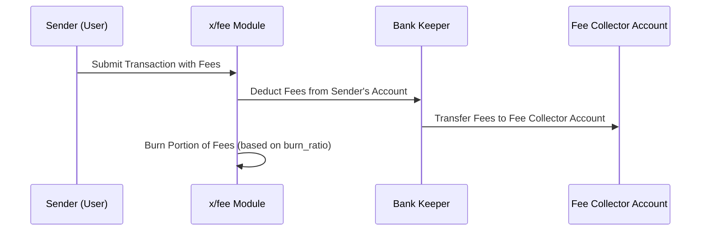

# Fee

`x/fee`モジュールはSunriseブロックチェーンの中核コンポーネントで、トランザクション手数料の管理を担当します。手数料として使用される$RISEトークンの一部をバーンするメカニズム、手数料のデノミネーション（単位）の適用、およびバイパスデノミネーションによる柔軟性を提供します。このモジュールは効率的な手数料システムを維持しながら、デフレーショナリーなトークノミクスをサポートします。

## `x/fee`の主な特徴


**レベル1: アプリ開発者向け**


1. **バーンメカニズム:**

    - トランザクション手数料として使用される$RISEトークンの一部が流通量を減らすためにバーンされます。
    - バーン比率は`burn_ratio`パラメータによって決定されます（デフォルト: 50%）。
2. **手数料デノミネーション（`fee_denom`）:**

    - トランザクション手数料に必要なデノミネーションを指定します（デフォルト: **`"urise"`**）。
    - トランザクションはバイパスされない限り、このデノミネーションで手数料を支払う必要があります。
3. **バイパスデノミネーション（`bypass_denoms`）**:

    - 特定のデノミネーションが標準的な手数料制限をバイパスすることを許可します。
    - デフォルトのバイパスデノミネーション: **`"uvrise"`**。
4. **動的パラメータ設定**:

    - 開発者はモジュールによって強制される検証を伴ってパラメータを動的に設定できます。
      

## 主要機能


**レベル3: モジュール開発者向け**


### 手数料控除とバーン

**トランザクションが処理されるとき:**

1. 手数料は送信者のアカウントから控除されます。
2. 手数料の一部は手数料コレクターモジュールアカウントに送られます。
3. 残りの部分は**`$RISE`**トークンの供給量を減らすためにバーンされます。

   ```go
   func DeductFees(bankKeeper BankKeeper, ctx sdk.Context, acc sdk.AccountI, fees sdk.Coins, feeKeeper feekeeper.Keeper) error {
   ...
   if err := feeKeeper.Burn(ctx, fees); err != nil {
   return err
   }
   ...
   }
   ```


**パラメータ設定**


**レベル2: 上級ユーザー向け**


| パラメータ                | 説明                                                                 |
|--------------------------|-----------------------------------------------------------------------------|
| 手数料デノミネーション（`fee_denom`）     | トランザクション手数料に必要なデノミネーションを指定します（デフォルト: `"urise"`）。       |
| バーン比率（`burn_ratio`）         | バーンするトランザクション手数料の割合（デフォルト: `0.5`）。`0`から`1`の間である必要があります。 |
| バイパスデノミネーション（`bypass_denoms`） | 手数料制限をバイパスするデノミネーションのリスト（デフォルト: `["uvrise"]`）。          |

**設定例:**

```json
{
  "fee_denom": "urise",
  "burn_ratio": 0.5,
  "bypass_denoms": ["uvrise"]
}
```

## 手数料モジュールの利点


**レベル1: アプリ開発者向け**


- **デフレ圧力:**
  バーンメカニズムは$RISEトークンにデフレ圧力をかけ、長期的なトークン価値をサポートします。
- **手数料の柔軟性:**
  bypass_denomsのような設定可能なパラメータは、特殊なトランザクションシナリオに対して柔軟性を提供します。
  

詳細と実装の仕様については、[GitHubリポジトリ](https://github.com/sunriselayer/sunrise/tree/main/x/fee)を参照してください。

## ワークフロー: 手数料控除とバーン


**レベル2: 上級ユーザー向け**



以下はトランザクション手数料の処理方法を示すシーケンス図です:



## 使用例


**レベル1: アプリ開発者向け**


開発者はSunrise Client JSを使用して手数料パラメータをクエリできます:

```javascript
import { SunriseClient } from "@sunriselayer/client";

async function queryFeeParams() {
    const cometRpc = "https://sunrise-test-da-1.cauchye.net/";
    const client = await SunriseClient.connect(cometRpc);
    const queryClient = client.getQueryClient();

    if (!queryClient) {
        console.error("Query client not initialized");
        return;
    }

    const feeParams = await queryClient.fee.params({});
    console.log("Fee Parameters:", feeParams.params);
}
queryFeeParams();
```

**出力例:**

```json
{
  "fee_denom": "urise",
  "burn_ratio": "0.5",
  "bypass_denoms": ["uvrise"]
}
```