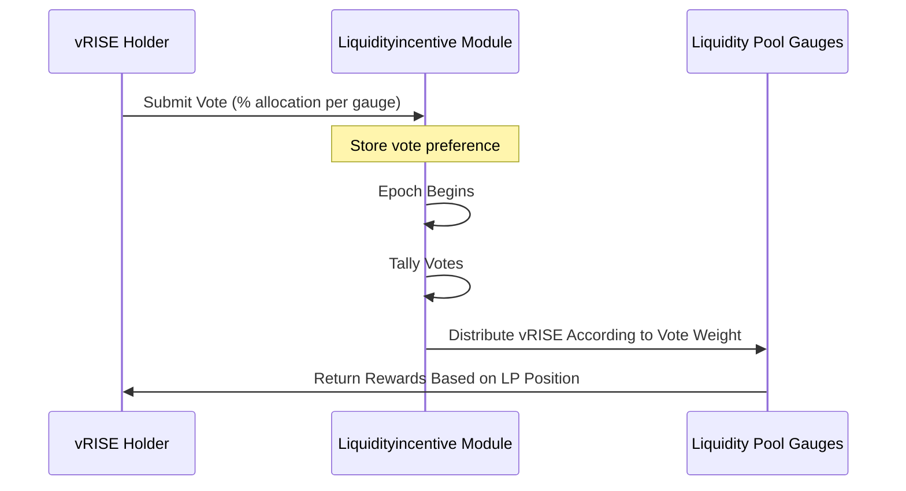

# ゲージ投票

## ゲージとは何か？


**レベル1: アプリ開発者向け**


Sunriseエコシステムにおけるゲージは、`vRISE`トークンの発行を管理するメカニズムです。現在、主要なゲージプロダクトは流動性プールシステムです。

`vRISE`保有者は、新しく発行される`vRISE`トークンの異なるゲージ間での配分を決定するために投票できます。より多くの投票パワーを集める流動性プールは、新しく発行されるvRISEトークンのより大きなシェアを受け取り、コミュニティの選好に沿ったインセンティブメカニズムを作成します。

## 投票システムの仕組み


**レベル2: 上級ユーザー向け**


### エポックベースの投票

ゲージウェイト投票はエポックシステムで運用されます：

* 各エポックは事前に定義されたブロック数にわたります（ガバナンスを通じて設定可能）
* 投票は各新しいエポックの開始時に集計されます
* 投票の重みはエポック開始時の投票者の`vRISE`残高によって決定されます
* 投票決定は明示的に変更されるまでエポック間で持続します

### 適格要件


**レベル1: アプリ開発者向け**


ゲージ投票に参加するには：

* **トークン要件**：主にプールに流動性を提供することで`vRISE`トークンを獲得する必要があります
* **残高タイミング**：エポック開始時の有効な`vRISE`残高があなたの投票パワーを決定します
* **トークンステータス**：ロックされたvRISEトークンは投票パワーにはカウントされません

`vRISE`トークンを持つ前でも投票を提出できます。次のエポックが始まるときにあなたが持っているvRISE残高に基づいて、あなたの投票選好が適用されます。

### 現在の投票ステータスの表示


**レベル2: 上級ユーザー向け**


**システムパラメータ**

* **エポックブロック数**：エポックあたりのブロック数（ガバナンスパラメータ）
* **ステーキング報酬比率**：元々ステーキングに割り当てられていた`vRISE`のうち、ゲージに転送される割合
* **投票数**：参加しているユニークな投票者の総数

**現在のエポックデータ**

* **総投票数**：すべてのゲージにわたる累積投票パワー
* **開始/終了**：現在のエポックのタイムスタンプまたはブロック高
* **前回のエポック**：前回のエポックからの履歴データ

**ゲージ分配**

投票ゲージの完全なリストは以下を示します：

* 各ゲージの累積投票パワーの合計
* 各ゲージに向けられた総投票の割合

システムは現在および前回のエポックのデータのみを保持します。それ以前のエポックからの履歴データは整理され、ブロックチェーンから取得することはできません。

## 投票方法


**レベル1: アプリ開発者向け**


### ステップ1：投票ダッシュボードにアクセスする

投票プロセスを開始するには**My Votes**をクリックします。

### ステップ2：ゲージを選択する

1. プール選択インターフェースを開くには「Select Pool」をクリックします
2. サポートしたいプール/ゲージを選択します
3. 該当する場合、前回の投票選択が自動的に読み込まれます
4. 削除ボタンをクリックして不要なゲージを削除します

### ステップ3：投票パワーを配分する

選択した各ゲージに投票パワーの割合を指定します：

- **パーセンテージベース**：配分は絶対額ではなくパーセンテージとして指定されます。これは以下の理由によります：

  * あなたのvRISE残高はエポック間で変動する可能性があります
  * パーセンテージ配分はエポック開始時の現在の残高に自動的に調整されます
  * このアプローチにより、毎エポックごとに再投票する必要がなくなります

### ステップ4：プレビューと提出

1. 「Preview Vote」機能を使用して、現在のvRISE残高がどのように分配されるかを確認します
2. 選択を確認します
3. Voteをクリックしてトランザクションを提出します
4. あなたの投票選好は変更されるまですべての将来のエポックに適用されます

### ステップ5：更新（任意）
いつでも投票を変更できます：

* エポック開始前の最新の投票決定が適用されます
* 変更は次のエポック境界で有効になります
* 選好を更新するには、投票プロセスを繰り返すだけです

## 戦略的投票の考慮事項


**レベル2: 上級ユーザー向け**


* **流動性インセンティブ**：より高い投票ウェイトを持つプールはより多くのvRISE発行を受け取ります
* **複利効果**：流動性を提供するとvRISEが獲得でき、それを使ってさらに報酬に投票できます
* **市場効率**：投票はコミュニティによって最も価値が置かれる場所に流動性を向けるのに役立ちます
* **長期計画**：投票配分はエポック間で持続し、戦略的なポジショニングを可能にします