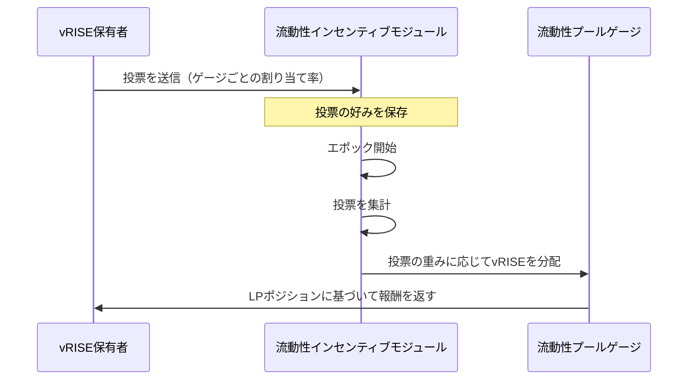

# ゲージ投票

## ゲージとは？

Sunriseエコシステムにおけるゲージは、`vRISE`トークンの発行を管理するメカニズムです。現在、主要なゲージ製品は流動性プールシステムです。

`vRISE`保有者は、異なるゲージ間で新たにミントされる`vRISE`トークンの割り当てを決定するために投票できます。より多くの投票力を集めた流動性プールは、新たに発行されるvRISEトークンのより大きなシェアを受け取り、コミュニティの好みに沿ったインセンティブメカニズムを創出します。

## 投票システムの仕組み

> **注意:** 次のセクションでは、経験豊富なユーザーまたは開発者向けの高度なトピックについて説明します。

### エポックベースの投票

ゲージの重み投票は、エポックシステムで動作します。

* 各エポックは、事前に定義された数のブロックにわたります（ガバナンスを介して設定可能）。
* 投票は、各新しいエポックの開始時に集計されます。
* 投票の重みは、エポック開始時の投票者の投票力によって決定されます。
* 新しいエポックが始まると、投票はクリアされます。

> **注意:**
> ここで説明する報酬は、特に**ゲージ投票の報酬であり、vRISEの投票力に応じて割り当てられます**。
> これらは、標準のLP報酬とは異なります。
> 報酬はユーザーのポジションに蓄積され、MsgClaimRewards (x/liquiditypool)で標準のLP報酬と同時に請求できます。

### 参加資格要件

ゲージ投票に参加するには：

* **トークン要件**: 主にプールに流動性を提供することで、`vRISE`トークンを獲得する必要があります。
* **投票力**: 投票力は、バリデーターにデリゲートすることで得られます。
* **集計タイミング:** エポック開始時の投票力が適用されます。

投票力を持つ前に投票を送信することもできます。投票の好みは、次のエポックが始まるときに持っている投票力に基づいて適用されます。

## 投票方法

### ステップ1：投票ダッシュボードにアクセス

**マイ票**をクリックして、投票プロセスを開始します。

### ステップ2：ゲージを選択

1. 「プールを選択」をクリックして、プール選択インターフェースを開きます。
2. サポートしたいプール/ゲージを選択します。
3. 該当する場合、以前の投票選択が自動的に読み込まれます。
4. 削除ボタンをクリックして、不要なゲージを削除します。

### ステップ3：投票力を割り当てる

選択した各ゲージに割り当てる投票力の割合を指定します。

* **パーセンテージベース:** 割り当ては、絶対額ではなくパーセンテージで指定されます。なぜなら：

  * vRISEの残高はエポック間で変動する可能性があるため
  * パーセンテージの割り当ては、エポック開始時の現在の残高に自動的に調整されるため
  * このアプローチにより、エポックごとに再投票する必要がなくなります

### ステップ4：プレビューして送信

1. 「投票をプレビュー」機能を使用して、現在のvRISE残高がどのように分配されるかを確認します。
2. 選択内容を確認します。
3. 「投票」をクリックして、トランザクションを送信します。
4. 変更されるまで、投票の好みは今後のすべてのエポックに適用されます。

### ステップ5：更新（オプション）

いつでも投票を変更できます。

* エポックが始まる前の最新の投票決定が適用されます。
* 変更は、次のエポックの境界で有効になります。
* 好みを更新するには、投票プロセスを繰り返すだけです。

システムの詳細については、[流動性インセンティブ](./liquidity-incentive.md)を参照してください。
