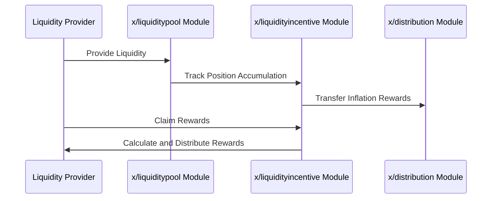

# 流動性インセンティブ

`x/liquidityincentive`モジュールは、流動性プールへの貢献に基づいて報酬を分配することで流動性提供者にインセンティブを与えます。このモジュールはエポックベースの報酬システムとゲージ投票メカニズムを使用して、報酬を動的に配分します。これにより持続可能な流動性提供を確保しながら、ユーザーがゲージ投票を通じてガバナンスに参加することを可能にします。

## 主な特徴


**レベル1: アプリ開発者向け**


1. **エポックベースの報酬分配**:
    - 報酬は各エポックの終了時に分配されます。
    - 遅延会計はクレーム時にのみ報酬を計算することで計算オーバーヘッドを最小化します。
2. **ゲージ投票**:
    - ユーザーはどの流動性プールがインセンティブを受け取るべきかについて投票できます。
    - 投票パワーは**`$vRISE`**トークン（譲渡不可のステーキングトークン）によって決定されます。
3. **報酬の遅延会計**:
    - 報酬はアキュムレーターを使用して追跡され、ユーザーがクレームする時にのみ分配されます。
    - これによりネットワークの計算負荷が軽減されます。
4. **動的インセンティブ配分**:
    - インセンティブは投票によって決定されるプールウェイト（ゲージ）に基づいて配分されます。

## **コアコンセプト**

### エポック


**レベル2: 上級ユーザー向け**


- 同時に2つのエポックが存在します:
    1. **過去エポック**: 終了したエポック。
    2. **現在エポック**: 進行中のエポック。
- 各エポックには以下のパラメータがあります:
    - **`start_block`**: エポックが開始するブロック。
    - **`end_block`**: エポックが終了するブロック。
    - **`gauges`**: インセンティブ分配のためのゲージ（プールウェイト）のリスト。

### ゲージ


**レベル2: 上級ユーザー向け**


- ゲージは報酬配分における特定の流動性プールのウェイトを表します。
- パラメータ:
    - **`pool_id`**: 流動性プールのID。
    - **`ratio`**: このプールに割り当てられた投票パワー。

### 遅延会計


**レベル3: モジュール開発者向け**


- 報酬はすぐに分配されず、クレーム時に計算されます。
- 報酬計算の式:

$$
\text{ClaimAmount}_{ij} = \frac{\text{PositionUnclaimedAccumulation}_{ij}}{\text{PoolUnclaimedAccumulation}_{i}} \times \text{PoolUnclaimed}_{i}
$$


## ワークフロー


**レベル3: モジュール開発者向け**


### 1. BeginBlocker

- 以下の条件で新しいエポックを作成します:
    - 最後のエポックが終了した場合。
    - エポックが存在しない場合（最初のエポック）。

### 2. EndBlocker

- インフレーション報酬の一部を**`x/distribution`**プールから**`x/liquidityincentive`**プールに転送します。

### 3. 報酬分配

- 報酬は各プールの手数料アキュムレーターに蓄積されます。
- ユーザーは流動性プールのポジションとやり取りすることで報酬をクレームします。

## シーケンス図: 報酬分配


**レベル2: 上級ユーザー向け**




## コード例


**レベル1: アプリ開発者向け**


**エポック情報をクエリする:**

```javascript
import { SunriseClient } from "@sunriselayer/client";

async function queryEpochs() {
    const cometRpc = "https://sunrise-test-da.cauchye.net/";
    const client = await SunriseClient.connect(cometRpc);
    const queryClient = client.getQueryClient();

    if (!queryClient) {
        console.error("Query client not initialized");
        return;
    }

    const epochs = await queryClient.liquidityincentive.epochs({});
    console.log("Epochs:", epochs);
}
queryEpochs();
```

**出力例:**

```json
{
  "current_epoch": {
    "start_block": "100",
    "end_block": "200",
    "gauges": [
      { "pool_id": "1", "ratio": "0.6" },
      { "pool_id": "2", "ratio": "0.4" }
    ]
  },
  "past_epoch": {
    "start_block": "0",
    "end_block": "100",
    ...
  }
}
```


詳細については[Github](https://github.com/sunriselayer/sunrise/tree/main/x/liquidityincentive)を参照してください。