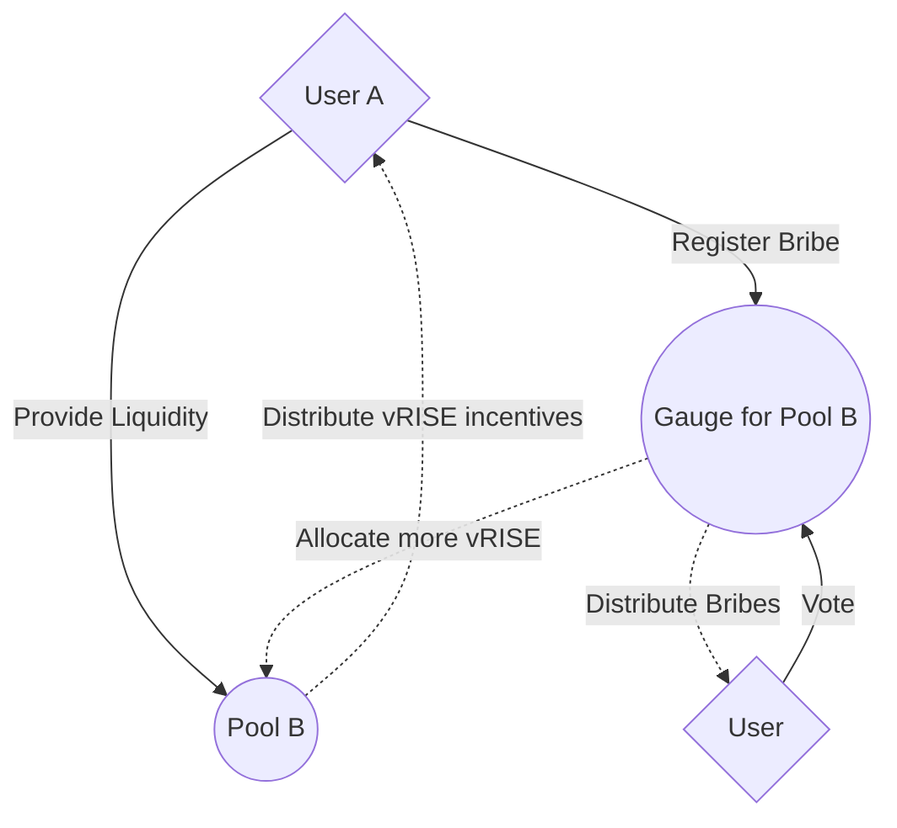
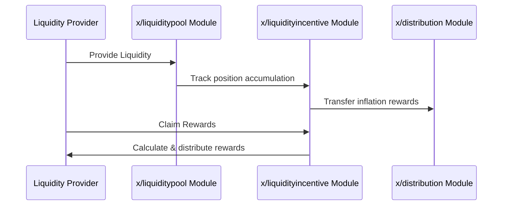

# 流動性インセンティブ

`x/liquidityincentive`モジュールは、流動性プールへの貢献に基づいて報酬を分配することにより、流動性プロバイダーにインセンティブを与えます。エポックベースの報酬システムとゲージ投票メカニズムを使用して、報酬を動的に割り当てます。このモジュールは、持続可能な流動性供給を保証すると同時に、ユーザーがゲージ投票を通じてガバナンスに参加できるようにします。

賄賂機能の詳細については、[賄賂](./bribes.md)を参照してください。

## 主な特徴

1. **エポックベースの報酬分配**:
   - 報酬は各エポックの終わりに分配されます。
   - 遅延会計は、請求時にのみ報酬を計算することで、計算オーバーヘッドを最小限に抑えます。
2. **ゲージ投票**:
   - ユーザーは、どの流動性プールがインセンティブを受け取るべきかについて投票できます。
   - 投票力は**`$vRISE`**トークン（譲渡不可能なステーキングトークン）によって決定されます。
3. **報酬のための遅延会計**:
   - 報酬はアキュムレータを使用して追跡され、ユーザーが請求したときにのみ分配されます。
   - これにより、ネットワークの計算負荷が軽減されます。
4. **動的なインセンティブ配分**:
   - インセンティブは、投票によって決定されたプールの重み（ゲージ）に基づいて割り当てられます。

## **コアコンセプト**

### エポック

> **注:** 以下のセクションでは、経験豊富なユーザーまたは開発者向けの高度なトピックについて説明します。

- 2つのエポックが同時に存在します。
  1. **過去のエポック**: 終了したエポック。
  2. **現在のエポック**: 進行中のエポック。
- 各エポックには、以下のパラメータがあります。
  - **`id`**: 一意のエポックID。
  - **`start_block`**: エポックが開始されるブロック。
  - **`start_time`**: エポックが開始されるUnix時間。
  - **`end_block`**: エポックが終了するブロック。
  - **`gauges`**: インセンティブ分配のためのゲージ（プールの重み）のリスト。

### ゲージ

> **注:** 以下のセクションでは、経験豊富なユーザーまたは開発者向けの高度なトピックについて説明します。

- ゲージは、報酬配分における特定の流動性プールの重みを表します。
- パラメータ:
  - **`pool_id`**: 流動性プールのID。
  - **`voting_power`**: このプールに割り当てられた投票力。

### 遅延会計

- 報酬はすぐに分配されるのではなく、請求時に計算されます。
- 報酬の計算式:

$$
\text{ClaimAmount}_{ij} = \frac{\text{PositionUnclaimedAccumulation}_{ij}}{\text{PoolUnclaimedAccumulation}_{i}} \times \text{PoolUnclaimed}_{i}
$$

## ワークフロー

### BeginBlocker

1. インフレ報酬の一部をFee Collectorアカウントから**`x/liquidityincentive`**モジュールアカウントに送金します。
2. 報酬は**`$vRISE`**トークン（譲渡不可能なステーキングトークン）に変換されます。
3. 報酬は各プールの手数料アキュムレータに蓄積されます。

### MsgClaimRewards (`x/liquiditypool`)

- ユーザーは、流動性プール内の自分のポジションと対話することで報酬を請求します。

> **注:**
> ここで説明する報酬は、特に**あなたのvRISE投票力に応じて割り当てられるゲージ投票報酬**です。
> これらは、標準のLP報酬とは異なります。
> ゲージ投票報酬は、あなたのvRISEでゲージ投票に参加することで請求します。これにより、エポックごとの各プールの報酬のあなたの分け前が決定されます。

## シーケンス図：報酬分配

> **注:** 以下のセクションでは、経験豊富なユーザーまたは開発者向けの高度なトピックについて説明します。

## パラメータ

| パラメータ | デフォルト | 単位 | 説明 |
| --- | --- | --- | --- |
| epoch_blocks | 4,320 | ブロック | エポックあたりのブロック数（約12日） |
| staking_reward_ratio | 0.50 | 比率 | ステーキングに割り当てられるvRISEの比率（50%） |
| bribe_claim_epochs | 5 | エポック | 賄賂を請求できるエポック数 |

### パラメータの詳細

1. **epoch_blocks**

   - 各エポックの長さをブロック単位で定義します
   - デフォルト値は約12日です（`DefaultParams().BlocksPerYear/365*12`）
   - エポックの開始と終了を制御し、報酬分配のタイミングを決定します

2. **staking_reward_ratio**

   - 新たにミントされたvRISEトークンのうち、ステーキング報酬に割り当てられる比率
   - デフォルト値は50%です（`math.LegacyNewDecWithPrec(50, 2)`）
   - 残りの50%は流動性インセンティブに使用されます

3. **bribe_claim_epochs**
   - 賄賂を請求できる期間をエポック単位で定義します
   - デフォルト値は5エポックです
   - この期間が終了すると、賄賂は請求できなくなります

これらのパラメータは、ガバナンスを通じて更新できます。パラメータの変更はシステムの動作に大きな影響を与える可能性があるため、慎重に検討する必要があります。

## メッセージ

このモジュールは、さまざまなメッセージタイプを提供します。

- MsgUpdateParams: モジュールパラメータの更新（ガバナンス操作）
- MsgStartNewEpoch: 新しいエポックを開始
- MsgVoteGauge: 報酬分配のためのプールの重みに投票
- MsgRegisterBribe: 特定のプールとエポックの賄賂を登録
- MsgClaimBribes: 蓄積された賄賂を請求

## クエリ

このモジュールは、さまざまなクエリエンドポイントを提供します。

- Params: モジュールパラメータのクエリ
- Epoch: 特定のエポックの詳細を取得
- Epochs: すべてのエポックを一覧表示
- Vote: 特定のアドレスの投票情報を取得
- Votes: すべての投票を一覧表示
- Bribe: 特定の賄賂の詳細を取得
- Bribes: オプションのフィルター付きですべての賄賂を一覧表示
- BribeAllocation: 特定のアドレス、エポック、プールの賄賂配分を取得
- BribeAllocations: オプションのフィルター付きですべての賄賂配分を一覧表示
- TallyResult: 次のエポックの集計結果を取得

詳細については、[Github](https://github.com/sunriselayer/sunrise/tree/main/x/liquidityincentive)を参照してください。
