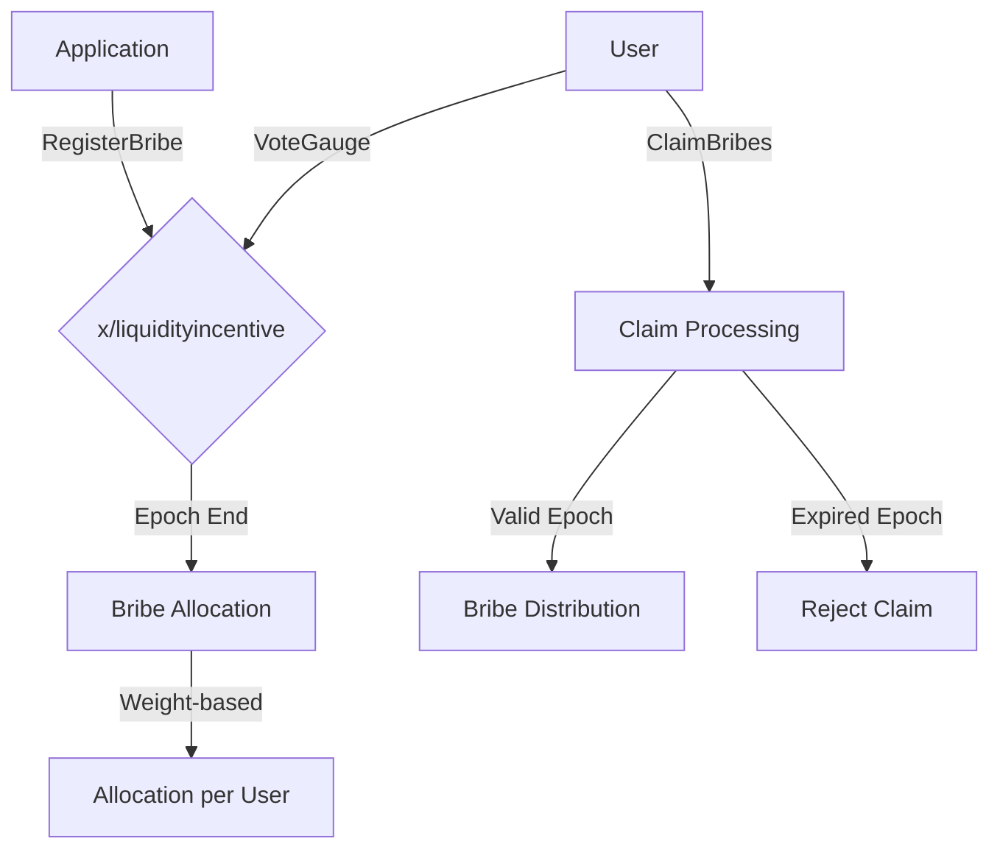

# 賄賂

`x/liquidityincentive`モジュールには、アプリケーションがvRISE保有者に報酬を与えて、特定のプールに投票を誘導できるようにする賄賂メカニズムが含まれています。この機能により、プロトコルは流動性を引き付け、エコシステム内の特定のプールをブートストラップするための市場ベースのアプローチを作成できます。

## 主な特徴

- **プロトコルレベルの賄賂**:
  - `x/liquidityincentive`モジュールに直接統合されています。
- **エポックベースのシステム**:
  - 賄賂はエポックごとに管理され、報酬の分配と一致します。
- **重みベースの分配**:
  - 賄賂は、プール内のユーザーの投票力に比例して分配されます。
- **経済効率**:
  - アプリケーションがターゲットを絞ったインセンティブを通じて流動性を引き付けるための資本効率の高い方法を提供します。

## **コア機能**

### **賄賂の管理**

- **登録**:
  - アプリケーションは、`RegisterBribe`メッセージを使用して、特定のエポックとプールの賄賂を登録します。
- **割り当て**:
  - 賄賂は、エポックの終了時に、プールの総投票力に対する各ユーザーの投票力の比率に基づいて割り当てられます。
- **請求**:
  - ユーザーは、`ClaimBribes`メッセージを介して、1つまたは複数のエポックにわたって蓄積された賄賂を請求します。

## **システムアーキテクチャとフロー**

> **注:** 以下のセクションでは、経験豊富なユーザーまたは開発者向けの高度なトピックについて説明します。

1. **賄賂の登録**:
   - アプリケーションは、特定のエポックとプールの賄賂を登録します。
2. **賄賂の請求**:
   - ユーザーは、蓄積された賄賂を請求できます。
3. **手数料処理**:
   - 賄賂の登録時に手数料が徴収され、バーンまたはコミュニティプールに割り当てることができます。
4. **クリーンアップ**:
   - 請求期間が終了すると、請求されなかった賄賂はクリーンアップされます。
5. **状態遷移**:
   - エポックが終了すると、新しい賄賂がアクティブになります。

## フローチャート

## **統合**

### **`x/liquiditypool`**

- 賄賂メカニズムは、`x/liquiditypool`モジュールと密接に統合されており、ユーザーは流動性プールに投票して賄賂を受け取ることができます。
- 賄賂の分配は、`x/liquiditypool`で定義されたプールの投票力に基づいています。

### **`x/distribution`**

- 賄賂の登録時に徴収された手数料は、バーンまたはコミュニティプールへの貢献のために`x/distribution`モジュールに送ることができます。
- これにより、賄賂メカニズムがより広範なエコシステムの経済モデルに貢献することが保証されます。
