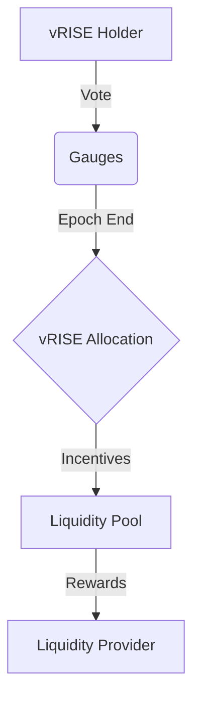

# ゲージ

> **注:** 以下のセクションでは、経験豊富なユーザーまたは開発者向けの高度なトピックについて説明します。

Sunriseエコシステムにおけるゲージは、流動性プロバイダーにインセンティブを与えるために、どの流動性プールが newly minted vRISE トークンを受け取るかを決定するための投票メカニズムです。

## ゲージ投票はどのように機能しますか？

ゲージは、エポックベースのシステムで動作します。各エポックの終わりに、vRISE保有者の投票に基づいて、newly minted vRISEトークンが流動性プールに割り当てられます。vRISE保有者は、複数のプールに投票を分散させることができます。

### 資格

- **vRISE保有者**: vRISEを保有しているユーザーのみがゲージ投票に参加できます。
- **ロックアップ期間**: 投票に参加するために、ユーザーはvRISEトークンを特定の期間ロックアップする必要はありません。
- **投票力**: ユーザーの投票力は、保有しているvRISEの量に比例します。

### 投票の仕組み

> **注:** このセクションでは、経験豊富なユーザーまたは開発者向けの高度なトピックについて説明します。

1. **投票期間**: ユーザーはいつでも投票できます。
2. **投票の割り当て**: ユーザーは、投票力を複数のゲージ（流動性プール）に割り当てることができます。
3. **投票の変更**: ユーザーはいつでも投票を変更できますが、変更は次のエポックの開始時に有効になります。

## 投票方法

1. **dAppに移動**: [Sunrise dApp](https://app.sunrise.games/)にアクセスします。
2. **ウォレットを接続**: ウォレットを接続し、**Gov**タブに移動します。
3. **ゲージを選択**: **Gauge**タブをクリックして、利用可能なゲージのリストを表示します。
4. **投票**: 投票したいゲージを選択し、割り当てたい投票力の量を入力します。
5. **トランザクションを確認**: トランザクションを確認して、投票を送信します。

> **注:**
> 投票は、次のエポックの開始時に有効になります。
> 各エポックの終わりに、あなたの投票に基づいて、vRISEトークンが選択した流動性プールに割り当てられます。
> これらのインセンティブは、流動性プロバイダーに分配されます。

