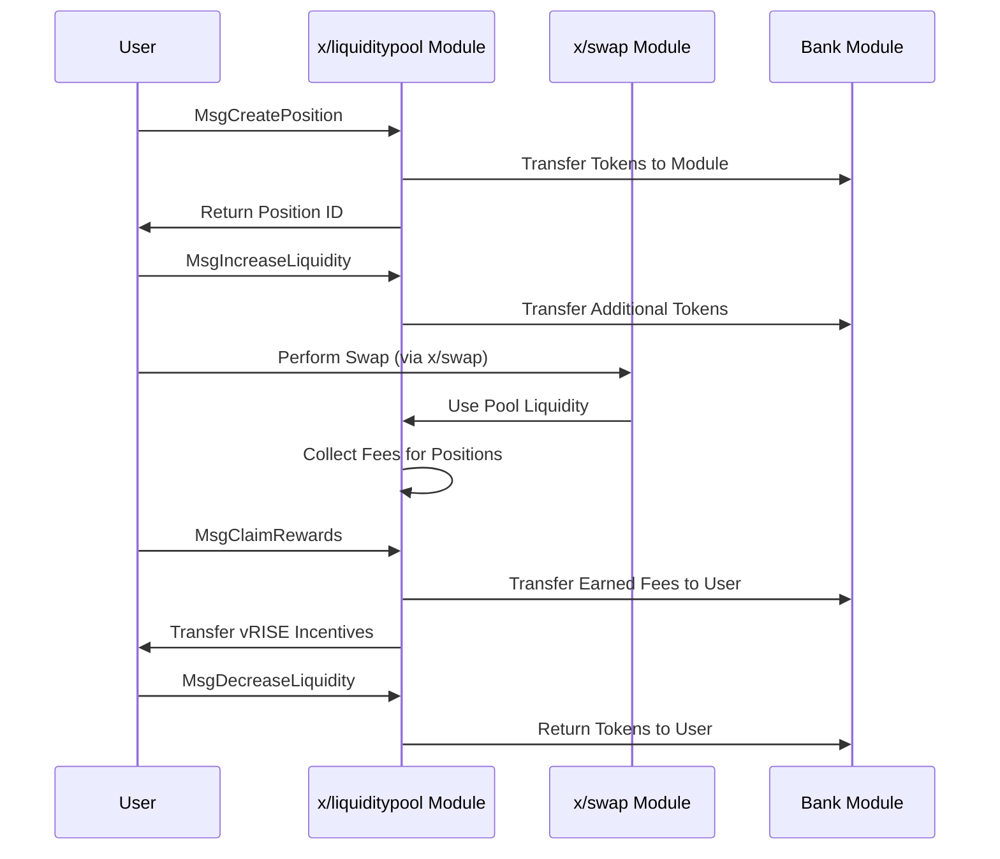

# 流動性プール

`x/liquiditypool`モジュールは、Sunriseブロックチェーン向けの集中型流動性自動マーケットメーカー（AMM）メカニズムを実装しています。このモジュールにより、ユーザーは流動性プールを作成し、特定の価格範囲でポジションを追加し、取引手数料やインセンティブから報酬を獲得できます。

## 主な特徴


**レベル1: アプリ開発者向け**


1. **集中型流動性AMM:**

   - Uniswap V3と同様のモデルに従い、流動性提供者が特定の価格範囲内に資産を集中させることができます。
   - 従来の定数積AMMと比較して資本効率が向上します。


2. **ポジションベースの流動性:**

   - ユーザーは定義された価格範囲（ティック）でポジションを作成します。
   - 各ポジションには固有のIDがあり、流動性提供者の貢献を追跡します。


3. **手数料の生成:**

   - ポジションは価格範囲内で発生する取引から手数料を獲得します。
   - 手数料はプールのベースおよびクォートデノミネーションで収集されます。


4. **`vRISE`インセンティブ:**

   - 流動性提供者は追加のインセンティブとしてvRISEトークンを獲得します。
   - これらのトークンはSunriseエコシステムでDA Fee Abstractionに使用できます。

## コア機能


**レベル2: 上級ユーザー向け**


### プール管理

**各プールはいくつかのパラメータで定義されます:**

- `id`: プールの一意の識別子
- `denom_base` & `denom_quote`: トークンペアのデノミネーション
- `fee_rate`: プール内のスワップに課される手数料
- `tick_params`: ティックシステムを定義するパラメータ
- `current_tick`, `current_tick_liquidity`, `current_sqrt_price`: 現在のステート変数


### ティックシステム


**レベル3: モジュール開発者向け**


ティックシステムは価格比率の公式に基づいています:

$$
\mathrm{price}(\mathrm{tick}) = \mathrm{price\_ratio}^{\mathrm{tick} - \mathrm{base\_offset}}
$$

`price_ratio = 1.0001`および`base_offset = 0`の一般的なケースでは:

$$
\mathrm{price}(\mathrm{tick}) = 1.0001^{\mathrm{tick}}
$$

これにより、特定の価格範囲内に流動性を正確に配置することができます。

## ワークフロー: ポジションの作成と使用


**レベル2: 上級ユーザー向け**




## メッセージ


**レベル3: モジュール開発者向け**


### MsgCreatePool

指定されたパラメータで新しい流動性プールを作成します。

```go
type MsgCreatePool struct {
    Authority   string
    DenomBase   string
    DenomQuote  string
    FeeRate     string
    PriceRatio  string
    BaseOffset  string
}
```

### MsgCreatePosition

プール内の価格範囲内でポジションを作成します。

```go
type MsgCreatePosition struct {
    Sender         string
    PoolId         uint64
    LowerTick      int64
    UpperTick      int64
    TokenBase      sdk.Coin
    TokenQuote     sdk.Coin
    MinAmountBase  string
    MinAmountQuote string
}
```

### MsgIncreaseLiquidity

既存のポジションに流動性を追加します。

```go
type MsgIncreaseLiquidity struct {
    Sender         string
    Id             uint64
    AmountBase     string
    AmountQuote    string
    MinAmountBase  string
    MinAmountQuote string
}
```

### MsgDecreaseLiquidity

既存のポジションから流動性を取り除きます。

```go
type MsgDecreaseLiquidity struct {
    Sender    string
    Id        uint64
    Liquidity string
}
```

### MsgClaimRewards

ポジションに蓄積された手数料とインセンティブを請求します。

```go
type MsgClaimRewards struct {
    Sender      string
    PositionIds []uint64
}
```

## 使用例


**レベル1: アプリ開発者向け**


**ポジションの作成**

```javascript
import { SunriseClient } from "@sunriselayer/client";
import { MsgCreatePosition } from "@sunriselayer/client/types";

async function createPosition() {
    const client = await SunriseClient.connect("https://rpc.sunriselayer.io");
    
    const msgCreatePosition = {
        sender: "sunrise1...",
        poolId: 1,
        lowerTick: -4155,  // およそ価格0.66
        upperTick: 4054,   // およそ価格1.5
        tokenBase: { denom: "urise", amount: "1000000" },
        tokenQuote: { denom: "uusdc", amount: "1000000" },
        minAmountBase: "0",
        minAmountQuote: "0"
    };
    
    const result = await client.executeTransaction(msgCreatePosition);
    console.log("Position created:", result);
}
```

## クエリ


**レベル1: アプリ開発者向け**


このモジュールはさまざまなクエリエンドポイントを提供します:

* Params: モジュールパラメータをクエリする
* Pools: すべての流動性プールを一覧表示する
* Pool: 特定のプールの詳細を取得する
* Positions: すべてのポジションを一覧表示する
* Position: 特定のポジションの詳細を取得する
* PoolPositions: 特定のプール内のポジションを一覧表示する
* AddressPositions: アドレスが所有するポジションを一覧表示する
* PositionFees: ポジションの発生手数料を取得する
* CalculationCreatePosition: ポジション作成のプレビュー
* CalculationIncreaseLiquidity: 流動性増加のプレビュー

詳細については[Github](https://github.com/sunriselayer/sunrise/tree/main/x/liquiditypool)を参照してください。