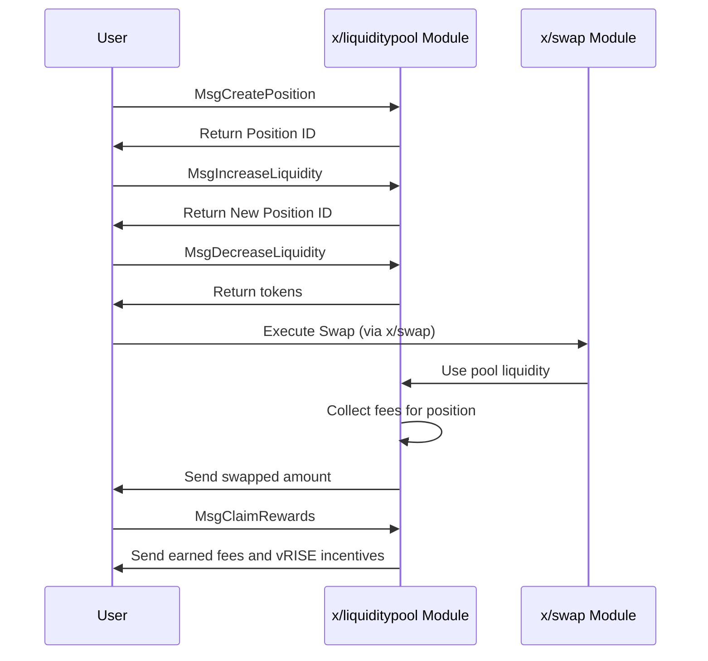

# 流動性プール

`x/liquiditypool`モジュールは、Sunriseブロックチェーンに集中流動性自動マーケットメーカー（AMM）メカニズムを実装します。このモジュールにより、ユーザーは流動性プールを作成し、特定の価格範囲でポジションを追加し、取引手数料やインセンティブから報酬を得ることができます。

## 主な特徴

1. **集中流動性AMM:**
   * Uniswap V3と同様のモデルに従い、流動性プロバイダーは特定の価格範囲内に資産を集中させることができます。
   * 従来の定数積AMMと比較して、資本効率が向上します。
2. **ポジションベースの流動性:**
   * ユーザーは、定義された価格範囲（ティック）でポジションを作成します。
   * 各ポジションには一意のIDがあり、流動性プロバイダーの貢献を追跡します。
3. **手数料の生成:**
   * ポジションは、その価格範囲内で発生した取引から手数料を得ます。
   * 手数料は、プールのベースデノミネーションとクォートデノミネーションで徴収されます。
4. **`vRISE`インセンティブ:**
   * 流動性プロバイダーは、追加のインセンティブとしてvRISEトークンを獲得します。
   * 詳細については、[流動性インセンティブ](liquidity-incentive/)を参照してください。

## コア機能

> **注意:** 次のセクションでは、経験豊富なユーザーまたは開発者向けの高度なトピックについて説明します。

### プール管理

**各プールは、いくつかのパラメータによって定義されます:**

* `id`: プールの一意の識別子
* `denom_base` & `denom_quote`: トークンペアのデノミネーション
* `fee_rate`: プール内のスワップで請求される手数料
* `tick_params`: ティックシステムを定義するパラメータ
* `current_tick`, `current_tick_liquidity`, `current_sqrt_price`: 現在の状態変数

### ティックシステム

ティックシステムは、価格比率の式に基づいています。

$$
\mathrm{価格}(\mathrm{ティック}) = \mathrm{価格比率}^{\mathrm{ティック} - \mathrm{ベースオフセット}}
$$

`価格比率 = 1.0001`および`ベースオフセット = 0`の一般的なケースでは：

$$
\mathrm{価格}(\mathrm{ティック}) = 1.0001^{\mathrm{ティック}}
$$

これにより、特定の価格範囲内に流動性を正確に配置できます。

## ワークフロー：ポジションの作成と使用

> **注意:** 次のセクションでは、経験豊富なユーザーまたは開発者向けの高度なトピックについて説明します。

## メッセージ

このモジュールは、さまざまなメッセージタイプを提供します。

* MsgUpdateParams：モジュールパラメータの更新（ガバナンス操作）
* MsgCreatePool：指定されたパラメータで新しい流動性プールを作成
* MsgCreatePosition：プール内の価格範囲内にポジションを作成
* MsgIncreaseLiquidity：既存のポジションに流動性を追加
* MsgDecreaseLiquidity：既存のポジションから流動性を削除
* MsgClaimRewards：ポジションで蓄積された手数料とインセンティブを請求

## クエリ

このモジュールは、さまざまなクエリエンドポイントを提供します。

* Params：モジュールパラメータのクエリ
* Pool：特定のプールの詳細を取得
* Pools：すべての流動性プールを一覧表示
* Position：特定のポジションの詳細を取得
* Positions：すべてのポジションを一覧表示
* PoolPositions：特定のプール内のポジションを一覧表示
* AddressPositions：アドレスが所有するポジションを一覧表示
* PositionFees：ポジションで発生した手数料を取得
* CalculationCreatePosition：ポジション作成のプレビュー
* CalculationIncreaseLiquidity：流動性増加のプレビュー

詳細については、[Github](https://github.com/sunriselayer/sunrise/tree/main/x/liquiditypool)を参照してください。
