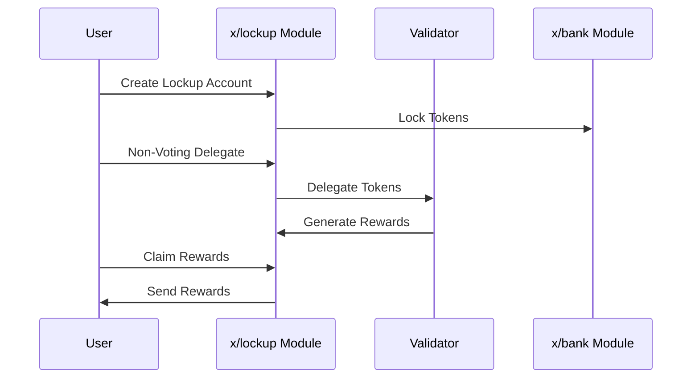

# Lockup

The `x/lockup` module provides functionality for managing token lockups and delegations. This module supports operations such as creating lockup accounts, non-voting delegation, reward claiming, and token transfers.

## Key Features

1. **Lockup Account Management**:
    - Creation and management of lockup accounts
    - Setting lockup periods (start and end times)
    - Tracking of locked tokens

2. **Non-Voting Delegation**:
    - Delegation of locked tokens to validators
    - Undelegation functionality
    - Delegation reward claiming

3. **Token Management**:
    - Transfer of locked tokens
    - Querying spendable amounts
    - Tracking lockup status

## Core Concepts

### Lockup Account

> **Note:** The following section covers advanced topics intended for experienced users or developers.

A lockup account is defined by the following parameters:

- **`address`**: The lockup account address
- **`owner`**: The account owner's address
- **`id`**: Unique identifier for the lockup account
- **`start_time`**: Lockup start time (Unix timestamp)
- **`end_time`**: Lockup end time (Unix timestamp)
- **`original_locking`**: Original locked amount
- **`delegated_free`**: Amount of delegated transfers available
- **`delegated_locking`**: Delegated amount of locking amount
- **`unbond_entries`**: List of unbonding entries
- **`additional_locking`**: Additional locked amount

### Unbonding Entry

An unbonding entry is defined by the following parameters:

- **`creation_height`**: Block height when the entry was created
- **`end_time`**: End time of the entry
- **`amount`**: Unbonding amount
- **`validator_address`**: Validator's address

## Workflow

### 1. Lockup Account Initialization

- User creates a lockup account
- Sets lockup period and amount
- Specifies account owner

### 2. Non-Voting Delegation

- Delegates locked tokens to validators
- Executes undelegation
- Claims delegation rewards

### 3. Token Transfer

- Transfers tokens from lockup account
- Verifies spendable amount
- Executes transfer

## Sequence Diagram: Lockup Operations

## Messages

The module provides various message types:

- MsgUpdateParams: Update module parameters (governance operation)
- MsgInitLockupAccount: Initialize a new lockup account with specified parameters
- MsgNonVotingDelegate: Delegate tokens from a lockup account without voting rights
- MsgNonVotingUndelegate: Undelegate tokens from a non-voting delegation
- MsgClaimRewards: Claim delegation rewards for a lockup account
- MsgSend: Send tokens from a lockup account to another address

## Queries

The module provides various query endpoints:

- Params: Query module parameters
- LockupAccounts: List all lockup accounts for a given owner
- LockupAccount: Get details of a specific lockup account
- SpendableAmount: Get the spendable amount for a specific lockup account

See [Github](https://github.com/sunriselayer/sunrise/tree/main/x/lockup) for details.
