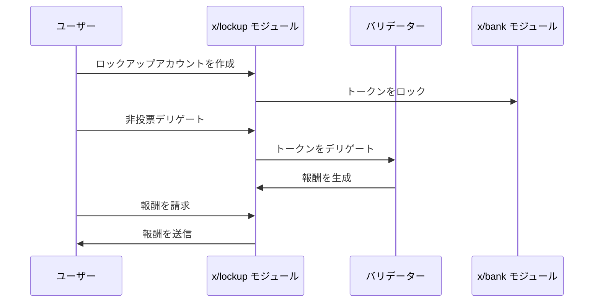

# ロックアップ

`x/lockup`モジュールは、トークンのロックアップとデリゲーションを管理する機能を提供します。このモジュールは、ロックアップアカウントの作成、非投票デリゲーション、報酬の請求、トークン転送などの操作をサポートします。

## 主な特徴

1. **ロックアップアカウント管理**:
    - ロックアップアカウントの作成と管理
    - ロックアップ期間の設定（開始時刻と終了時刻）
    - ロックアップされたトークンの追跡

2. **非投票デリゲーション**:
    - ロックアップされたトークンのバリデーターへのデリゲーション
    - アンデリゲーション機能
    - デリゲーション報酬の請求

3. **トークン管理**:
    - ロックアップされたトークンの転送
    - 使用可能額のクエリ
    - ロックアップステータスの追跡

## コアコンセプト

### ロックアップアカウント

> **注意:** 次のセクションでは、経験豊富なユーザーまたは開発者向けの高度なトピックについて説明します。

ロックアップアカウントは、次のパラメータによって定義されます。

- **`address`**: ロックアップアカウントのアドレス
- **`owner`**: アカウント所有者のアドレス
- **`id`**: ロックアップアカウントの一意の識別子
- **`start_time`**: ロックアップ開始時刻（Unixタイムスタンプ）
- **`end_time`**: ロックアップ終了時刻（Unixタイムスタンプ）
- **`original_locking`**: 元のロックアップ額
- **`delegated_free`**: 利用可能なデリゲート済み転送額
- **`delegated_locking`**: ロックアップ額のデリゲート済み額
- **`unbond_entries`**: アンボンディングエントリのリスト
- **`additional_locking`**: 追加のロックアップ額

### アンボンディングエントリ

アンボンディングエントリは、次のパラメータによって定義されます。

- **`creation_height`**: エントリが作成されたブロック高
- **`end_time`**: エントリの終了時刻
- **`amount`**: アンボンディング額
- **`validator_address`**: バリデーターのアドレス

## ワークフロー

### 1. ロックアップアカウントの初期化

- ユーザーがロックアップアカウントを作成
- ロックアップ期間と金額を設定
- アカウント所有者を指定

### 2. 非投票デリゲーション

- ロックアップされたトークンをバリデーターにデリゲート
- アンデリゲーションを実行
- デリゲーション報酬を請求

### 3. トークン転送

- ロックアップアカウントからトークンを転送
- 使用可能額を検証
- 転送を実行

## シーケンス図：ロックアップ操作

## メッセージ

このモジュールは、さまざまなメッセージタイプを提供します。

- MsgUpdateParams：モジュールパラメータの更新（ガバナンス操作）
- MsgInitLockupAccount：指定されたパラメータで新しいロックアップアカウントを初期化
- MsgNonVotingDelegate：投票権なしでロックアップアカウントからトークンをデリゲート
- MsgNonVotingUndelegate：非投票デリゲーションからトークンをアンデリゲート
- MsgClaimRewards：ロックアップアカウントのデリゲーション報酬を請求
- MsgSend：ロックアップアカウントから別のアドレスにトークンを送信

## クエリ

このモジュールは、さまざまなクエリエンドポイントを提供します。

- Params：モジュールパラメータのクエリ
- LockupAccounts：特定の所有者のすべてのロックアップアカウントを一覧表示
- LockupAccount：特定のロックアップアカウントの詳細を取得
- SpendableAmount：特定のロックアップアカウントの使用可能額を取得

詳細については、[Github](https://github.com/sunriselayer/sunrise/tree/main/x/lockup)を参照してください。
