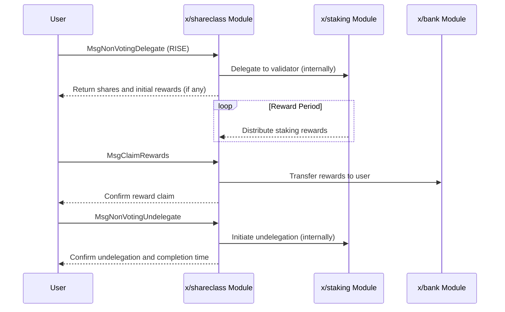

# 株式クラス

`x/shareclass`モジュールは、ユーザーが投票権なしでRISEトークンをデリゲートし、ステーキング報酬を得ることを可能にします。これにより、`$vRISE`（譲渡不可能なステーキングトークン）を保有していなくても、RISEトークンを使用してステーキングに参加できます。

## 主な特徴

1. **RISEによる非投票デリゲーション:**
    * ユーザーはRISEトークンをバリデーターにデリゲートできます。
    * デリゲーションは投票権を付与せず、ステーキング報酬とガバナンス参加を分離します。
2. **ステーキング報酬の獲得:**
    * デリゲーターは、デリゲートしたRISEの量に基づいてステーキング報酬を得ます。
    * RISEトークン保有者が報酬を得るための代替方法を提供します。
3. **バリデーターの作成:**
    * ネットワーク内での新しいバリデーターの作成をサポートします。

## コアコンセプト

### 非投票デリゲーション

ユーザーは、選択したバリデーターにRISEトークンをデリゲートできます。このモジュールは、株式と報酬の計算を処理します。このメカニズムにより、ユーザーは`$vRISE`トークンを管理したり、ガバナンスに直接参加したりすることなく、ステーキング報酬の恩恵を受けることができます。

### 報酬計算

ステーキング報酬は、デリゲートされたRISEの量とモジュールの報酬パラメータに基づいて計算されます。ユーザーは、蓄積された報酬を請求できます。

## ワークフロー

### 1. RISEのデリゲート（非投票）

* ユーザーは`MsgNonVotingDelegate`トランザクションを送信し、バリデーターとデリゲートするRISEの量を指定します。
* モジュールはデリゲーションを記録し、対応する株式を計算します。

### 2. 報酬の請求

* ユーザーは`MsgClaimRewards`トランザクションを送信して、特定のバリデーターの蓄積されたステーキング報酬を請求します。
* モジュールは報酬をユーザーのアカウントに転送します。

### 3. RISEのアンデリゲート（非投票）

* ユーザーは`MsgNonVotingUndelegate`トランザクションを送信して、デリゲートしたRISEを引き出します。
* モジュールはアンデリゲーション要求を処理し、トークンはアンボンディング期間後に利用可能になります。

### 4. バリデーターの作成（オプション）

* ユーザーは`MsgCreateValidator`トランザクションを送信して、ネットワークに新しいバリデーターノードを登録できます。

## シーケンス図：非投票デリゲーションと報酬

## メッセージ

このモジュールは、さまざまなメッセージタイプを提供します。

* MsgUpdateParams：モジュールパラメータの更新（ガバナンス操作）
* MsgNonVotingDelegate：投票権なしでRISEトークンをバリデーターにデリゲート
* MsgNonVotingUndelegate：非投票デリゲーションからRISEトークンをアンデリゲート
* MsgClaimRewards：非投票デリゲーションから蓄積されたステーキング報酬を請求
* MsgCreateValidator：ネットワークに新しいバリデーターを作成

## クエリ

このモジュールは、さまざまなクエリエンドポイントを提供します。

* Params：モジュールパラメータのクエリ
* CalculateBondingAmount：特定の株式に対して結合されるトークンを計算
* CalculateShare：特定のトークンに対して受け取る株式を計算
* AddressBonded：特定のアドレスの結合済み合計額を取得
* ClaimableRewards：バリデーターからアドレスが請求できる報酬を取得
* AddressUnbonding：特定のアドレスのアンボンディングデリゲーションを取得

詳細については、[Github](https://github.com/sunriselayer/sunrise/tree/main/x/shareclass)を参照してください。
