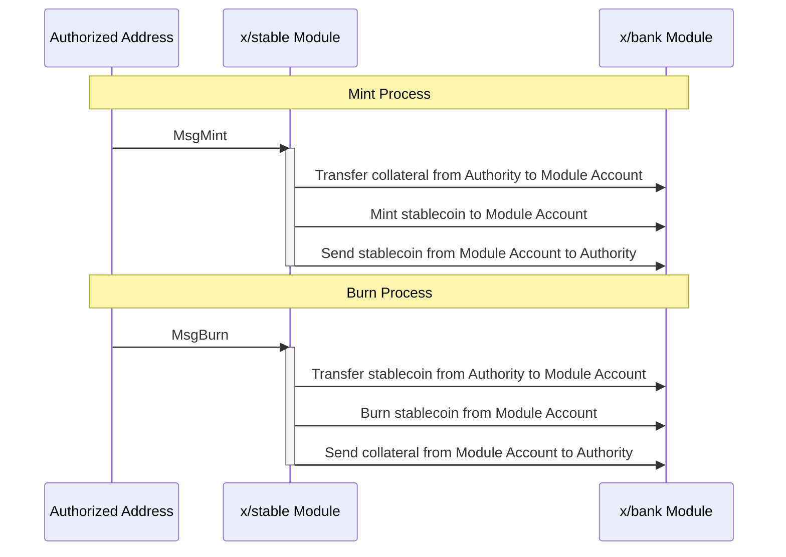

# Stable

The `x/stable` module manages the minting and burning of a native stablecoin, backed by a basket of accepted collateral assets.

## Key Features

1. **Minting and Burning**:
    - Allows minting of the native stablecoin against approved collateral.
    - Allows burning of the native stablecoin to redeem collateral.
2. **Collateral Management**:
    - Supports a configurable basket of accepted collateral assets, typically IBC denoms.
3. **Permissioned Control**:
    - Restricts mint and burn operations to a whitelist of authorized addresses.
4. **Dynamic Exchange Rate**:
    - Calculates exchange rates dynamically based on the `exponent` (decimal places) of the involved tokens, ensuring fair value exchange.
5. **On-Chain Auditability**:
    - Provides full transparency of all operations and balances for easy auditing.

## Core Concepts

> **Note:** The following section covers advanced topics intended for experienced users or developers.

### Parameters

The `stable` module's behavior is controlled by a set of on-chain parameters:

- **`authority_addresses`** (string[]): A list of addresses authorized to execute `MsgMint` and `MsgBurn`.
- **`accepted_denoms`** (string[]): A whitelist of collateral asset denominations that can be deposited to mint the stablecoin. These are typically IBC denoms.
- **`stable_denom`** (string): The denomination of the native stablecoin minted by the module (e.g., `uusdrise`).

### Exchange Rate Calculation

The exchange rate between the collateral asset and the native stablecoin is not hardcoded. Instead, it is calculated dynamically using the `exponent` field from the `DenomMetadata` stored in the `x/bank` module.

If `DenomMetadata` is not found for a given token, its exponent is assumed to be `0`. This ensures a fair exchange rate for tokens based on their specified decimal places.

## Workflow: Minting and Burning

### Sequence Diagram

## Messages

The module supports the following messages:

- **MsgMint**
  - **Action**: An authorized sender deposits collateral to mint the native stablecoin.
  - **Process**:
        1. Verifies the `sender` is in `authority_addresses`.
        2. Confirms all deposited denoms are in `accepted_denoms`.
        3. Transfers collateral from the sender to the module account.
        4. Calculates the corresponding amount of `stable_denom` to mint using the exponent-based exchange rate.
        5. Mints the calculated amount of `stable_denom` and sends it to the `sender`.

- **MsgBurn**
  - **Action**: An authorized sender burns the native stablecoin to receive a chosen collateral asset.
  - **Process**:
        1. Verifies the `sender` is an authority.
        2. Confirms the requested `output_denom` is in `accepted_denoms`.
        3. Transfers the `input_amount` of stablecoin from the sender to the module and burns it.
        4. Calculates the corresponding amount of `output_denom` to return using the exponent-based exchange rate.
        5. Transfers the calculated collateral amount from the module account to the `sender`.

## Queries

The module provides various query endpoints:

- **Params**: Query the current module parameters.
- **ModuleAccountBalance**: Query the balance of all collateral assets held by the module account.

## Auditability

All mint and burn operations, collateral balances held by the module, and the total supply of the stablecoin are publicly accessible on-chain. This design ensures that the stablecoin is always transparently and verifiably collateralized by the assets held in the module account.

See [Github](https://github.com/sunriselayer/sunrise/tree/stable/x/stable) for details.
