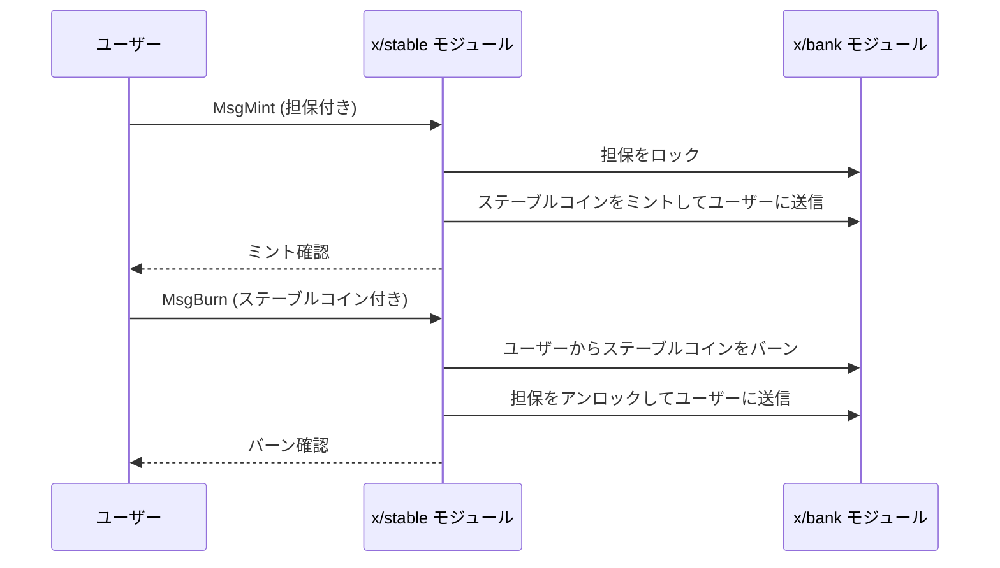

# 安定版

`x/stable`モジュールは、担保資産によって裏付けられたネイティブステーブルコインの発行（ミント）と償還（バーン）を管理します。

## 主な特徴

1. **ミントとバーン:**
    * ユーザーは、承認された担保資産を預けることでステーブルコインをミントできます。
    * ステーブルコインを返却することで、対応する担保を引き出す（バーンする）ことができます。
2. **担保管理:**
    * モジュールは、どの資産が担保として受け入れられるかを定義し、ステーブルコインの供給を裏付けます。
3. **許可制の管理:**
    * ステーブルコインのミントとバーンは、許可されたアドレスまたはコントラクトによってのみ実行でき、管理された供給を保証します。
4. **動的な為替レート:**
    * 為替レートは、担保資産の市場価値に基づいて動的に決定できます。
5. **オンチェーンの監査可能性:**
    * モジュールは、担保と発行されたステーブルコインの透明な追跡を提供し、オンチェーンでの監査を可能にします。

## コアコンセプト

### モジュールパラメータ

`x/stable`モジュールは、その動作を制御するいくつかのパラメータによって設定されます。

| パラメータ | 説明 |
| :--- | :--- |
| `Authority` | モジュールパラメータを更新する権限を持つアドレス |
| `Minter` | ステーブルコインをミントおよびバーンする権限を持つアドレス |
| `AcceptedDenoms` | ミントの担保として受け入れられるトークンのデノミネーション |
| `StableDenom` | ミントされるステーブルコインのデノミネーション |
| `ExchangeRates` | 受け入れられるデノミネーションとステーブルデノミネーション間の為替レート |

### 為替レート

モジュールは、`AcceptedDenoms`と`StableDenom`間の為替レートを維持します。これにより、ミントおよびバーン操作中に公正な価値の交換が保証されます。

## ワークフロー

### 1. ステーブルコインのミント

* ユーザーは`MsgMint`トランザクションを送信し、ミントしたいステーブルコインの量と、担保として提供する`AcceptedDenom`の量を指定します。
* モジュールは、ユーザーが十分な担保を持っていることを確認し、指定された量のステーブルコインをユーザーのアカウントにミントします。

### 2. ステーブルコインのバーン

* ユーザーは`MsgBurn`トランザクションを送信し、バーンしたいステーブルコインの量を指定します。
* モジュールは、ユーザーのステーブルコインをバーンし、対応する量の担保をユーザーのアカウントに返します。

## シーケンス図：ミントとバーン

## メッセージ

* MsgMint：承認された担保を使用してステーブルコインをミントします。
* MsgBurn：ステーブルコインをバーンして、基礎となる担保資産を償還します。

## クエリ

* Params：モジュールパラメータのクエリ。
* ModuleAccountBalance：`x/stable`モジュールの残高のクエリ。これにより、担保準備金の透明性が提供されます。

### 監査可能性

`ModuleAccountBalance`クエリは、モジュールによって保持されている担保資産の合計量を誰でも検証できるようにするため、監査可能性にとって重要です。この残高は、流通しているステーブルコインの供給を裏付けるはずです。

詳細については、[Github](https://github.com/sunriselayer/sunrise/tree/main/x/stable)を参照してください。
