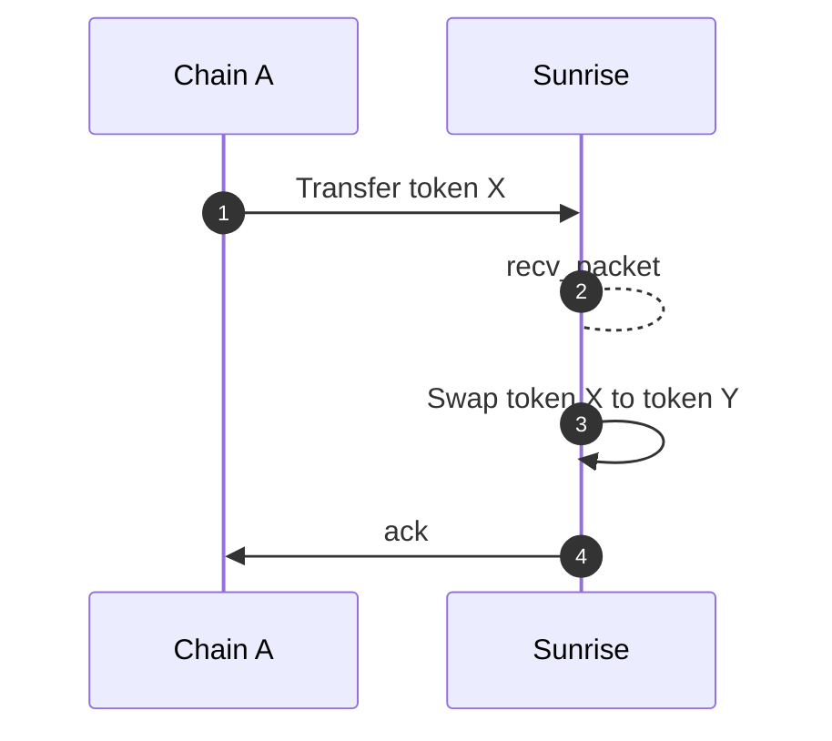
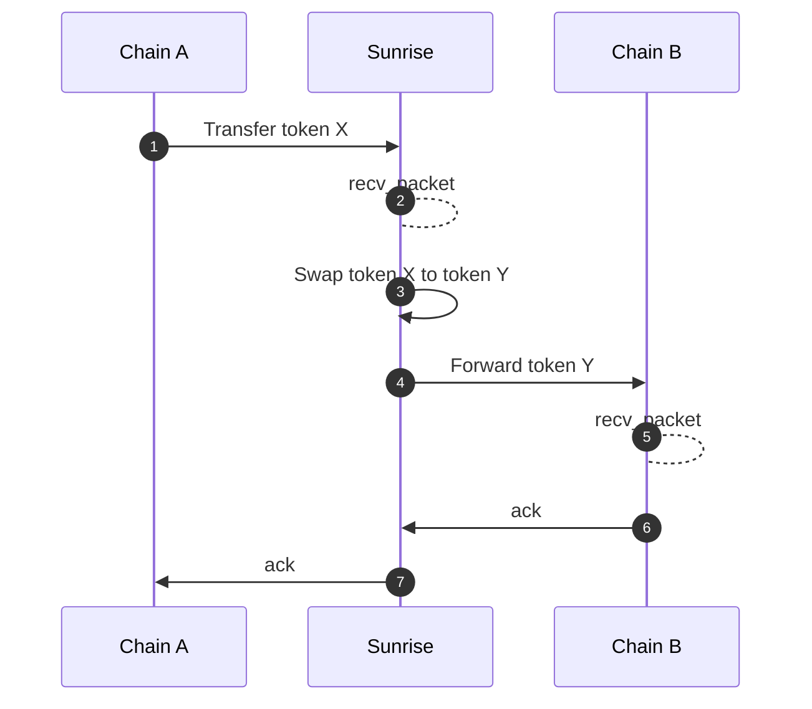
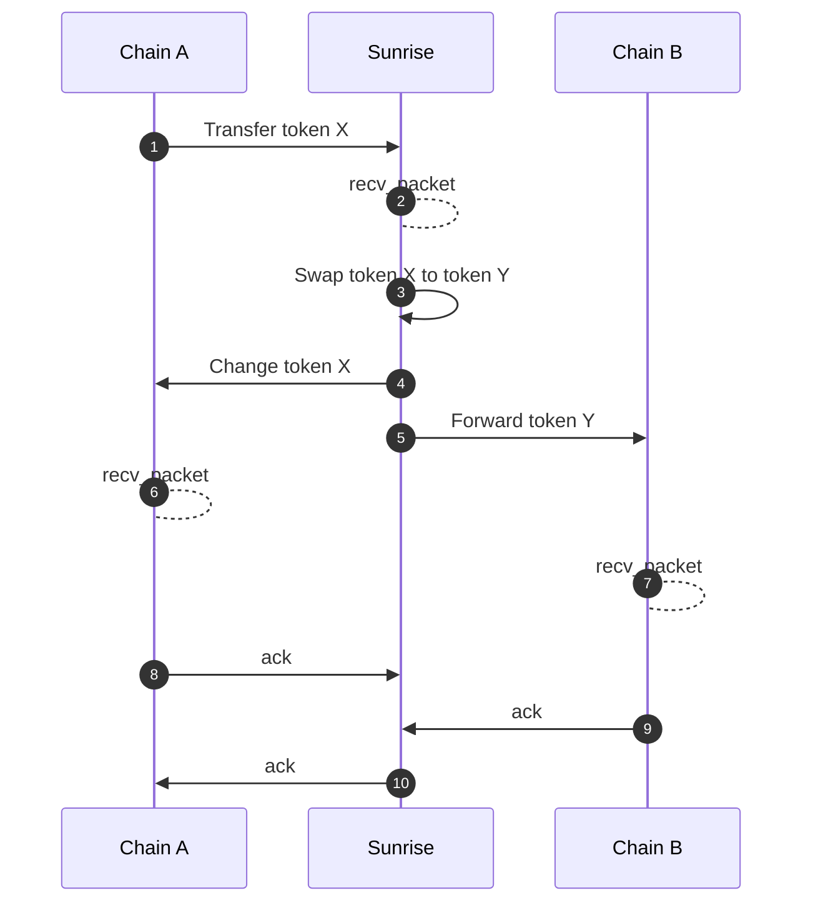

# スワップ

`x/swap`モジュールは、`x/liquiditypool`モジュール内の流動性を使用してトークンをスワップする機能を提供します。

## インターフェースプロバイダーの手数料報酬

スワップモジュール上に構築されたフロントエンドアプリケーション、ウォレット、dApp、またはプロトコルは、手数料を獲得する能力を持っています。これにより、Sunrise AMM周辺のオープンで構成可能なインフラストラクチャが奨励されます。

注意すべき2つの重要なパラメータがあります：

*   **interface\_fee\_rate**
    スワップの総額から取られる手数料で、パーセンテージで表示されます。

*   **interface\_provider**
    手数料の送付先を指定するアドレスです。アドレスが提供されない場合、インターフェース手数料は徴収されません。

Sunrise AMMを介してスワップを実行する際、自身の手数料受取人を指定することで**インターフェース手数料を獲得**し、トランザクションごとの利益を最大化できます。この機能は、単純なフロントエンドから複雑な金融プロトコルまで、**スワップ量を促進するあらゆるエンティティに報酬を与える**ように設計されています。

---

### スワップメッセージタイプ

受け取る金額または送信する金額を指定するために使用できる2つのメッセージタイプがあります。

*   **MsgSwapExactAmountIn** – 指定された入力金額でトークンをスワップ
    このメッセージを使用すると、ユーザーは提供したい正確な入力トークン量を定義してトークンをスワップできます。対応する出力は指定された入力に基づいて計算されます。

*   **MsgSwapExactAmountOut** – 指定された出力金額でトークンをスワップ
    このメッセージを使用すると、ユーザーは受け取りたい正確な出力トークン量を定義してトークンをスワップできます。システムは希望する出力を達成するために必要な入力量を計算します。

---

### ルート

> **注:** 以下のセクションは、経験豊富なユーザーまたは開発者向けの高度なトピックを扱います。

このモジュールは、再帰的な構造を持つスワップルートをサポートしており、連続（シリーズ）または同時（パラレル）に複数のステップを含む複雑なスワップを可能にします。ルート内の各ステップは検証され、入力と出力が正しく処理されるように処理されます。

```typescript
message RoutePool {
    uint64 pool_id = 1;
}

message RouteSeries {
    repeated Route routes = 1 [
        (gogoproto.nullable)   = false,
            (amino.dont_omitempty) = true
        ];
}

message RouteParallel {
    repeated Route routes = 1 [
        (gogoproto.nullable)   = false,
            (amino.dont_omitempty) = true
        ];
    repeated string weights = 2 [
        (cosmos_proto.scalar)  = "cosmos.Dec",
            (gogoproto.customtype) = "cosmossdk.io/math.LegacyDec",
            (gogoproto.nullable)   = false,
            (amino.dont_omitempty) = true
        ];
}

message Route {
    string denom_in = 1;
    string denom_out = 2;
    oneof strategy {
        RoutePool pool = 3;
        RouteSeries series = 4;
        RouteParallel parallel = 5;
    }
}
```

---

### ICS20トークン転送のためのスワップミドルウェア

スワップ機能は、ICS20トークン転送パケットによって自動的にトリガーされることがあります。これはIBCフックに似ており、あらゆるチェーン（Solidity IBC Eureka、Sei上のCosmWasmなど）でICS20を使用できる開発者が、IBCミドルウェアを介してスワップモジュールと対話するために使用できます。

#### メタデータ

シリアライズされた`PacketMetadata` JSON文字列を、ICS20転送パケットの`memo`フィールドに配置する必要があります。

```typescript
type PacketMetadata = {
    [namespace: string]: unknown;
    swap?: SwapMetadata;
};

type SwapMetadata = {
    interface_provider: string;
    route: Route;

    forward?: ForwardMetadata;
} & (
    | {
    exact_amount_in: {
        min_amount_out: string;
    };
}
    | {
    exact_amount_out: {
        amount_out: string;
        change?: ForwardMetadata;
    };
}
    );

type ForwardMetadata = {
    receiver: string;
    port: string;
    channel: string;
    timeout: string;
    retries: number;
    next?: PacketMetadata;
};
```

`ForwardMetadata`は[Packet Forward Middleware](https://github.com/cosmos/ibc-apps/tree/main/middleware/packet-forward-middleware)から派生しています。

## **シーケンス図**

> **注:** 以下のセクションは、経験豊富なユーザーまたは開発者向けの高度なトピックを扱います。

### 転送なしの基本的なスワップ

このシナリオでは、トークン転送が発生し、続いてスワップが行われますが、別のチェーンへの転送はありません。



#### 転送を伴うスワップ

このシナリオでは、トークンが転送され、スワップされ、その後別のチェーンに転送されます。



#### 余剰の払い戻しと転送を伴うスワップ

スワップが正確な出力量を指定する場合、過剰な入力は自動的に払い戻されます。スワップ後、残りのトークンは別のチェーンに転送されます。



### 受信者アドレスの取り扱い

スワップ後、その後の変更や転送が失敗しても、「トークンX転送」の確認は常に成功します。スワップされたトークンは受信者のアカウントに残ります。

## メッセージ

このモジュールはさまざまなメッセージタイプを提供します：

*   MsgUpdateParams: モジュールパラメータを更新します（ガバナンス操作）
*   MsgSwapExactAmountIn: 指定された入力金額でトークンをスワップします
*   MsgSwapExactAmountOut: 指定された出力金額でトークンをスワップします

## クエリ

このモジュールはさまざまなクエリエンドポイントを提供します：

*   Params: モジュールパラメータを照会します
*   IncomingInFlightPacket: 受信中のインフライトパケットの詳細を取得します
*   IncomingInFlightPackets: すべての受信中のインフライトパケットを一覧表示します
*   OutgoingInFlightPacket: 送信中のインフライトパケットの詳細を取得します
*   OutgoingInFlightPackets: すべての送信中のインフライトパケットを一覧表示します
*   CalculationSwapExactAmountIn: 正確な入力金額でのスワップをプレビューします
*   CalculationSwapExactAmountOut: 正確な出力金額でのスワップをプレビューします

詳細については[Github](https://github.com/sunriselayer/sunrise/tree/main/x/swap)を参照してください。
