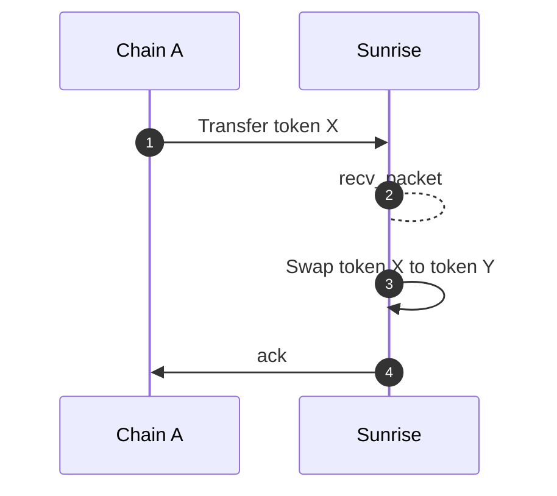
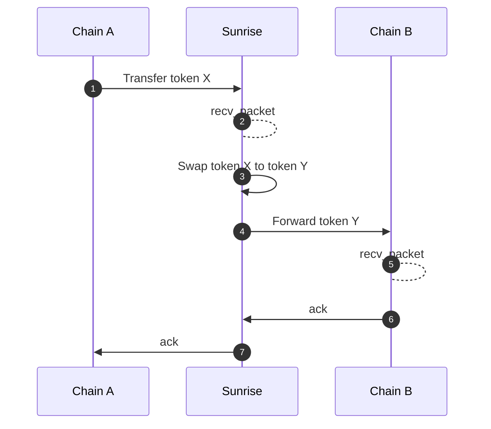
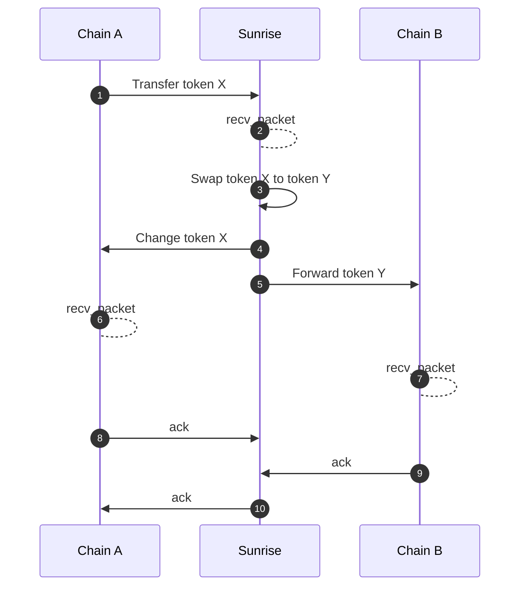

# Swap

`x/swap`モジュールは、`x/liquiditypool`モジュール内の流動性を使用してトークンをスワップする機能を提供します。

**パラメータ**
このモジュールには以下のパラメータがあります：

- `interface_fee_rate`（インターフェース手数料率）：インターフェースプロバイダー（例：フロントエンドのウェブアプリケーションプロバイダー）は、スワップトランザクションの手数料から一定の割合を受け取ることができます。

**MsgSwapExactAmountIn**（正確な入力量でのスワップメッセージ）
このメッセージを含むトランザクションを送信することで、ユーザーは入力量を指定してトークンをスワップできます。

**MsgConvertExactAmountOut**（正確な出力量でのスワップメッセージ）
このメッセージを含むトランザクションを送信することで、ユーザーは出力量を指定してトークンをスワップできます。

## Route

このモジュールは、再帰的な構造を持つ Swap Route（スワップルート）を受け入れます。

```typescript
message RoutePool {
  uint64 pool_id = 1;
}

message RouteSeries {
  repeated Route routes = 1 [
    (gogoproto.nullable)   = false,
    (amino.dont_omitempty) = true
  ];
}

message RouteParallel {
  repeated Route routes = 1 [
    (gogoproto.nullable)   = false,
    (amino.dont_omitempty) = true
  ];
  repeated string weights = 2 [
    (cosmos_proto.scalar)  = "cosmos.Dec",
    (gogoproto.customtype) = "cosmossdk.io/math.LegacyDec",
    (gogoproto.nullable)   = false,
    (amino.dont_omitempty) = true
  ];
}

message Route {
  string denom_in = 1;
  string denom_out = 2;
  oneof strategy {
    RoutePool pool = 3;
    RouteSeries series = 4;
    RouteParallel parallel = 5;
  }
}
```

## **ICS20 ミドルウェア**

スワップ機能は、ICS20 トークン転送パケットによって自動的に実行することもできます。

### **Metadata（メタデータ）**

マーシャリングされた`PacketMetadata`の JSON 文字列を ICS20 転送パケットの`memo`フィールドに挿入する必要があります。

```typescript
type PacketMetadata = {
  [namespace: string]: unknown;
  swap?: SwapMetadata;
};

type SwapMetadata = {
  interface_provider: string;
  route: Route;

  forward?: ForwardMetadata;
} & (
  | {
      exact_amount_in: {
        min_amount_out: string;
      };
    }
  | {
      exact_amount_out: {
        amount_out: string;
        change?: ForwardMetadata;
      };
    }
);

type ForwardMetadata = {
  receiver: string;
  port: string;
  channel: string;
  timeout: string;
  retries: number;
  next?: PacketMetadata;
};
```

`ForwardMetadata`は、[Packet Forward Middleware](https://github.com/cosmos/ibc-apps/tree/main/middleware/packet-forward-middleware)（パケットフォワードミドルウェア）から引用されています。

## **Sequence diagrams**

### **Neither Return nor Forward（返還も転送もしない）**



### **Forward（転送）**



**Change and Forward（変更と転送）**

スワップに対して正確な出力量が指定された場合、余剰の入力量が発生します。余剰の入力量を自動的に払い戻す機能があります。



**Receiver address（受信者アドレス）**

スワップが実行された後、次の変更/転送パケットが失敗した場合でも、「トークン X の転送」の確認は常に成功します。スワップされた資金は受信者アドレスの残高に保持されます。
