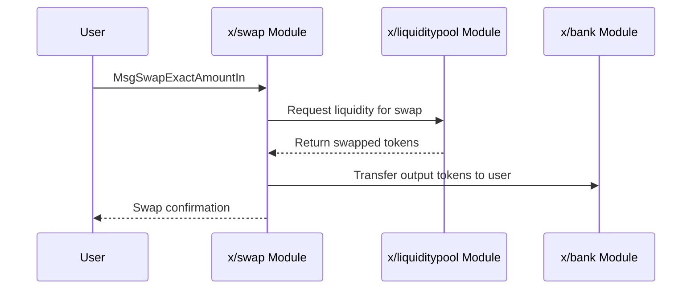
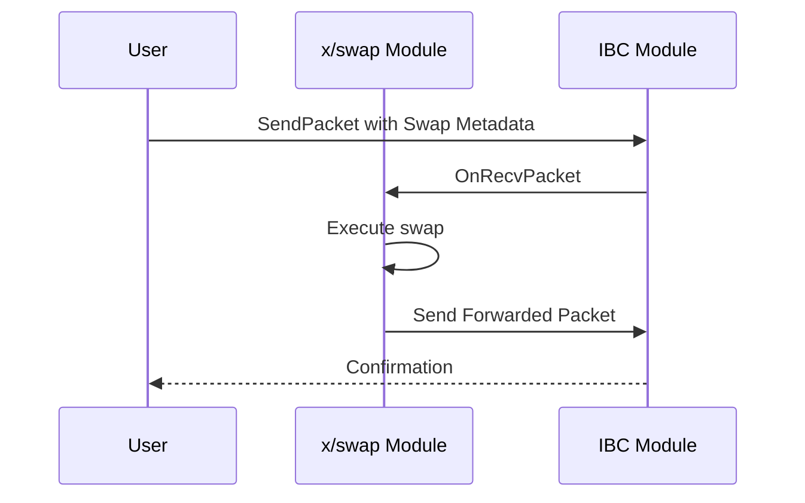
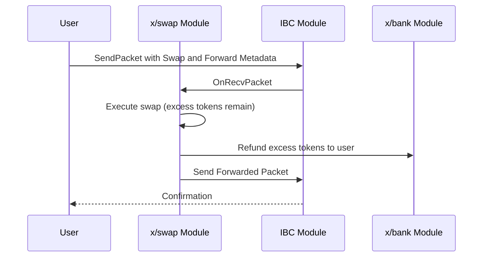

# スワップ

`x/swap`モジュールは、`x/liquiditypool`モジュールから提供される流動性を使用して、トークンスワップを容易にします。

## 主な特徴

* **インターフェースプロバイダーの手数料報酬:** `x/swap`モジュールは、スワップ操作を容易にするインターフェースまたはフロントエンドに報酬を与える手数料メカニズムをサポートしています。
* **正確な入力と出力:** モジュールは、スワップのための2つの主要なメッセージタイプをサポートしています。
  * `MsgSwapExactAmountIn`: ユーザーは、スワップしたい入力トークンの正確な量を指定します。
  * `MsgSwapExactAmountOut`: ユーザーは、スワップから受け取りたい出力トークンの正確な量を指定します。
* **再帰的なルート構造:** `Route`構造は再帰的に定義されており、シリーズとパラレルの両方のスワップルートを可能にします。
  * **シリーズ:** `[A -> B -> C]`のように、1つのプールから次のプールへの連続したスワップ。
  * **パラレル:** `[A -> B, A -> C]`のように、複数のプールにわたる並列スワップ。

## ICS20トークン転送のスワップミドルウェア

`x/swap`モジュールは、ICS20トークン転送と統合するためのミドルウェアを実装しています。これにより、ユーザーはIBC転送の一部としてスワップを実行できます。

### パケットメタデータ

スワップ操作は、IBCパケットの`memo`フィールドにJSONオブジェクトとして埋め込まれた`PacketMetadata`を使用して指定されます。

```json
{
  "swap": {
    "routes": [
      // Route objects
    ],
    "min_out_amount": "1000",
    "receiver": "cosmos1..."
  }
}
```

### フォワードメタデータ

`PacketMetadata`には、ICS20転送を別のチェーンに転送するための`ForwardMetadata`を含めることもできます。

```json
{
  "forward": {
    "receiver": "osmo1...",
    "port": "transfer",
    "channel": "channel-0"
  }
}
```

### シーケンス図

#### 基本的なスワップ



#### フォワーディング付きスワップ



#### 過剰な返金とフォワーディング付きスワップ



## メッセージ

* `MsgSwapExactAmountIn`: 正確な入力量でトークンをスワップします。
* `MsgSwapExactAmountOut`: 正確な出力量でトークンをスワップします。

## クエリ

* `Params`: モジュールパラメータのクエリ。
* `Pools`: 利用可能なすべての流動性プールのクエリ。
* `Routes`: 特定のトークンペア間の最適なスワップルートのクエリ。

詳細については、[Github](https://github.com/sunriselayer/sunrise/tree/main/x/swap)を参照してください。
