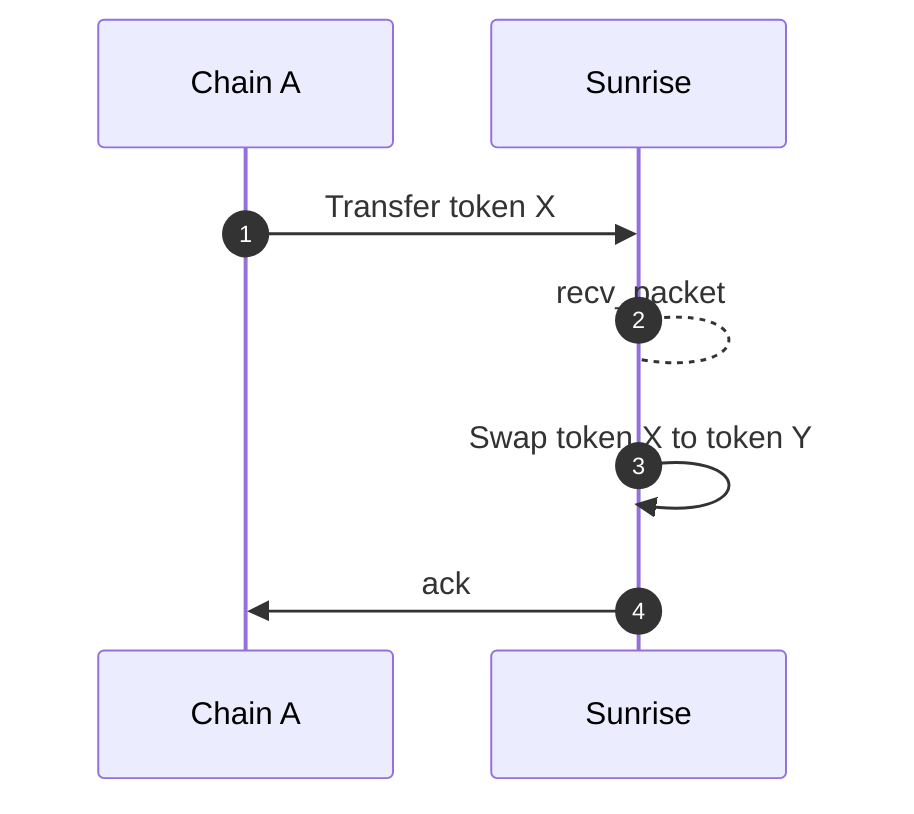
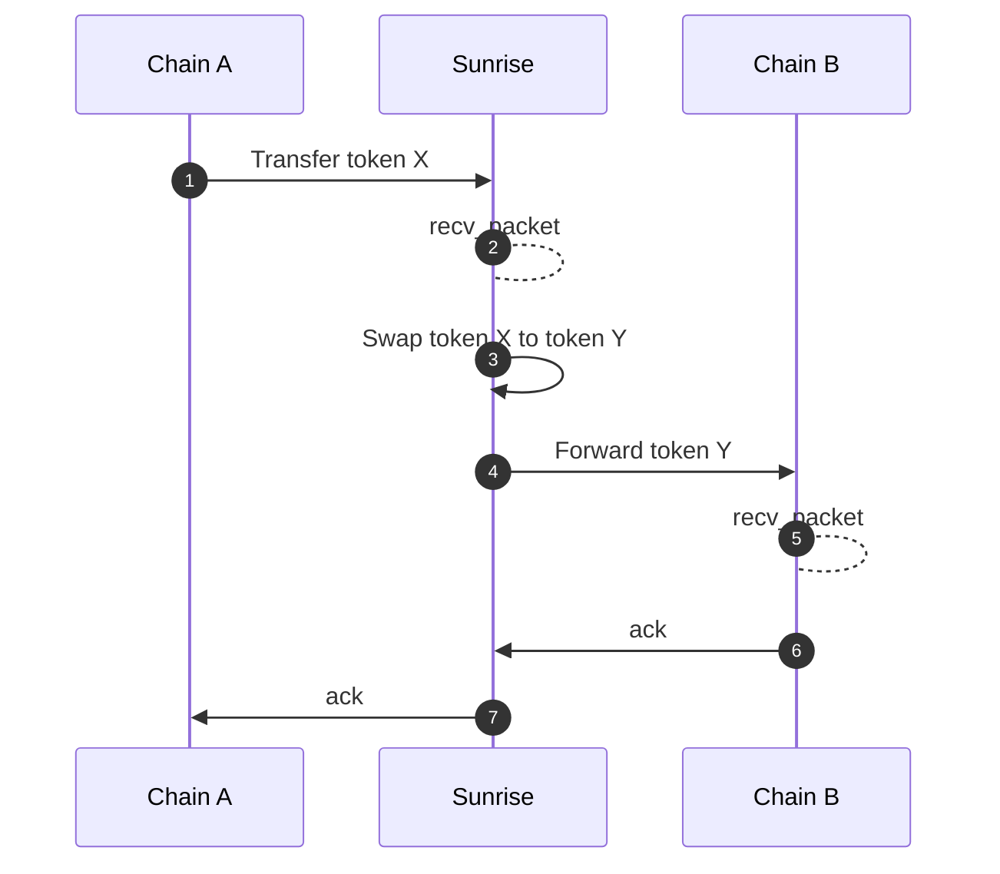
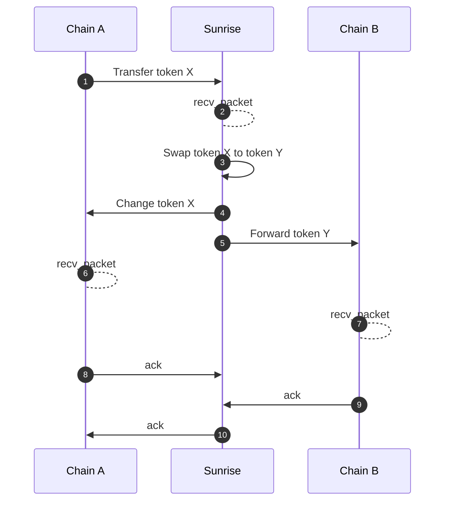

# スワップ

モジュール`x/swap`は`x/liquiditypool`モジュール内の流動性を使用してトークンをスワップする機能を提供します。

### インターフェースプロバイダー手数料報酬


**レベル1: アプリ開発者向け**


スワップモジュール上に構築されるフロントエンドアプリケーションには手数料を獲得する能力があります。これはどのように行われるのでしょうか？

注意すべき2つの重要なパラメータがあります：

- <strong>`interface_fee_rate`:</strong> スワップの総額から取られる手数料で、パーセンテージで表示されます。

- <strong>`interface_provider`:</strong> 手数料の送信先を指定するアドレスです。アドレスが提供されない場合、インターフェース手数料は取られません。

---

### スワップメッセージタイプ


**レベル1: アプリ開発者向け**


受け取る金額または送る金額を指定するために使用できる2つのメッセージタイプがあります。

<strong>`MsgSwapExactAmountIn`</strong> – 指定された入力金額でトークンをスワップ

このメッセージを使用することで、ユーザーは提供したい正確な入力トークン量を定義してトークンをスワップできます。対応する出力は指定された入力に基づいて計算されます。

<strong>`MsgSwapExactAmountOut`</strong> – 指定された出力金額でトークンをスワップ

このメッセージを使用することで、ユーザーは受け取りたい正確な出力トークン量を定義してトークンをスワップできます。システムは希望する出力を達成するために必要な入力量を計算します。

---

### ルート


**レベル2: 上級ユーザー向け**


このモジュールは再帰的構造を持つスワップルートをサポートし、連続（シリーズ）または同時（パラレル）に複数のステップを含む複雑なスワップを可能にします。ルート内の各ステップは検証され、入力と出力が正しく処理されるように処理されます。

```typescript
message RoutePool {
  uint64 pool_id = 1;
}

message RouteSeries {
  repeated Route routes = 1 [
    (gogoproto.nullable)   = false,
    (amino.dont_omitempty) = true
  ];
}

message RouteParallel {
  repeated Route routes = 1 [
    (gogoproto.nullable)   = false,
    (amino.dont_omitempty) = true
  ];
  repeated string weights = 2 [
    (cosmos_proto.scalar)  = "cosmos.Dec",
    (gogoproto.customtype) = "cosmossdk.io/math.LegacyDec",
    (gogoproto.nullable)   = false,
    (amino.dont_omitempty) = true
  ];
}

message Route {
  string denom_in = 1;
  string denom_out = 2;
  oneof strategy {
    RoutePool pool = 3;
    RouteSeries series = 4;
    RouteParallel parallel = 5;
  }
}
```

---

### ICS20トークン転送のためのスワップミドルウェア


**レベル1: アプリ開発者向け**


スワップ機能はICS20トークン転送パケットによって自動的にトリガーされることがあります。これはIBC Hooksに似ており、あらゆるチェーン（Solidity IBC Eureka、Sei上のCosmWasmなど）でICS20を使用できる開発者がIBCミドルウェアを通じてスワップモジュールと対話するために使用できます。

#### メタデータ

シリアライズされた`PacketMetadata` JSON文字列をICS20転送パケットの`memo`フィールドに配置する必要があります。

```typescript
type PacketMetadata = {
  [namespace: string]: unknown;
  swap?: SwapMetadata;
};

type SwapMetadata = {
  interface_provider: string;
  route: Route;

  forward?: ForwardMetadata;
} & (
  | {
      exact_amount_in: {
        min_amount_out: string;
      };
    }
  | {
      exact_amount_out: {
        amount_out: string;
        change?: ForwardMetadata;
      };
    }
);

type ForwardMetadata = {
  receiver: string;
  port: string;
  channel: string;
  timeout: string;
  retries: number;
  next?: PacketMetadata;
};
```

`ForwardMetadata`は[Packet Forward Middleware](https://github.com/cosmos/ibc-apps/tree/main/middleware/packet-forward-middleware)から派生しています。

## **シーケンス図**


**レベル2: 上級ユーザー向け**


#### 転送なしの基本的なスワップ

このシナリオでは、トークン転送が発生し、続いてスワップが行われますが、別のチェーンへの転送はありません。



#### 転送を伴うスワップ

このシナリオでは、トークンが転送され、スワップされ、その後別のチェーンに転送されます。



#### 余剰の払い戻しと転送を伴うスワップ

スワップが正確な出力量を指定する場合、過剰な入力は自動的に払い戻されます。スワップ後、残りのトークンは別のチェーンに転送されます。




**レベル1: アプリ開発者向け**


**受信者アドレスの取り扱い**

スワップ後、その後の変更や転送が失敗しても、「トークンX転送」の確認は常に成功します。スワップされたトークンは受信者のアカウントに残ります。

詳細については[Github](https://github.com/sunriselayer/sunrise/tree/main/x/swap)を参照してください。