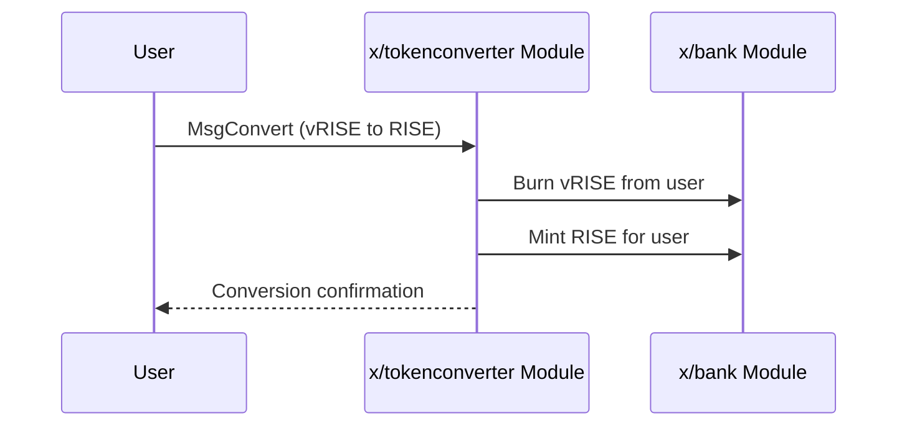

# トークンコンバーター

`x/tokenconverter`モジュールは、`vRISE`と`RISE`トークン間のシームレスな1:1変換を可能にします。このプロセスは許可不要で手数料もかかりません。

## 主な特徴

* **双方向変換:**
  * `vRISE`から`RISE`への変換は、すべてのユーザーが利用できます。
  * `RISE`から`vRISE`への変換は、内部モジュール専用に予約されており、ユーザーは直接利用できません。
* **許可不要:** `vRISE`から`RISE`への変換は、誰でも許可なく実行できます。

## コア機能

### vRISEからRISEへ

ユーザーが`vRISE`を`RISE`に変換したい場合、モジュールは指定された量の`vRISE`をバーンし、同量の`RISE`をミントします。

### RISEからvRISEへ

この変換パスは、内部のシステム操作用に予約されています。ユーザーは、`vRISE`を得るために流動性を提供する必要があります。

## ワークフロー

### シーケンス図

## メッセージ

* `MsgConvert`: `vRISE`を`RISE`に、またはその逆に変換します。

## 利点

* **柔軟なトークン利用:** ユーザーは、流動性ステーキング報酬（`vRISE`）と取引やその他の目的（`RISE`）との間で簡単に切り替えることができます。
* **エコシステム統合:** `vRISE`と`RISE`間のシームレスな変換は、さまざまなDeFiアプリケーションとのより良い統合を促進します。
* **シンプルな設計:** モジュールは、2つのトークン間の変換を処理するための単一のメッセージタイプを持つシンプルなインターフェースを提供します。

詳細については、[Github](https://github.com/sunriselayer/sunrise/tree/main/x/tokenconverter)を参照してください。
