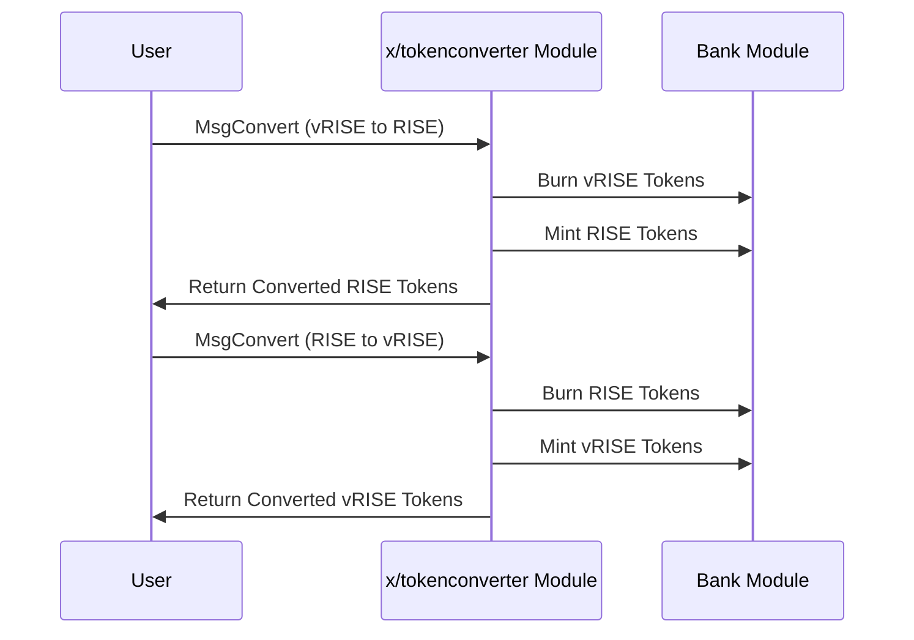

# トークンコンバーター

`x/tokenconverter`モジュールは、Sunriseブロックチェーン上で`vRISE`と`RISE`トークン間のシームレスな変換を可能にします。このモジュールは、ステーキングトークンと手数料トークン間の変換を可能にしながら、同等の価値関係を維持することで、エコシステムにおいて重要な役割を果たします。

## 主な特徴


**レベル1: アプリ開発者向け**


1. **双方向トークン変換:**

   - `vRISE`（ボンドデノミネーション）を`RISE`（手数料デノミネーション）に、またその逆に変換します。
   - トークン間で1:1の同等価値関係を維持します。


2. **パラメータガバナンス:**

   - モジュールパラメータを通じて設定可能なデノミネーション。
   - デフォルトのボンドデノミネーション: "uvRISE"（マイクロ`vRISE`）。
   - デフォルトの手数料デノミネーション: "urise"（マイクロ`RISE`）。


3. **統合システムコンポーネント:**

   - `x/shareclass`や`x/fee`などの他のモジュールと連携して動作します。
   - Sunriseエコシステムの広範なトークノミクスをサポートします。


4. **許可不要の操作:**

   - どのユーザーでもいつでもトークン変換を実行できます。
   - 変換プロセスにスリッページや手数料は適用されません。


## コア機能


**レベル2: 上級ユーザー向け**


### トークン変換

このモジュールは`vRISE`と`RISE`トークン間のシンプルで直接的な変換メカニズムを提供します:

- vRISEからRISEに変換する場合、モジュールはvRISEをバーンし、同等量のRISEをミントします。
- RISEからvRISEに変換する場合、モジュールはRISEをバーンし、同等量のvRISEをミントします。

このプロセスはシステム内の総経済価値を維持しながら、ユーザーが自分のニーズに最適なトークンタイプを保持できるようにします。

## ワークフロー: トークン変換プロセス


**レベル2: 上級ユーザー向け**




## メッセージ


**レベル3: モジュール開発者向け**


### MsgConvert

ボンドデノミネーションと手数料デノミネーション間でトークンを変換します。

```go
type MsgConvert struct {
    Sender  string
    Amount  string
}
```

**パラメータ設定**


**レベル2: 上級ユーザー向け**


| パラメータ                     | 説明                                                                          |
|------------------------------|--------------------------------------------------------------------------------------|
| ボンドデノミネーション（`bond_denom`） | ステーキングとガバナンスに使用されるデノミネーション（デフォルト: `"uvRISE"`）。             |
| 手数料デノミネーション（`fee_denom`）   | トランザクション手数料に使用されるデノミネーション（デフォルト: `"urise"`）。                    |

**設定例:**

```json
{
  "bond_denom": "uvRISE",
  "fee_denom": "urise"
}
```

## 使用例


**レベル1: アプリ開発者向け**


**トークンコンバーターパラメータのクエリ**

```javascript
import { SunriseClient } from "@sunriselayer/client";

async function queryTokenConverterParams() {
    const client = await SunriseClient.connect("https://rpc.sunriselayer.io");
    const queryClient = client.getQueryClient();

    if (!queryClient) {
        console.error("Query client not initialized");
        return;
    }

    const params = await queryClient.tokenconverter.params({});
    console.log("Token Converter Parameters:", params.params);
}
```

**トークンの変換**

```javascript
import { SunriseClient } from "@sunriselayer/client";
import { MsgConvert } from "@sunriselayer/client/types";

async function convertTokens() {
    const client = await SunriseClient.connect("https://rpc.sunriselayer.io");
    
    // 1 vRISEをRISEに変換
    const msgConvert = {
        sender: "sunrise1...",
        amount: "1000000"  // 1 vRISE（マイクロ単位）
    };
    
    const result = await client.executeTransaction(msgConvert);
    console.log("Conversion result:", result);
}
```


## 利点


**レベル1: アプリ開発者向け**


1. **柔軟なトークン使用:**

   - ユーザーは好みのデノミネーションでトークンを保持できます。
   - 意図した使用（ステーキングvs手数料）に基づいてトークン間をシームレスに切り替えられます。


2. **エコシステム統合:**

   - トークンタイプ間の変換を可能にすることで、DA Fee Abstractionメカニズムをサポートします。
   - Sunriseエコシステムの他のモジュールの運用を促進します。


3. **シンプルな設計:**

   - 手数料やスリッページのない直接的な変換。
   - 理解しやすく、アプリケーションに簡単に統合できます。


詳細については[Github](https://github.com/sunriselayer/sunrise/tree/main/x/tokenconverter)を参照してください。