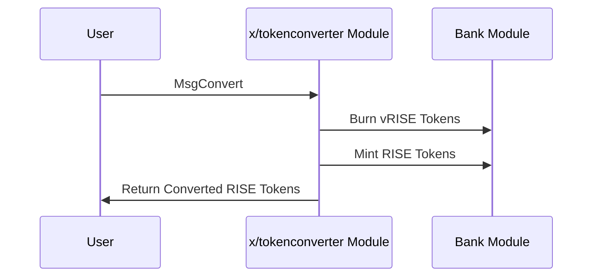

# トークンコンバーター

`x/tokenconverter`モジュールは、Sunriseブロックチェーン上で`vRISE`と`RISE`トークン間のシームレスな変換を可能にします。このモジュールは、ステーキングトークンと手数料トークン間の変換を可能にしながら、同等の価値関係を維持することで、エコシステムにおいて重要な役割を果たします。

## 主な特徴

1.  **双方向トークン変換:**

    - `vRISE`（ボンドデノミネーション）を`RISE`（手数料デノミネーション）に、またその逆に変換します。
    - トークン間で1:1の同等価値関係を維持します。

2.  **許可不要の操作:**

    - どのユーザーでもいつでもトークン変換を実行できます。
    - 変換プロセスにスリッページや手数料は適用されません。

## コア機能

> **注:** 以下のセクションは、経験豊富なユーザーまたは開発者向けの高度なトピックを扱います。

### トークン変換

このモジュールは`vRISE`と`RISE`トークン間のシンプルで直接的な変換メカニズムを提供します:

- vRISEからRISEに変換する場合、モジュールはvRISEをバーンし、同等量のRISEをミントします。
- RISEからvRISEに変換する場合、モジュールはRISEをバーンし、同等量のvRISEをミントします。（ユーザーは利用できません）

このプロセスはシステム内の総経済価値を維持しながら、ユーザーが自分のニーズに最適なトークンタイプを保持できるようにします。

## ワークフロー: トークン変換プロセス

> **注:** 以下のセクションは、経験豊富なユーザーまたは開発者向けの高度なトピックを扱います。



## メッセージ

このモジュールはさまざまなメッセージタイプを提供します：

- MsgUpdateParams: モジュールパラメータを更新します（ガバナンス操作）
- MsgConvert: ボンドデノミネーションと手数料デノミネーション間でトークンを変換します

### MsgConvert

ボンドデノミネーションと手数料デノミネーション間でトークンを変換します。

```go
type MsgConvert struct {
    Sender  string
    Amount  string
}
```

## 利点

1.  **柔軟なトークン使用:**

    - ユーザーは好みのデノミネーションでトークンを保持できます。
    - 意図した使用（ステーキングvs手数料）に基づいてトークン間をシームレスに切り替えられます。

2.  **エコシステム統合:**

    - トークンタイプ間の変換を可能にすることで、DA Fee Abstractionメカニズムをサポートします。
    - Sunriseエコシステムの他のモジュールの運用を促進します。

3.  **シンプルな設計:**

    - 手数料やスリッページのない直接的な変換。
    - 理解しやすく、アプリケーションに簡単に統合できます。

詳細については[Github](https://github.com/sunriselayer/sunrise/tree/main/x/tokenconverter)を参照してください。
