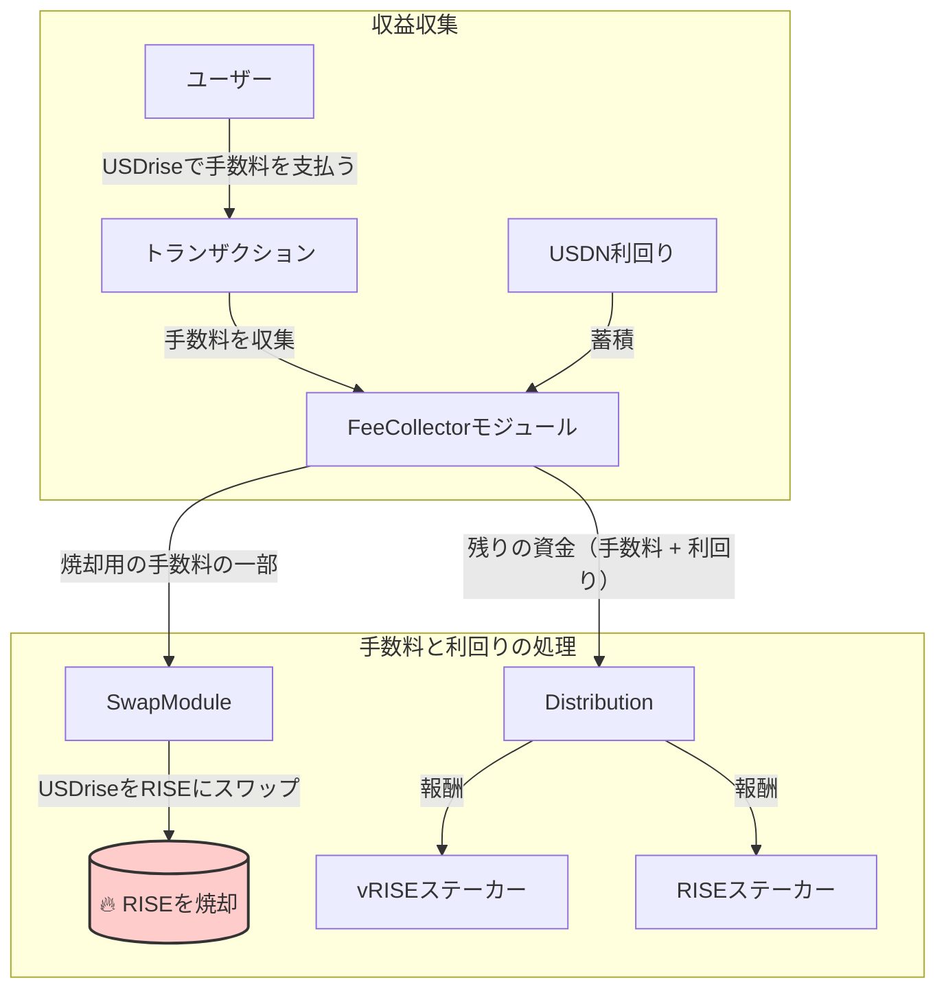

# $USDrise

$USDriseは、nobleのUSDNをラップすることで発行される、Sunriseプロトコルのネイティブステーブルコインです。このドキュメントでは、USDriseの概要、その特徴、そしてSunriseエコシステムにどのように統合されるかについて説明します。

## 概要

USDriseは、Sunriseプロトコル内で安定した信頼性の高い交換媒体として設計されています。米ドルとの1:1のペッグを維持することを目指しています。

USDriseを取得するには、主に2つの方法があります。

1. **スワップ:** ユーザーは、Sunriseエコシステム内の`x/swap`モジュールを通じて、USDC、USDN、RISEなどの他のトークンをスワップすることでもUSDriseを取得できます。
2. **ミント:** USDriseの発行と焼却は`x/stable`モジュールによって管理されており、これには承認されたコントラクトを介した対話が必要です。ユーザーは、1 USDN = 1 USDriseの固定為替レートでUSDNをデポジットすることでUSDriseをミントできます。このプロセスにより、トークン供給の透明性と管理が保証されます。

`x/stable`モジュールの詳細については、[x/stableモジュールのドキュメント](../sunrise/stable.md)を参照してください。

## 主な特徴

- **取引手数料:** Sunriseプロトコル内のすべての取引手数料はUSDriseで支払われ、ネットワーク経済の中心的な構成要素となっています。
- **利回り生成:** USDriseはUSDNで担保されているため、$RISEおよび$vRISEのステーカーに分配される利回りを生成します。

## 手数料のメカニズムと分配

USDriseは、Sunriseエコシステム内の取引手数料の主要なトークンとして機能します。収集された手数料は、原資産であるUSDNからの利回りと共にステークホルダーに分配され、持続可能な経済ループを生み出します。

### フローの内訳

1. **収益収集:** `FeeCollector`モジュールアカウントは、主に2つのソースから資金を蓄積します。
    - **取引手数料:** ユーザーは**$USDrise**で取引手数料を支払います。
    - **USDN利回り:** USDriseを裏付ける原資産であるUSDNから生成された利回りも`FeeCollector`に向けられます。
2. **焼却メカニズム:** `x/fee`モジュールの`burn_ratio`パラメータに基づき、収集された**手数料**の一部が**$RISE**にスワップされ、その後焼却されます。これは$RISEのデフレメカニズムとして機能します。
3. **報酬分配:** `FeeCollector`内の残りのすべての資金（焼却されなかった手数料の一部とすべてのUSDN利回り）は、**$vRISE**と**$RISE**の両方のステーカーに報酬として分配され、ガバナンスとネットワークセキュリティへの参加を奨励します。

このプロセスにより、ネットワークの利用がネイティブトークンの価値に直接貢献し、最も献身的な参加者に報酬が与えられることが保証されます。

`x/fee`モジュールの詳細については、[x/fee](../sunrise/fee.md)を参照してください。

## USDNについて

USDriseは、nobleネットワークのステーブルコインであるNoble Dollar (USDN)によって裏付けられています。ユーザーはUSDNに関連するメカニズムとリスクを理解することが重要です。情報に基づいた意思決定を行うために、USDNについて独自に調査することを強くお勧めします。

Noble Dollar (USDN)は、構成可能な利回りを基盤に構築されたステーブルコインです。USDNはM^0プロトコルを活用して、短期米国財務省短期証券で担保されたステーブルコイン利回りを提供します。
USDNはモジュラーエコシステム向けに専用に構築されており、カスタマイズ可能でプログラム可能かつ透明な方法で利回りを誘導できるように構成されています。

詳細については、Nobleの公式ドキュメントを参照してください：[Noble Dollar (USDN)](https://www.noble.xyz/usdn)

## 関連ドキュメント

- **[x/stableモジュール](../sunrise/stable.md)**
