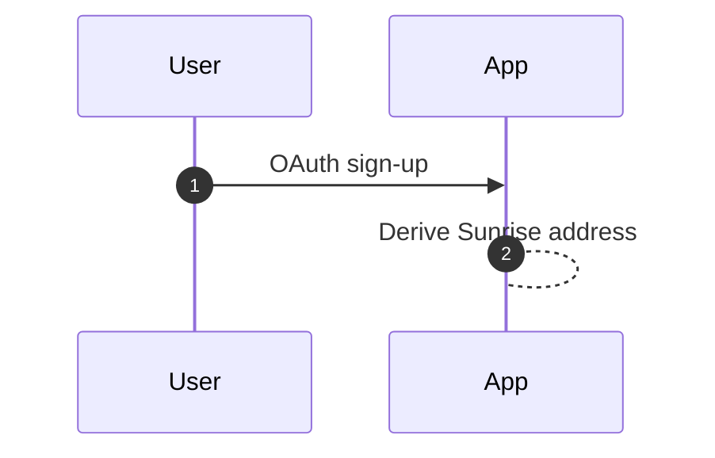
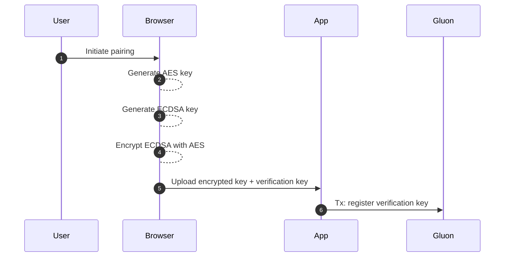
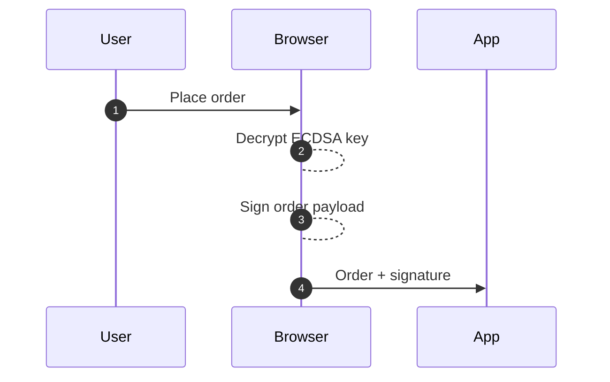
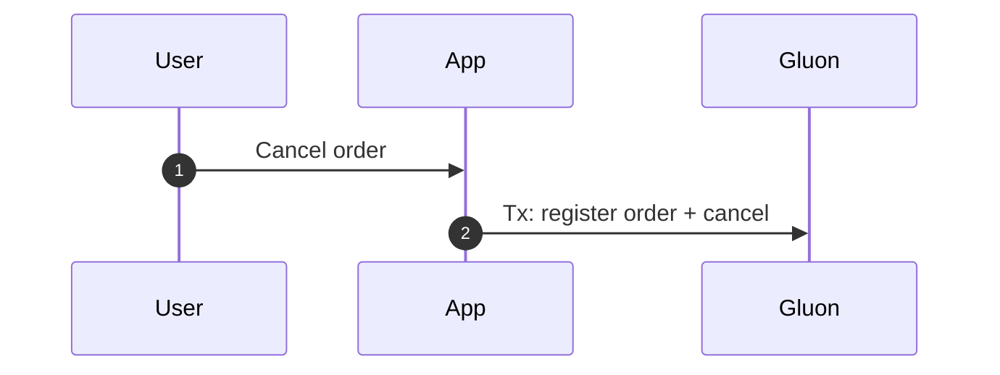
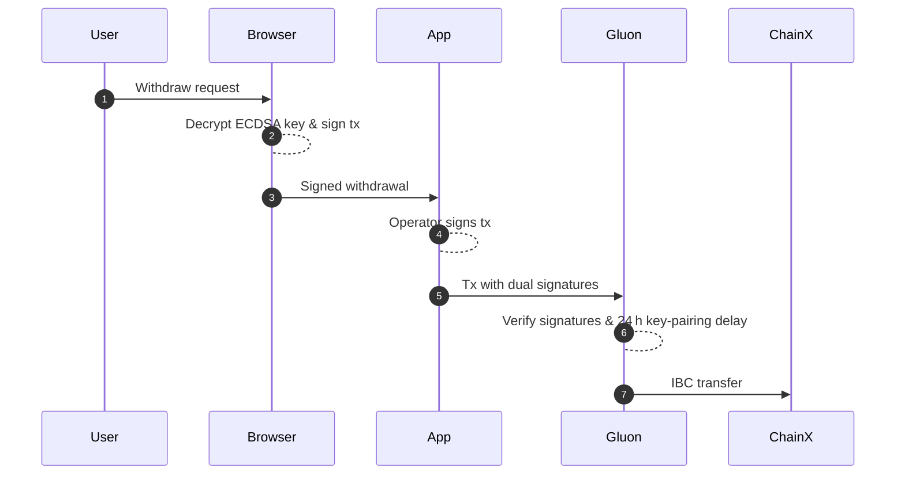

# Gluon Sovereign Rollup

Gluon is an order‑book Layer‑2 blockchain built with [Rollkit](https://rollkit.dev/) and secured by the **Sunrise Data‑Availability (DA) Layer**.  
The rollup implements Sunrise's Proof‑of‑Liquidity (PoL) and leverages IBC for seamless asset movement.

---

## Key Features

| Category                  | Description                                                                                           |
|---------------------------|-------------------------------------------------------------------------------------------------------|
| **Order‑book DEX**        | Deterministic matching logic, price‑time priority, and on‑chain settlement.                           |
| **Web2‑style onboarding** | OAuth registration abstracts private‑key management; user keys never leave the client device.         |
| **Off‑chain matching**    | High‑throughput matching engine batches trades before finalising them on chain.                       |
| **Double‑signature model**| All funding transactions require both user and operator signatures, preventing unilateral withdrawals.|
| **IBC deposits/withdraws**| Native IBC channels connect Gluon to external Cosmos‑SDK chains for trust‑minimised transfers.        |

---

## Developer Overview

* **Source code:** <https://github.com/sunriselayer/gluon>  
* **Sunrise Rollkit adapter:** <https://github.com/sunriselayer/sunrise-rollkit>  
* **Modules used:** `x/order`, `x/perp`, `x/customauth` (see protobuf definitions).

---

## Authentication & Key Management

Gluon introduces a *CustomAuth* flow that pairs a web‑generated ECDSA key with an on‑chain account:

1. **OAuth sign‑up** → server deterministically derives user address.  
2. **Device pairing** → browser generates an AES key and an ECDSA key; the latter is AES‑encrypted and stored server‑side.  
3. **Verification key** is submitted on chain (pairing transaction).

### Sign‑up Flow

The sign-up process is intentionally simple and user-friendly:

* Users can sign up using familiar OAuth providers (Google, GitHub, etc.)
* The application automatically derives a Sunrise address for the user
* No manual wallet setup or seed phrase management required



This streamlined process ensures users can start trading quickly without blockchain complexity.

### Device‑Pairing Flow

The device pairing process implements several security measures:

* Generates unique encryption keys for each device
* Keeps sensitive ECDSA keys encrypted and secure
* Establishes a verification mechanism for future transactions



This multi-step process ensures secure key management while maintaining user control.

### Order Creation (off‑chain)

The off-chain order creation process enables high-performance trading:

* Orders are signed locally using the user's encrypted key
* Signatures are verified before being accepted
* Orders remain off-chain until batched for matching



This approach allows for sub-second order placement while maintaining security.

### Order Cancellation (on‑chain)

The cancellation process ensures order integrity:

* Cancellations are recorded on-chain for transparency
* Prevents replay attacks of old signatures
* Provides immutable proof of cancellation



This on-chain record is crucial for maintaining order book integrity.

### Withdrawal (IBC)

The withdrawal process implements multiple security layers:

* Requires dual signatures from both user and operator
* Implements a 24-hour security delay for new key pairs
* Uses IBC for trust-minimized cross-chain transfers



This multi-layered approach ensures secure and reliable asset transfers across chains.

> No external wallets (e.g., MetaMask) are required; keys remain client‑side and are revocable on‑chain.

## Trading Lifecycle

### Order Creation (off‑chain)

Orders reside off‑chain until batched in the first matching transaction, enabling sub‑second UX.


### Order Cancellation (on‑chain)

An on‑chain record prevents operators from replaying stale user signatures.


### Withdrawal (IBC)

A 24‑hour latency between key‑pairing and fund movements mitigates operator‑key compromise.


## Order Module (protobuf)

The order subsystem is defined in `gluon/order/*`. Core types:

The `BaseOrder` message defines the fundamental structure for all orders in the system:

* Each order is associated with a specific user address and trading pair
* Orders can be either limit orders (with a specified price) or market orders
* The expiry timestamp prevents replay attacks and ensures order freshness
* Amount and price are stored as strings to handle arbitrary precision

```go
message BaseOrder {
  string         address      = 1;  // bech32 user address
  string         denom_base   = 2;  // e.g., "uatom"
  string         denom_quote  = 3;  // e.g., "uusdc"
  OrderDirection direction    = 4;  // BUY / SELL
  string         amount       = 5;  // base amount
  string         limit_price  = 6;  // optional
  google.protobuf.Timestamp expiry = 7;  // anti‑replay
}

enum OrderDirection {
  ORDER_DIRECTION_UNSPECIFIED = 0;
  ORDER_DIRECTION_BUY         = 1;
  ORDER_DIRECTION_SELL        = 2;
}
```

The `OrderDirection` enum provides a type-safe way to specify order sides:

* Uses standard protobuf enum conventions with an UNSPECIFIED default
* Clearly distinguishes between buy and sell orders
* Helps prevent order-side related bugs through compile-time checking
