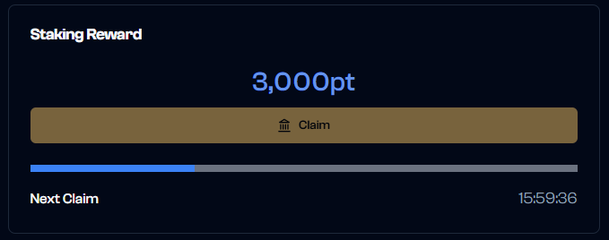
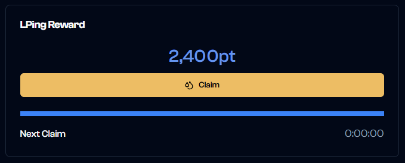
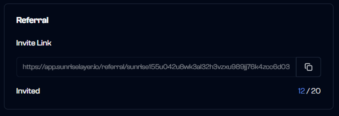
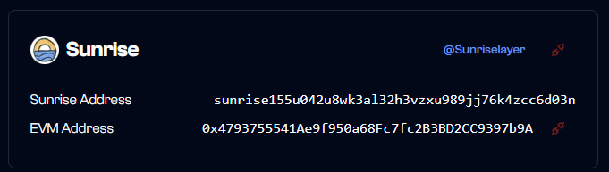

# Sunrise Point Program

Welcome to the Sunrise Point Program! This program rewards users for their active participation in the Sunrise ecosystem. By engaging in various activities, you can earn points that contribute to your standing in the community.

## Overview

The Sunrise Point Program offers multiple ways to earn points through activities:

- Daily
  - Staking vRISE tokens
  - Providing liquidity (LP)
- Up to specific time
  - Referring new users
- One-time
  - Connecting accounts

## Daily Point Claims

### Staking Rewards

Claim your staking points once every 24 hours
Points are calculated based on your current staking amount

`1 vRISE = 100 points`

- View your:
  - Available points to claim
    - Total staking amount
    - Staking distribution across validators
  - Remaining cooldown time

### LP Rewards

Claim your LP points once every 24 hours
Points are based on your valid liquidity positions


`Valid` means that the current price is within the price range set for the position.
Invalid positions is not counted for points. It is recommended that you close the invalid position and create a valid position.


`RISE LP: 1 RISE = 12 points`
`Other LP: 1 RISE (converted to RISE) = 10 points`

- View your:
  - Available points to claim
    - Total LP amount
    - Your valid & invalid positions
  - Remaining cooldown time

## Referral Program

Share your unique referral link to earn additional points:

- Receive 10% of your referrals' earned points
- Track successful referrals in the referral dashboard
- Bonus points are calculated independently for each referral


There is a limit to the number of people that can be invited.
No points can be earned from users invited over the limit. The upper limit is updated at regular intervals.


## Account Connections

### EVM Wallet Connection

- One-time bonus: 500 points
- Link your EVM wallet to access additional features
  - NFT Bonus (coming soon)

### X (Twitter) Connection

- One-time bonus: 100 points
- Show your X (Twitter) account in your profile
- Enable participation in retweet campaigns (coming soon)

## Point Scaling System

The point system scales over time to ensure fair distribution and reward early adopters and later participants while maintaining long-term sustainability.

## Important Notes

- Claims require manual interaction through the "Claim" buttons
- Each claim type has a 24-hour cooldown period
- You can continue staking and providing liquidity during cooldown periods
- Point calculations are performed at the time of claiming
