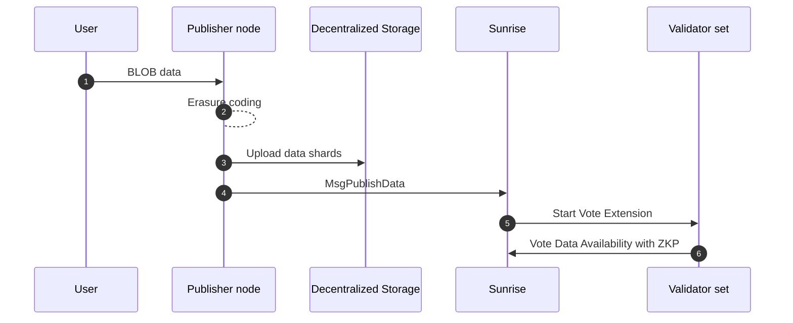

# Blob

The module `x/blob` is the Celestia-compatible module of Sunrise.

This module allows L2 operators to post the data to the Sunrise network. The data will be stored in the Sunrise network until the L2 transactions are finalized in the L1 blockchain.

## OFf Chain Blob Data (Data Availability v2)

After successfully launching the Sunrise v1 as a specialized Data Availability Layer for Proof of Liquidity,
we will introduce an upgrade for Blob features in Sunrise v2, to realize the usecases of Data Availability for fully on-chain AI, gaming, social and so on. Gluon will be the first place to realize the full on chain AI with Sunrise DA.

In the Sunrise v1 architecture, `data_hash` is replaced with the merkle root of the erasure-coded data with 2-dimension Reed Solomon encoding. The data means the txs data in the block. Data Availability Sampling technology plays a role of mitigating the running costs of full nodes with big blocks by enabling the light nodes to verify the data availability without downloading the entire block data.

[`CometBFT types.proto`](https://github.com/cometbft/cometbft/blob/main/proto/cometbft/types/v1/types.proto)
```protobuf
// Header defines the structure of a block header.
message Header {
  // basic block info
  cometbft.version.v1.Consensus version  = 1 [(gogoproto.nullable) = false];
  string                        chain_id = 2 [(gogoproto.customname) = "ChainID"];
  int64                         height   = 3;
  google.protobuf.Timestamp     time     = 4 [(gogoproto.nullable) = false, (gogoproto.stdtime) = true];

  // prev block info
  BlockID last_block_id = 5 [(gogoproto.nullable) = false];

  // hashes of block data
  bytes last_commit_hash = 6;  // commit from validators from the last block
  bytes data_hash        = 7;  // transactions

  // hashes from the app output from the prev block
  bytes validators_hash      = 8;   // validators for the current block
  bytes next_validators_hash = 9;   // validators for the next block
  bytes consensus_hash       = 10;  // consensus params for current block
  bytes app_hash             = 11;  // state after txs from the previous block
  bytes last_results_hash    = 12;  // root hash of all results from the txs from the previous block

  // consensus info
  bytes evidence_hash    = 13;  // evidence included in the block
  bytes proposer_address = 14;  // original proposer of the block
}
```

In this design, trivially all full nodes have to transfer and download the txs data in the mempool.
When the sizes of `BlobTx`s get larger, the throughput of the network will be limited by the txs transfer in the mempool. This will be an obstacle to apply the Data Availability technology for the usage of large BLOB data on decentralized applications, for example, fully on-chain AI, gaming, social and so on.

To mitigate this bottleneck, we will do these things:

1. Off chain execution of erasure encoding to generate the erasure-coded BLOB data
1. Using off chain distributed file transfer system / storage like IPFS, Arweave, etc.

In this new design, `MsgPublishData` will have the URI of metadata that has URIs of erasure-coded data shares.
The value is assumed to be the URI of decentralized storage / file transfer system like IPFS `"ipfs://[ipfs-cid]"` or Arweave `"ar://[hash]"`, and it will not be contained by `BlobTx` hence the blob data will not be on-chain of Sunrise.

In the consensus network, erasure encoding is not executed anymore. Only the double hash of erasure coded shard data will be included in `MsgPublishData`.

```protobuf
message MsgPublishData {
  option (cosmos.msg.v1.signer) = "sender";
  string sender = 1;
  string metadata_uri = 2;
  repeated bytes shard_double_hashes = 3;
}

message Metadata {
  uint64 shard_size = 1;
  uint64 shard_count = 2;
  repeated string shard_uris = 3;
}
```

Data Availability will be attested through zero knowledge proof using `shard_double_hashed` by proving that the validators can know the hash of shard data without disclosing them.

Currently it is assumed to do this process in [Vote Extension of ABCI 2.0](https://docs.cosmos.network/main/build/abci/vote-extensions).

In this design, "long term Data Retrievability" is easy to control by using external storage / file system like IPFS and Arweave whereas the Data Retrievability is not guaranteed by other ecosystem which serve Data Availability. The reason why long term Data Retrievability is not guaranteed by other ecosystem which serve Data Availability is that it is not needed to preserve the tx data of Optimistic Rollups after the challenge period for fraud proofs, or ZK Rollups after the submission of validity proofs.

In conclusion, there are benefits:

- The throughput of the network will be increased due to the block size
- Easy to control the long term Data Retrievability
  - Applications for fully on-chain AI, gaming, social and so on can be realized
- The decentralization of the network will be improved



## Specification for Zero-Knowledge Proof

### Terms and Notation

Total number of erasure coded shards:

$$
  n
$$

Threshold (minimum number of shards required to prove the possession):

$$
  t
$$

The i-th erasure coded data shard:

$$
  s_i
$$

The hash function:

$$
  H
$$

### Overview

This system verifies the possession of data shard hash

$$
  H(s_i)
$$

without exposing

$$
  H(s_i)
$$

### Zero-Knowledge Proof System

#### Public Inputs

$$\{H^2(s_i)\}_{i=1}^n, t$$

#### Private Inputs

$$I, \{H(s_i)\}_{i \in I}$$

#### ZKP Circuit Constraints

For each `i`, verify

$$
  H^2(s_i) = H^2(s_i)_{public}
$$

Verify

$$
  t \le |I|
$$
