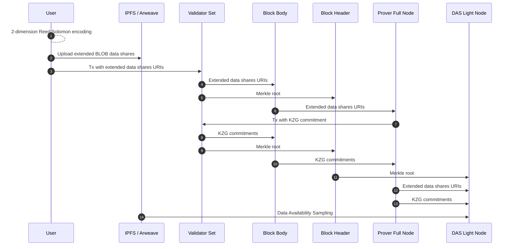

# Blob

The module `x/blob` is the Celestia-compatible module of Sunrise.

This module allows L2 operators to post the data to the Sunrise network. The data will be stored in the Sunrise network until the L2 transactions are finalized in the L1 blockchain.

## Blob Sunrise v2

### OFf Chain Blob Data

After successfully launching the Sunrise v1 as a specialized Data Availability Layer for Proof of Liquidity,
we will introduce an upgrade for Blob features in Sunrise v2, to realize the usecases of Data Availability for full-onchain AI, gaming, social and so on. Gluon will be the first place to realize the full on chain AI with Sunrise DA.

In the Sunrise v1 architecture, `data_hash` is replaced with the merkle root of the extended data with 2-dimension Reed Solomon encoding. The data means the txs data in the block.

[`CometBFT types.proto`](https://github.com/cometbft/cometbft/blob/main/proto/cometbft/types/v1/types.proto)
```protobuf
// Header defines the structure of a block header.
message Header {
  // basic block info
  cometbft.version.v1.Consensus version  = 1 [(gogoproto.nullable) = false];
  string                        chain_id = 2 [(gogoproto.customname) = "ChainID"];
  int64                         height   = 3;
  google.protobuf.Timestamp     time     = 4 [(gogoproto.nullable) = false, (gogoproto.stdtime) = true];

  // prev block info
  BlockID last_block_id = 5 [(gogoproto.nullable) = false];

  // hashes of block data
  bytes last_commit_hash = 6;  // commit from validators from the last block
  bytes data_hash        = 7;  // transactions

  // hashes from the app output from the prev block
  bytes validators_hash      = 8;   // validators for the current block
  bytes next_validators_hash = 9;   // validators for the next block
  bytes consensus_hash       = 10;  // consensus params for current block
  bytes app_hash             = 11;  // state after txs from the previous block
  bytes last_results_hash    = 12;  // root hash of all results from the txs from the previous block

  // consensus info
  bytes evidence_hash    = 13;  // evidence included in the block
  bytes proposer_address = 14;  // original proposer of the block
}
```

In this design, trivially all full nodes have to transfer and download the txs data in the mempool.
When the sizes of `BlobTx`s get larger, the throughput of the network will be limited by the txs transfer in the mempool.

To mitigate this bottleneck, we will do these things:

1. Abolishing the `BlobTx` type and changing the `MsgPayForBlob`
1. User side execution of 2-dimension Reed Solomon encoding to generate the extended BLOB data
1. Users directly uploading the shares of extended data to the storage network like IPFS, Arweave, etc.
1. Users posting the tx with URI list of the shares of extended data to the Sunrise consensus network
1. Introducing the field for storing the merkle root of the list of extended data shares URI in the `Header` message.

In this new design, `MsgPayForBlob` will contain the URIs of extended data shares.
The value is assumed to be the URI of the IPFS `"ipfs://[ipfs-cid]"` or Arweave `"ar://[hash]"`, and it will not be contained by `BlobTx` hence the blob data will not be on-chain of Sunrise.

In the consensus network, 2-dimension reed solomon encoding is not executed anymore. Only the merkle root of the list of extended data shares URI will be stored in the `Header` message.

Ultimately it means that Data Availability Sampling will be done only for blob data off-chain, not the entire tx data in the block. Data Availability light nodes still can do Data Availability sampling only with downloading the block header and a few sizes of the data share of 2-dimension Reed Solomon encoding.

### KZG Commitment

In the Sunrise v1 architecture, correctness of the 2-dimensional Reed Solomon encoding is guaranteed by the fraud proof.
By substituting the fraud proof with the KZG commitment, we can reduce time to the attestation of the data availability.
Due to the design of user side execution of 2-dimension Reed Solomon encoding, the KZG commitment will be done by the prover full node for each BLOB data.

### Sequence Diagram


