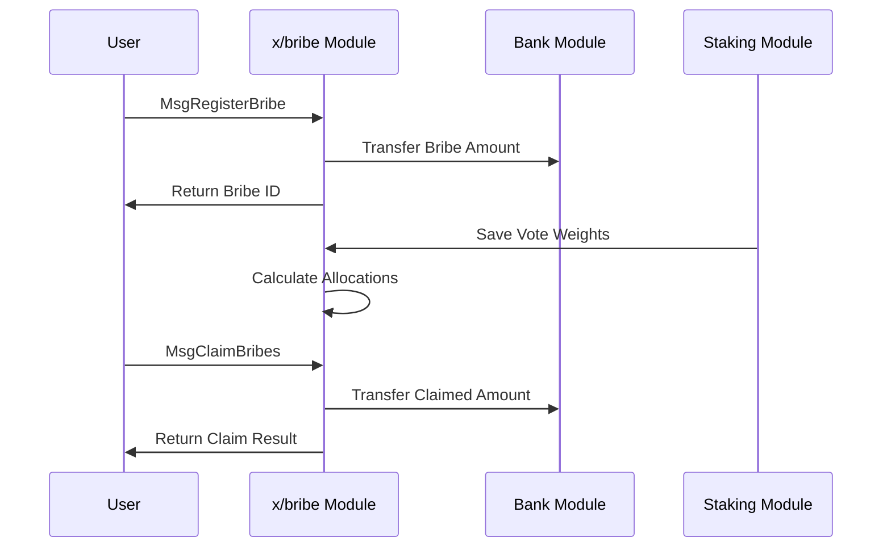

# Bribes

The `x/bribe` module implements a protocol-level mechanism that allows applications to reward vRISE holders for directing votes to specific pools. This creates an efficient market for liquidity allocation through a bribe-based incentive system.

## Key Features


**LEVEL 1: FOR APP DEVELOPERS**


1. **Protocol-Level Bribes:**
   - Applications can offer bribes to attract liquidity to specific pools
   - vRISE holders are incentivized to direct votes to pools with higher bribes
   - Creates an efficient market for liquidity allocation

2. **Epoch-Based System:**
   - Bribes are tied to specific epochs
   - System tracks expired epochs
   - Unclaimed bribes from expired epochs are processed and sent to fee collector

3. **Weight-Based Distribution:**
   - Fair allocation based on vote weights
   - Prevents double claiming
   - Transparent and verifiable on-chain

4. **Economic Efficiency:**
   - Creates a market for liquidity allocation
   - vRISE holders can maximize returns by directing votes
   - Unclaimed rewards are recycled to fee collector

## Core Functionality


**LEVEL 2: FOR ADVANCED USERS**


### Bribe Management

**Each bribe is defined by several parameters:**

- `id`: Unique identifier for the bribe
- `epoch_id`: The epoch for which the bribe is valid
- `pool_id`: The pool to which the bribe applies
- `amount`: Total amount of the bribe
- `claimed_amount`: Amount already claimed by voters

### Bribe Allocation

The system tracks how bribes are allocated to voters:

- `address`: Voter's address
- `epoch_id`: Epoch for which the allocation is valid
- `pool_id`: Pool to which the allocation applies
- `weight`: Weight of the voter's votes
- `claimed_bribe_ids`: List of bribe IDs already claimed

## Workflow: Registering and Claiming Bribes


**LEVEL 2: FOR ADVANCED USERS**




## Messages


**LEVEL 3: FOR MODULE DEVELOPERS**


### MsgRegisterBribe

Registers a new bribe for a future epoch.

```go
type MsgRegisterBribe struct {
    Sender   string
    EpochId  uint64
    PoolId   uint64
    Amount   sdk.Coin
}
```

### MsgClaimBribes

Claims bribes for a specific epoch and pool.

```go
type MsgClaimBribes struct {
    Sender   string
    EpochId  uint64
    PoolId   uint64
}
```

## Example Usage


**LEVEL 1: FOR APP DEVELOPERS**


**Register a Bribe**

```javascript
import { SunriseClient } from "@sunriselayer/client";
import { MsgRegisterBribe } from "@sunriselayer/client/types";

async function registerBribe() {
    const client = await SunriseClient.connect("https://rpc.sunriselayer.io");
    
    const msgRegisterBribe = {
        sender: "sunrise1...",
        epochId: 100,
        poolId: 1,
        amount: { denom: "urise", amount: "1000000" }
    };
    
    const result = await client.executeTransaction(msgRegisterBribe);
    console.log("Bribe registered:", result);
}
```

**Claim Bribes**

```javascript
import { SunriseClient } from "@sunriselayer/client";
import { MsgClaimBribes } from "@sunriselayer/client/types";

async function claimBribes() {
    const client = await SunriseClient.connect("https://rpc.sunriselayer.io");
    
    const msgClaimBribes = {
        sender: "sunrise1...",
        epochId: 100,
        poolId: 1
    };
    
    const result = await client.executeTransaction(msgClaimBribes);
    console.log("Bribes claimed:", result);
}
```

## Queries


**LEVEL 1: FOR APP DEVELOPERS**


The module provides various query endpoints:

- BribeAllocation: Get allocation for specific address/epoch/pool
- BribesByPoolId: Get all bribes for a pool
- BribesByEpochAndPoolId: Get bribes for specific epoch and pool
- BribeAllocations: Get all bribe allocations
- BribeAllocationsByAddress: Get allocations for specific address

## Integration Points

The bribe module integrates with several other modules:

- Bank module for coin transfers
- Account module for address handling
- Staking module for vRISE holders
- Governance module for parameter updates

## Parameters

The system has configurable parameters:

- Bribe claim epochs (time window for claiming)
- Other governance-controlled parameters
