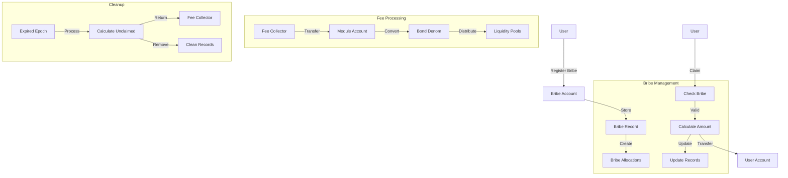

# Bribes

The `x/bribe` module implements a protocol-level mechanism that allows applications to reward vRISE holders for directing votes to specific pools. This creates an efficient market for liquidity allocation through a bribe-based incentive system.

## Key Features


**LEVEL 1: FOR APP DEVELOPERS**


1. **Protocol-Level Bribes:**
   - Applications can offer bribes to attract liquidity to specific pools
   - vRISE holders are incentivized to direct votes to pools with higher bribes
   - Creates an efficient market for liquidity allocation

2. **Epoch-Based System:**
   - Bribes are tied to specific epochs
   - System tracks expired epochs
   - Unclaimed bribes from expired epochs are processed and sent to fee collector

3. **Weight-Based Distribution:**
   - Fair allocation based on vote weights
   - Prevents double claiming
   - Transparent and verifiable on-chain

4. **Economic Efficiency:**
   - Creates a market for liquidity allocation
   - vRISE holders can maximize returns by directing votes
   - Unclaimed rewards are recycled to fee collector

## Core Functionality


**LEVEL 2: FOR ADVANCED USERS**


### Bribe Management

**Each bribe is defined by several parameters:**

- `id`: Unique identifier for the bribe
- `epoch_id`: The epoch for which the bribe is valid
- `pool_id`: The pool to which the bribe applies
- `amount`: Total amount of the bribe
- `claimed_amount`: Amount already claimed by voters

### Bribe Allocation

The system tracks how bribes are allocated to voters:

- `address`: Voter's address
- `epoch_id`: Epoch for which the allocation is valid
- `pool_id`: Pool to which the allocation applies
- `weight`: Weight of the voter's votes
- `claimed_bribe_ids`: List of bribe IDs already claimed

---

## Bribe System Architecture & Flow

### Key Components and Flows

#### Bribe Registration

- **User registers a bribe** by sending coins to the Bribe module.
- The system **creates a Bribe record** (with unique ID, epoch, pool, amount, and claimed amount).
- **Bribe allocations** are created for voters based on their vote weights for the pool in that epoch.
- Funds are stored in the **Bribe Account** (module account).

#### Bribe Claiming

- **User initiates a claim** for their bribe allocation.
- The system:
  - Verifies the bribe exists and is valid for the epoch/pool.
  - Checks the user's allocation and ensures the bribe hasn't been claimed.
  - Calculates the claimable amount based on the user's vote weight.
  - Transfers the appropriate amount from the Bribe Account to the user.
  - Updates the claimed amount and allocation records.

#### Fee Processing

- Unclaimed bribes from expired epochs are **returned to the Fee Collector**.
- Fees are processed:
  - Transferred from the Fee Collector to the module account.
  - Converted to the bond denomination if needed.
  - Distributed to liquidity pools as incentives.

#### Cleanup (Unclaimed Bribes)

- At the end of each epoch, the system:
  - Processes expired epochs.
  - Calculates unclaimed bribe amounts.
  - Returns unclaimed funds to the Fee Collector.
  - Cleans up expired bribe and allocation records.

#### State Transitions

- **Bribe:** Created → Active → Claimed/Expired
- **Allocation:** Created → Active → Claimed/Expired
- **Funds:** User → Bribe Account → User/Fee Collector

---

### Data Structures

**Bribe**

```protobuf
message Bribe {
  uint64 id = 1;
  uint64 epoch_id = 2;
  uint64 pool_id = 3;
  string address = 4 [(cosmos_proto.scalar) = "cosmos.AddressString"];
  repeated cosmos.base.v1beta1.Coin amount = 5;
  repeated cosmos.base.v1beta1.Coin claimed_amount = 6;
}
```

**BribeAllocation**

```protobuf
message BribeAllocation {
  string address = 1 [(cosmos_proto.scalar) = "cosmos.AddressString"];
  uint64 epoch_id = 2;  
  uint64 pool_id = 3;
  string weight = 4 [(cosmos_proto.scalar) = "cosmos.Dec"];
  repeated uint64 claimed_bribe_ids = 5;
}
```

---

### Bribe System Flowchart



---

### Querying Bribes

The system provides endpoints to:

- `BribesByPoolId`: Query all bribes for a pool
- `BribesByEpochAndPoolId`: Query bribes for a specific epoch and pool
- `BribeAllocations`: Query all bribe allocations
- `BribeAllocation`: Query allocation for a specific address/epoch/pool
- `BribeAllocationsByAddress`: Get allocations for specific address
- Query claimable amounts and claimed status
- Query expired/cleaned up bribes

## Integration Points

The bribe module integrates with several other modules:

- Bank module for coin transfers
- Account module for address handling
- Staking module for vRISE holders
- Governance module for parameter updates

## Parameters

The system has configurable parameters:

- Bribe claim epochs (time window for claiming)
- Other governance-controlled parameters
