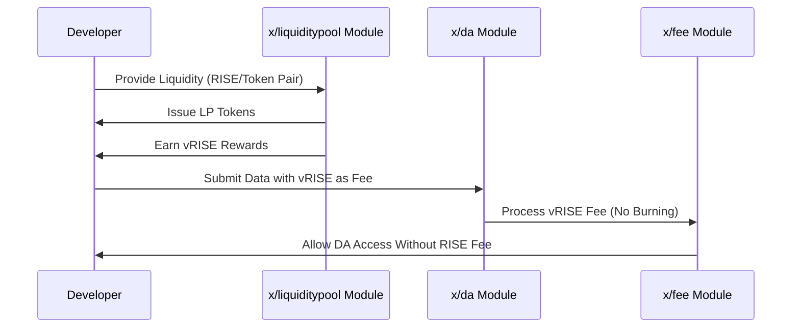

# DA Fee Abstraction

Sunrise introduces "DA Fee Abstraction," a mechanism that allows developers to access blob spaces on Sunrise without paying direct fees. Instead, developers can provide liquidity to Sunrise liquidity pools to gain access to data availability services. This innovative approach reduces entry barriers for developers while maintaining the economic sustainability of the network.

## Key Features

1. **Liquidity-Based Access:**

   - Developers provide liquidity to pools in the `x/liquiditypool` module.
   - This contribution supports the network's overall liquidity and stability.


2. **Reward Mechanism (`$vRISE`):**

   - Liquidity providers receive `$vRISE` tokens as rewards.
   - These tokens can be used to pay for data availability transactions.


3. **Fee Segregation:**

   - Data availability transactions can use `$vRISE` tokens.
   - Other transaction types still require `$RISE` tokens for fees.


4. **Economic Sustainability:**

   - Ensures Sunrise can provide data availability services without direct fee revenue.
   - Creates an alternative economic model that benefits both the network and developers.

## Core Functionality

### Liquidity Provision and DA Access

**When developers want to access data availability services:**

- They provide liquidity to selected pools in the `x/liquiditypool` module.
- They receive LP tokens representing their share of the pool.
- They earn `$vRISE` tokens through liquidity mining.
- These `$vRISE` tokens can be used to pay for data availability transactions.

## Workflow: DA Fee Abstraction Process

Below is a sequence diagram illustrating how the DA Fee Abstraction works:



## Benefits

1. **Lower Entry Barriers:**

   - Developers can access data availability services without upfront token costs.
   - Promotes greater adoption of Sunrise's data availability layer.


2. **Liquidity Enhancement:**

   - Encourages developers to provide liquidity to the network.
   - Improves overall market depth and reduces slippage.


3. **Sustainable Economics:**

   - Creates a virtuous cycle where DA usage drives liquidity.
   - Liquidity providers are incentivized through `$vRISE` rewards.

## Example Usage

**Providing Liquidity and Using DA**

```javascript
import { SunriseClient } from "@sunriselayer/client";
import { MsgCreatePosition } from "@sunriselayer/client/types";

async function provideLiquidityAndUseDA() {
    // Connect to Sunrise
    const client = await SunriseClient.connect("https://sunrise-rpc.example.com");
    
    // Step 1: Provide liquidity to a pool
    const msgCreatePosition = {
        sender: "sunrise1...",
        poolId: 1,
        tokenBase: { denom: "urise", amount: "1000000" },
        tokenQuote: { denom: "uusdc", amount: "1000000" },
        lowerTick: "-10000",
        upperTick: "10000"
    };
    
    // Step 2: Submit DA data using vRISE for fees
    const msgPublishData = {
        sender: "sunrise1...",
        data: "0x...", // Your data to publish
        fee: { denom: "uvRISE", amount: "100000" }
    };
    
    // Execute transactions
    const result = await client.executeTransactions([msgCreatePosition, msgPublishData]);
    console.log("Liquidity provided and DA accessed:", result);
}
```

For more details and implementation specifics, see the [GitHub repository](https://github.com/sunriselayer/sunrise/tree/liquidstaking/x/liquiditypool)

