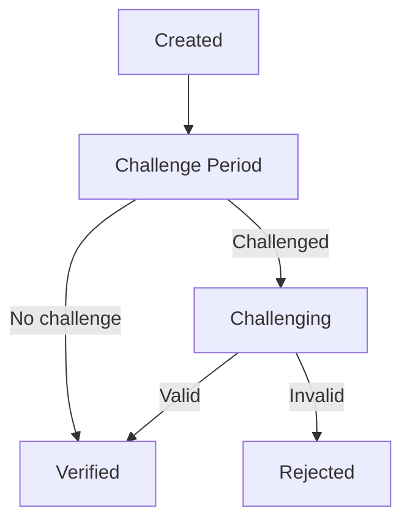
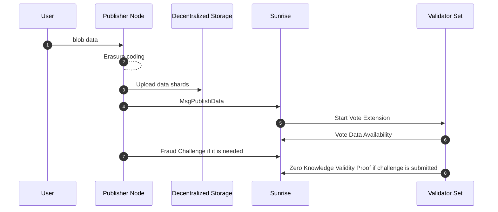

# Data Availability

> **Sunrise v2 DA at a glance**
>
> - Blazing fast: 4 MB blocks, 5 MB/s sustained throughput, 14.2 s finality (30 validators)
> - Off-chain erasure coding and blob propagation for unmatched scalability
> - KZG commitments for sub-second proof verification and instant challenge resolution
> - Flexible storage: IPFS (hot), Arweave (perma), Filecoin (sealed)

## Blazing Fast Data Availability

Sunrise's off‑chain DA design unlocks unmatched throughput and cost‑efficiency without sacrificing on‑chain security.

1. **Off‑chain Erasure Coding**  
   Dramatically cuts validator compute & storage: only coded shards live on chain, full data reconstruction happens off‑chain.
2. **Off‑chain Blob Propagation**  
   Keeps the mempool lightweight and scales to **5 + MB/s**—validators sample availability while nodes fetch or prune blobs on demand.
3. **KZG Commitments**  
   Cryptographic anchors on‑chain enable sub‑second proof verification and instant challenge resolution.

## Data Availability Features

Sunrise moves heavy data work off‑chain while keeping on‑chain proofs lean and verifiable.

1. **Off‑chain Erasure Coding**  
   - Blob data is split and Reed–Solomon encoded outside the chain.  
   - Validators store only the 32‑byte double‑hash per shard, cutting disk I/O and memory overhead.
2. **Off‑chain Blob Propagation**  
   - Transactions carry only metadata (shard hashes) into the mempool.  
   - Full blob payloads are P2P‑distributed via the blob network, supporting sustained **5 MB/s** throughput.  
   - Nodes fetch or prune blobs on demand, giving you control over local storage.
3. **KZG Polynomial Commitments**  
   - A single on‑chain KZG commitment binds all shards.  
   - Verifiers check inclusion in **O(log n)** time with constant‑size proofs (~48 bytes).  
   - Rapid challenge/response cycles (< 1 s) ensure data‑availability guarantees.

## On-chain vs Off-chain DA: Comparison

|                                          | On-chain DA attestation              | Off-chain DA attestation |
| ---------------------------------------- | ------------------------------------ | ------------------------ |
| Data Corruption Durability               | 〇                                   | 〇                       |
| Tx Mempool Scalability                   | ×                                    | 〇                       |
| Data Retrievability Control              | ×                                    | 〇                       |
| Validators Load Mitigation               | ×                                    | 〇                       |
| False-Positive DA Attestation Resistance | 〇                                   | 〇※                      |
| Examples                                 | Celestia, Avail, EigenDA | Sunrise   |

## Design Overview

### Key Features of Sunrise v2

Several enhancements in Sunrise v2 increase throughput, decentralization, and long-term data retrievability:

- **Off-chain Erasure Encoding:** Blob data is erasure-coded off-chain, minimizing the computational and storage load on validators.
- **Off-chain Storage Integration:** Utilizing decentralized storage solutions such as IPFS and Arweave, data shards are stored externally. MsgPublishData includes only a metadata URI pointing to these erasure-coded data shares, reducing the on-chain block size requirements for blob transactions and enhancing scalability.

### Design patterns of other DA layers

#### Data Availability Committee

Data Availability Committee (DAC) is the traditional method to construct alternative Data Availability layer with low costs.

However, in DAC, it is impossible for clients to verify whether Data Availability attested by the committee is true or false, without downloading entire blob data.

#### Data Availability Sampling

In the Data Availability layers which adopts Data Availability Sampling (DAS), block data are processed for Erasure Coding. Then clients can verify the Data Availability only with downloading a part of block data, and can verify the inclusion of blob data in the block by using Merkle Tree structure.

In typical DAS setup, full nodes must transfer and download transaction data within the mempool.

As blob data sizes grow, the network's throughput could be limited by these transaction transfers, creating challenges for applications handling large blob data.

### Sunrise's design

To address these problems in DAC and DAS, Sunrise v2 implements the following solutions:

1. **Off-chain Erasure Encoding:** Blob data is processed for Erasure Coding in off-chain program, to reduce validator load.
2. **Blob data sharding:** Not the entire block data but each blob is processed for Erasure Coding. Clients still can verify the Data Availability for each blob only with repeating to download shards, without downloading entire data. Clients also can verify the inclusion of blob in the block by using Merkle Tree structure.
3. **External Storage:** Blob data is stored on decentralized storage platforms like IPFS and Arweave. Rather than containing blob data on-chain, MsgPublishData holds a metadata URI pointing to erasure-coded data shares.

## Formal Specification

### MsgPublishData ABI

```protobuf
message MsgPublishData {
  option (cosmos.msg.v1.signer) = "sender";
  string sender = 1 [(cosmos_proto.scalar) = "cosmos.AddressString"];
  string metadata_uri = 2;
  uint64 parity_shard_count = 3;
  repeated bytes shard_double_hashes = 4;
  string data_source_info = 5;
}
```

### Proof Lifecycle

Submitted data will have one of the following statuses:

- **Created** → **Challenge Period** → **Challenging** → **Verified** / **Rejected**

- **Challenge Period:** After submission, data remains in this status for a set period. If enough invalidity challenges are submitted, it moves to Challenging; otherwise, it becomes Verified.
- **Challenging:** Validators verify the data and submit proofs. If the validated shard meets the criteria, it becomes Verified; if not, Rejected.
- **Verified:** The metadata URI is included in the block and can be referenced externally.
- **Rejected:** The data was determined to be invalid and is not included in the block.



### Flow of proof



### Zero-Knowledge Proof System

- The hash function: $$H$$
- Set of validators: $$ V $$
- Set of data shards: $$ S_d $$
- Set of parity shards: $$ S_p $$
- Set of shards: $$ S = S_d \cup S_p $$

1. **Circuit Constraints:**

$$
  H_{\text{public}}^2(s) = H(H_{\text{private}}(s))
$$

2. **Proof size formula:**

$$
\text{proof\_size} = 48\text{B} + 32\text{B} \times \lceil \log_2(n_{\text{shards}}) \rceil
$$

### Slashing rule

For validator $v$:
$$
\frac{|Z_v|}{n} < 0.67 \implies \text{slash}(v, \text{slash\_ratio})
$$

### Parameter Table

| Param              | Default   | Units   | CLI flag                |
|--------------------|-----------|---------|-------------------------|
| challenge_period   | 2         | blocks  | --da-challenge-period   |
| parity_shards      | 10        | shards  | --da-parity             |
| replication_factor | 6         | copies  | implicit                |

## Operational Details

### Performance Metrics

- 4 MB block, 5 MB/s sustained throughput, 14.2 s finality across 30 validators (synthetic benchmark)

### Security Story

- Validators are slashed for failing to provide valid proofs (see slashing rule above)
- DoS resistance: lightweight on-chain proofs, off-chain heavy lifting
- Light-client proofs: constant-size, O(log n) verification

### Storage Backends

| Backend   | Use Case      | Retention | Notes                        |
|-----------|---------------|-----------|------------------------------|
| IPFS      | Hot storage   | Short     | Fast retrieval, not permanent|
| Arweave   | Permanent     | Long      | Permaweb, pay-once           |
| Filecoin  | Sealed/cold   | Medium    | Sealed deals, slower access  |
