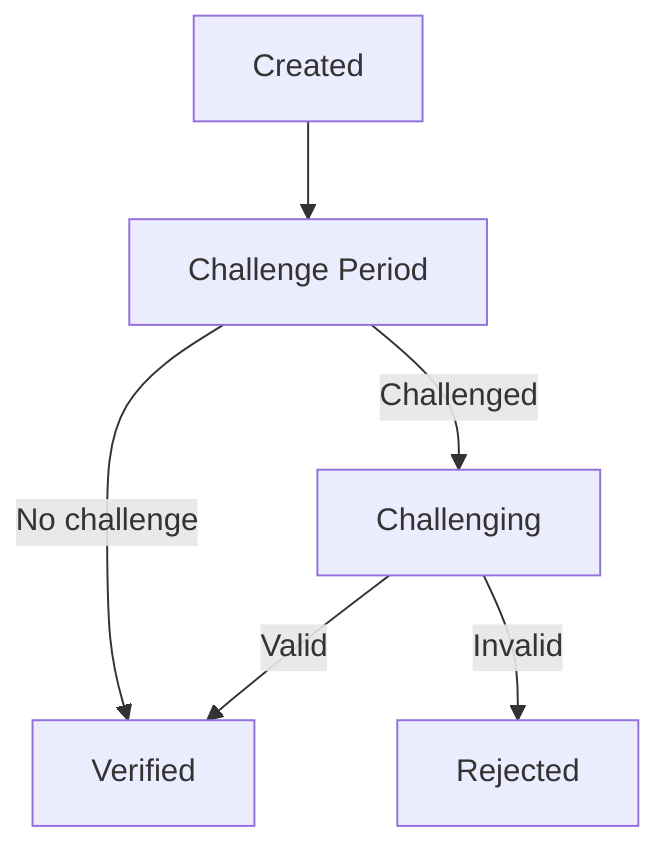
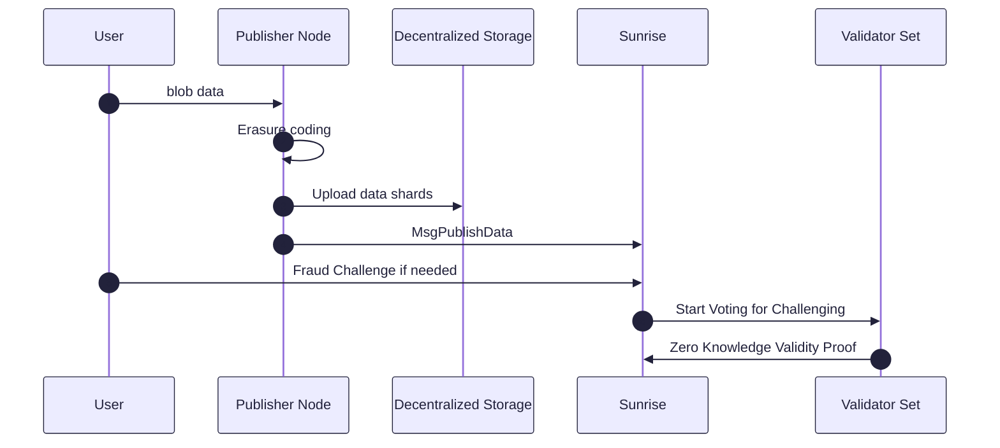

# Data Availability

Sunrise Data Availability Layer is designed for high-throughput data availability, offering enhanced scalability and flexibility for applications. To achieve this, Sunrise adopts off-chain BLOB data and executes Erasure Coding for each Blob data, not entire block data.

The `x/da` module provides these features.

## Key Features

Sunrise's off‑chain DA design unlocks unmatched throughput and cost‑efficiency without sacrificing on‑chain security.

1. **Off-chain Erasure Encoding**  
   Dramatically cuts validator compute & storage: only a metadata URI pointing to these erasure-coded data shares on chain, full data reconstruction happens off‑chain.
2. **Off-chain Storage Integration**  
   Utilizing decentralized storage solutions such as IPFS and Arweave, data shards are stored externally. MsgPublishData includes only a metadata URI pointing to these erasure-coded data shares, reducing the on-chain block size requirements for blob transactions and enhancing scalability.

## DA Comparison

|                          | Sunrise                           | Avail DA              | Celestia              | EigenDA           | Ethereum (EIP-4844)   |
| ------------------------ | --------------------------------- | --------------------- | --------------------- | ----------------- | --------------------- |
| Architecture             | L1 with off-chain blobs           | L1 Blockchain         | L1 Blockchain         | DA Service        | L1 Blockchain (blobs) |
| Throughput               | 5+ MB/s                           | 0.2 MB/s (4MB/block)  | 1.33 MB/s (8MB/block) | 15 MB/s           | 0.064 MB/s            |
| Time to Finality         | ~4min (7s+240s)                   | 40 seconds            | 6 sec + 10 min        | 12 min            | 12 min                |
| Data Storage             | Off-chain blobs                   | On-chain              | On-chain              | Committee storage | On-chain blobs        |
| Proof Mechanism          | Optimistic with off-chain storage | Validity proof (KZG)  | Fraud proof           | Validity proof    | Validity proof        |
| Long-term Retrievability | Seamless                          | Not native            | Not native            | Not native        | Not native            |
| Cost Model               | Fee Abstraction via liquidity     | Direct fees           | Direct fees           | Committee fees    | On-chain gas fees     |
| Consensus                | Proof of Liquidity                | Babe & Grandpa (NPoS) | Tendermint            | N/A               | Ghost & Casper        |

## Design Overview

### Design patterns of other DA layers

1. **Data Availability Committee**

    Data Availability Committee (DAC) is the traditional method to construct alternative Data Availability layer with low costs.

    However, in DAC, it is impossible for clients to verify whether Data Availability attested by the committee is true or false, without downloading entire blob data.

1. **Data Availability Sampling**

    In the Data Availability layers which adopts Data Availability Sampling (DAS), block data are processed for Erasure Coding. Then clients can verify the Data Availability only with downloading a part of block data, and can verify the inclusion of blob data in the block by using Merkle Tree structure.

    In typical DAS setup, full nodes must transfer and download transaction data within the mempool.

    As blob data sizes grow, the network's throughput could be limited by these transaction transfers, creating challenges for applications handling large blob data.

### Sunrise's design

To address these problems in DAC and DAS, Sunrise implements the following solutions:

1. **Off-chain Erasure Encoding**
    Blob data is processed for Erasure Coding in off-chain program, to reduce validator load.
1. **Blob data sharding**
    Not the entire block data but each blob is processed for Erasure Coding. Clients still can verify the Data Availability for each blob only with repeating to download shards, without downloading entire data. Clients also can verify the inclusion of blob in the block by using Merkle Tree structure.
1. **External Storage**
    Blob data is stored on decentralized storage platforms like IPFS and Arweave. Rather than containing blob data on-chain, MsgPublishData holds a metadata URI pointing to erasure-coded data shares.

    ```protobuf
    message MsgPublishData {
      option (cosmos.msg.v1.signer) = "sender";
      string sender = 1 [(cosmos_proto.scalar) = "cosmos.AddressString"];
      string metadata_uri = 2;
      uint64 parity_shard_count = 3;
      repeated bytes shard_double_hashes = 4;
      string data_source_info = 5;
    }
    ```

    Data availability is attested with Optimistic way. If enough invalidity challenges is submitted to the Sunrise network, validators will submit Zero-Knowledge Proofs (ZKP) using double-hashed shard data (`shard_double_hashes`), allowing validators to verify the presence of shard data without revealing it.

### Proof Lifecycle

Submitted data will have one of the following statuses:

- **Created** → **Challenge Period** → **Challenging** → **Verified** / **Rejected**

- **Challenge Period:** After submission, data remains in this status for a set period. If enough invalidity challenges are submitted, it moves to Challenging; otherwise, it becomes Verified.
- **Challenging:** Validators verify the data and submit proofs. If the validated shard meets the criteria, it becomes Verified; if not, Rejected.
- **Verified:** The metadata URI is included in the block and can be referenced externally.
- **Rejected:** The data was determined to be invalid and is not included in the block.



### Flow of proof



## Zero-Knowledge Proof System

### Terms and Notation

- The hash function: $$H$$
- Set of validators: $$ V $$
- Set of data shards: $$ S_d $$
- Set of parity shards: $$ S_p $$
- Set of shards: $$ S $$

$$
  S = S_d \cup S_p
$$

### Overview

This system verifies the possession of data shard hash $$ H(s_i) $$ without exposing $$ H(s_i) $$
The circuit is for one shard $ s \in S $.

1. Public Inputs
  
    $$ H\_{\text{public}}^2(s)$$

1. Private Inputs

    $$ H\_{\text{private}}(s) $$

1. Circuit Constraints

    $$
      H_{\text{public}}^2(s) = H(H_{\text{private}}(s))
    $$

## The condition of Data Availability

### Notations

- Replication Factor (Based only on data shards): $$ r $$
- Replication Factor (Based on including parity shards): $$ r_p $$

$$
  r_p = r \frac{|S_d|}{|S_d| + |S_p|}
$$

- The number of shards each validator is engaged in: $$ n $$

$$
  n = \text{ceil}\left( r_p \frac{|S_d| + |S_p|}{|V|} \right) = \text{ceil} \left( r\frac{|S_d|}{|V|} \right)
$$

### Requirements for each shard to prove Data Availability

- Set of valid proofs for a shard `s` from validators engaged in this shard: $$ Z_s $$

$$
  \frac{|Z_s|}{r_p} \ge \frac{2}{3}
$$

- Set of shards which satisfy this condition: $$ S^\text{available} $$

### Requirements for tally to prove Data Availability

$$
\begin{aligned}
  \frac{|S^\text{available}|}{|S|} &\ge \frac{|S_d|}{|S_d| + |S_p|} \\
\Rightarrow |S^\text{available}| &\ge |S_d|
\end{aligned}
$$

#### Example parameters

- 10 validators: $$ v_1 , ..., v_{10} $$
- 20 shards: $$ s_1, ..., s_{20} $$
  - 10 data shards
  - 10 parity shards
- $$ r = 6 $$
- $$ r_p = 6 \times \frac{10}{10 + 10} = 3 $$
- Each validator submits 6 shards proofs
  - $$ 3 \times \frac{20}{10} = 6 $$

#### Case A: valid shard `s_1`

- Validator $$ v_1 $$, $$ v_3 $$ and $$ v_9 $$ 's proof contain shard $$ s_1 $$ and other 5 shards
- Validator $$ v_3 $$ failed to contain the validity of shard $$ s_1 $$ in its proof
- However validator $$ v_1 $$ and $$ v_9 $$ succeeded to contain the validity of shard $$ s_1 $$ in its proof, then
  - $$ |Z\_{s_1}| = 2 $$
  - It satisfies $$ \frac{|Z\_{s_1}|}{r_p} \ge \frac{2}{3} $$

#### Case B: invalid shard `s_2`

- Validator $$ v_2 $$, $$ v_4 $$ and $$ v_{10} $$ 's proof contain shard $$ s_2 $$ and other 5 shards
- Validator $$ v_2 $$ and $$ v_4 $$ failed to contain the validity of shard $$ s_2 $$ in its proof
- Only validator $$ v_{10} $$ succeeded to contain the validity of shard $$ s_2 $$ in its proof, then
  - $$ |Z\_{s_2}| = 1 $$
  - It doesn't satisfy $$ \frac{|Z\_{s_2}|}{r_p} \ge \frac{2}{3} $$

#### Case X: shard s_1, s_3-s_11 are valid with the condition above

- $$ |S^\text{available}| = 10 $$
- $$ |S_d| = 10 $$
- It satisfies $$ |S^\text{available}| \ge |S_d| $$

#### Case Y: Only shard s_1, s_3 are valid with the condition above

- $$ |S^\text{available}| = 2 $$
- $$ |S_d| = 10 $$
- It doesn't satisfy $$ |S^\text{available}| \ge |S_d| $$

## Parameters

| Param                 | Default    | Units  | Description                                                           |
| --------------------- | ---------- | ------ | --------------------------------------------------------------------- |
| publish_data_gas      | 1,000,000  | gas    | Gas cost for publishing data                                          |
| challenge_threshold   | 0.33       | ratio  | Threshold of invalidity challenges required to enter challenge period |
| replication_factor    | 5.0        | copies | Number of data shard replicas                                         |
| slash_epoch           | 120,960    | blocks | Epoch period for slash judgment (approximately 1 week)                |
| slash_fault_threshold | 0.5        | ratio  | Threshold of invalid proofs that triggers validator slashing          |
| slash_fraction        | 0.001      | ratio  | Voting power reduction rate during slashing                           |
| challenge_period      | 4 minutes  | time   | Period for challenges after data published                            |
| proof_period          | 10 minutes | time   | Period for submitting proofs after challenge                          |

## Messages

The module provides various message types:

- MsgUpdateParams: Update module parameters (governance operation)
- MsgPublishData: Publish data with metadata URI and shard information
- MsgSubmitInvalidity: Report data invalidity for specific indices
- MsgSubmitValidityProof: Submit validity proof from a validator
- MsgRegisterProofDeputy: Register a proof deputy for a validator
- MsgUnregisterProofDeputy: Unregister a proof deputy

## Queries

The module provides various query endpoints:

- Params: Query module parameters
- PublishedData: Get details of published data for a specific metadata URI
- AllPublishedData: List all published data
- ValidityProof: Get validity proof from a specific validator
- AllValidityProofs: List all validity proofs for a specific metadata URI
- Invalidity: Get invalidity report for a specific metadata URI and sender
- AllInvalidity: List all invalidity reports for a specific metadata URI
- ValidatorShardIndices: Get shard indices for a specific validator
- ZkpProofThreshold: Get ZKP proof threshold for a specific number of shards
- ProofDeputy: Get proof deputy for a specific validator

See [Github](https://github.com/sunriselayer/sunrise/tree/main/x/da) for details.
