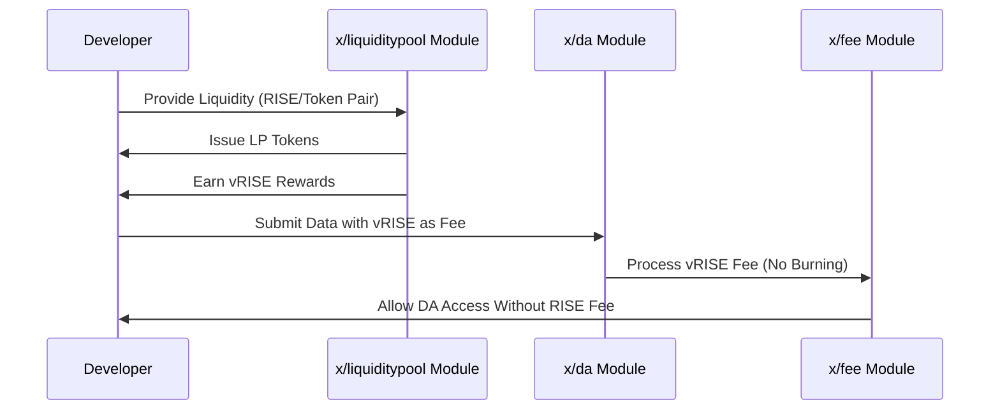

# Fee Abstraction

Sunrise introduces "Fee Abstraction," a mechanism that allows developers to access blob spaces on Sunrise without paying direct fees. Instead, developers can provide liquidity to Sunrise liquidity pools to gain access to data availability services. This innovative approach reduces entry barriers for developers while maintaining the economic sustainability of the network.

## Key Features

1. **Liquidity-Based Access:**

   - Developers provide liquidity to pools in the `x/liquiditypool` module.
   - This contribution supports the network's overall liquidity and stability.
   - Multiple pool options allow flexibility for capital allocation.

2. **Reward Mechanism (`$vRISE`):**

   - Liquidity providers receive `$vRISE` tokens as rewards proportional to their liquidity contribution.
   - These tokens can be used to pay for data availability transactions without being burned.
   - `$vRISE` rewards accumulate continuously while liquidity is provided.

3. **Fee Segregation:**

   - Data availability transactions can use `$vRISE` tokens for fee payment.
   - Other transaction types still require `$RISE` tokens for fees.
   - Clear separation between DA access and standard transaction costs.

4. **Economic Sustainability:**

   - Ensures Sunrise can provide data availability services without direct fee revenue.
   - Creates an alternative economic model that benefits both the network and developers.
   - Strengthens network TVL (Total Value Locked) as usage increases.

## Core Functionality

> **Note:** The following section covers advanced topics intended for experienced users or developers.

### Liquidity Provision and DA Access

**When developers want to access data availability services:**

- They provide liquidity to selected pools in the `x/liquiditypool` module.
- They receive LP tokens representing their share of the pool.
- They earn `$vRISE` tokens through liquidity mining based on their pool share.
- These `$vRISE` tokens can be used to pay for data availability transactions.
- The `$vRISE` fees are collected by the network but not burned, creating a sustainable cycle.

### Technical Implementation

The Fee Abstraction mechanism is implemented through interaction between several Sunrise modules:

- **`x/liquiditypool`**: Manages liquidity positions and distributes `$vRISE` rewards
- **`x/fee`**: Handles transaction fee processing, including the special treatment for `$vRISE` fees
- **`x/da`**: Processes data availability submissions and verifies fee payment
- **`x/tokenconverter`**: Allows conversion between `$RISE` and `$vRISE` tokens when needed

## Workflow: Fee Abstraction Process

> **Note:** The following section covers advanced topics intended for experienced users or developers.

Below is a sequence diagram illustrating how the Fee Abstraction works:



### Fee Calculation and Economics

The amount of `$vRISE` required for a DA transaction depends on:

1. The size of the data being published
2. Current network congestion levels
3. Base fee parameters set by governance

The system is designed to maintain equilibrium between liquidity provision rewards and the cost of DA services, ensuring sustainability for both developers and the network.

## Benefits

1. **Lower Entry Barriers:**

   - Developers can access data availability services without upfront token costs.
   - Promotes greater adoption of Sunrise's data availability layer.
   - Simplifies onboarding for new projects with limited initial capital.

2. **Liquidity Enhancement:**

   - Encourages developers to provide liquidity to the network.
   - Improves overall market depth and reduces slippage for all participants.
   - Creates deeper, more resilient liquidity pools as more developers join.

3. **Sustainable Economics:**

   - Creates a virtuous cycle where DA usage drives liquidity.
   - Liquidity providers are incentivized through `$vRISE` rewards.
   - Network security increases as liquidity grows.

4. **Flexibility for Developers:**

   - Developers can choose which pools to provide liquidity to based on their token holdings.
   - DA costs are effectively offset by liquidity provision rewards.
   - Teams can optimize their capital efficiency while using Sunrise's DA.

## Example Usage

**Providing Liquidity and Using DA**

```javascript
import { SunriseClient } from "@sunriselayer/client";
import { MsgCreatePosition } from "@sunriselayer/client/types";

async function provideLiquidityAndUseDA() {
   // Connect to Sunrise
   const client = await SunriseClient.connect("https://sunrise-rpc.example.com");

   // Step 1: Provide liquidity to a pool
   const msgCreatePosition = {
      sender: "sunrise1...",
      poolId: 1,
      tokenBase: { denom: "urise", amount: "1000000" },
      tokenQuote: { denom: "uusdc", amount: "1000000" },
      lowerTick: "-10000",
      upperTick: "10000"
   };

   // Execute liquidity provision
   const lpResult = await client.executeTransaction(msgCreatePosition);
   console.log("Liquidity provided:", lpResult);
   
   // Wait for vRISE rewards to accumulate
   console.log("Waiting for vRISE rewards...");
   
   // Step 2: Submit DA data using vRISE for fees
   const msgPublishData = {
      sender: "sunrise1...",
      data: "0x...", // Your data to publish
      fee: { denom: "uvRISE", amount: "100000" }
   };

   // Execute DA transaction
   const daResult = await client.executeTransaction(msgPublishData);
   console.log("DA data published:", daResult);
}

// Example for checking vRISE balance
async function checkVriseBalance(address) {
   const client = await SunriseClient.connect("https://sunrise-rpc.example.com");
   const balance = await client.getBalance(address, "uvRISE");
   console.log(`vRISE Balance: ${parseInt(balance.amount) / 1000000} vRISE`);
   return balance;
}
```

**Calculating Required Liquidity for DA Usage**

```javascript
async function calculateRequiredLiquidity(dataSize, usageDuration) {
   // Connect to Sunrise
   const client = await SunriseClient.connect("https://sunrise-rpc.example.com");
   
   // Get current network parameters
   const params = await client.getDAParams();
   
   // Calculate expected vRISE rewards per day based on current rates
   const liquidityAmount = 1000000; // 1 RISE
   const estimatedDailyReward = liquidityAmount * params.vRiseRewardRate;
   
   // Calculate DA costs for specified usage
   const daCost = dataSize * params.blobCostPerByte;
   
   // Calculate required liquidity for desired usage
   const requiredLiquidity = (daCost / estimatedDailyReward) * liquidityAmount;
   
   console.log(`Estimated liquidity required: ${requiredLiquidity} RISE for ${usageDuration} days`);
   return requiredLiquidity;
}
```

## Integration with Liquidity Incentives

The Fee Abstraction mechanism works in harmony with Sunrise's broader liquidity incentive system. Developers who provide liquidity for DA access also participate in the governance gauge voting system, allowing them to direct additional rewards to their preferred pools. This creates multiple streams of benefits for liquidity providers:

1. Direct `$vRISE` rewards for DA access
2. Trading fees from their liquidity position
3. Additional incentives from gauge-directed emissions

This holistic approach ensures that developers are properly incentivized to maintain their liquidity while using Sunrise's DA services.

For more details and implementation specifics, see the [GitHub repository](https://github.com/sunriselayer/sunrise/tree/liquidstaking/x/liquiditypool)
