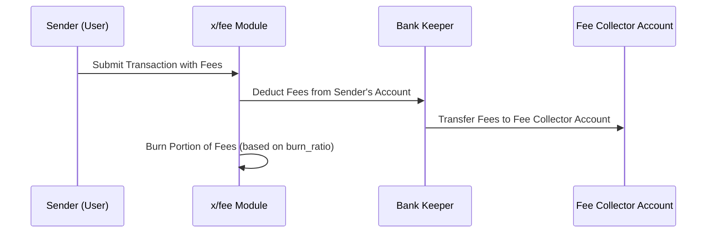

# Fee

The `x/fee` module is a core component of the Sunrise blockchain responsible for managing transaction fees. It introduces mechanisms for burning a portion of $RISE tokens used as fees, enforcing fee denominations, and providing flexibility through bypass denominations. This module supports deflationary tokenomics while maintaining an efficient fee system.

## Key Features of `x/fee`

<div class="level-1">
<div class="level-1-tag">LEVEL 1: FOR APP DEVELOPERS</div>

1. **Burn Mechanism:**

    - A portion of $RISE tokens used as transaction fees is burned to reduce the circulating supply.
    - The burn ratio is determined by the `burn_ratio` parameter (default: 50%).
2. **Fee Denomination (`fee_denom`):**

    - Specifies the denomination required for transaction fees (default: **`"urise"`**).
    - Transactions must pay fees in this denomination unless bypassed.
3. **Bypass Denominations (`bypass_denoms`)**:

    - Allows certain denominations to bypass standard fee restrictions.
    - Default bypass denomination: **`"uvrise"`**.
4. **Dynamic Parameter Configuration**:

    - Developers can configure parameters dynamically with validation enforced by the module.
</div>

## Core Functionality

<div class="level-3">
<div class="level-3-tag">LEVEL 3: FOR MODULE DEVELOPERS</div>

### Fee Deduction and Burning

**When a transaction is processed:**

1. Fees are deducted from the sender's account.
2. A portion of the fees is sent to the fee collector module account.
3. The remaining portion is burned to reduce **`$RISE`** token supply.

   ```go
   func DeductFees(bankKeeper BankKeeper, ctx sdk.Context, acc sdk.AccountI, fees sdk.Coins, feeKeeper feekeeper.Keeper) error {
   ...
   if err := feeKeeper.Burn(ctx, fees); err != nil {
   return err
   }
   ...
   }
   ```
</div>

**Parameter Configuration**

<div class="level-2">
<div class="level-2-tag">LEVEL 2: FOR ADVANCED USERS</div>

| Parameter                | Description                                                                 |
|--------------------------|-----------------------------------------------------------------------------|
| Fee Denomination (`fee_denom`)     | Specifies the denomination required for transaction fees (default: `"urise"`).       |
| Burn Ratio (`burn_ratio`)         | Percentage of transaction fees to burn (default: `0.5`). Must be between `0` and `1`. |
| Bypass Denominations (`bypass_denoms`) | List of denominations that bypass fee restrictions (default: `["uvrise"]`).          |

**Example Configuration:**

```json
{
  "fee_denom": "urise",
  "burn_ratio": 0.5,
  "bypass_denoms": ["uvrise"]
}
```
</div>

## Benefits of the Fee Module

<div class="level-1">
<div class="level-1-tag">LEVEL 1: FOR APP DEVELOPERS</div>

- **Deflationary Pressure:**
  The burning mechanism introduces deflationary pressure on $RISE tokens, supporting long-term token value.
- **Fee Flexibility:**
  Configurable parameters like bypass_denoms provide flexibility for specialized transaction scenarios.
</div>

For more details and implementation specifics, see the [GitHub repository](https://github.com/sunriselayer/sunrise/tree/main/x/fee).

## Workflow: Fee Deduction and Burning

<div class="level-2">
<div class="level-2-tag">LEVEL 2: FOR ADVANCED USERS</div>

Below is a sequence diagram illustrating how transaction fees are processed:


</div>

## Example Usage

<div class="level-1">
<div class="level-1-tag">LEVEL 1: FOR APP DEVELOPERS</div>

Developers can query fee parameters using Sunrise Client JS:

```javascript
import { SunriseClient } from "@sunriselayer/client";

async function queryFeeParams() {
    const cometRpc = "https://sunrise-test-da-1.cauchye.net/";
    const client = await SunriseClient.connect(cometRpc);
    const queryClient = client.getQueryClient();

    if (!queryClient) {
        console.error("Query client not initialized");
        return;
    }

    const feeParams = await queryClient.fee.params({});
    console.log("Fee Parameters:", feeParams.params);
}
queryFeeParams();
```

**Example Output:**

```json
{
  "fee_denom": "urise",
  "burn_ratio": "0.5",
  "bypass_denoms": ["uvrise"]
}
```
</div>