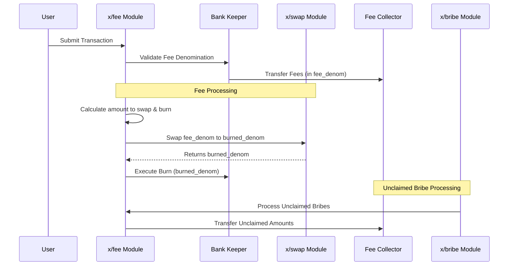

# Fee

The `x/fee` module is a core component of the Sunrise blockchain responsible for managing transaction fees. It collects fees in a designated stablecoin (`fee_denom`) and then swaps a portion of these fees into $RISE (`burned_denom`) to be burned. This module supports deflationary tokenomics for $RISE while maintaining a stable fee system for users.

## Key Features of `x/fee`

1. **Burn Mechanism:**

   - A portion of collected fees (in `fee_denom`) is swapped to $RISE (`burned_denom`) and then burned, reducing the circulating supply.
   - The burn ratio is determined by the `burn_ratio` parameter (default: 50%).
   - The swap and burn operations are atomic and verified on-chain.

1. **Fee Denomination (`fee_denom`):**

   - Specifies the denomination required for transaction fees (default: **`"uusdrise"`**).
   - Transactions must pay fees in this denomination unless bypassed.
   - Strict validation of fee denominations is enforced.

1. **Dynamic Parameter Configuration:**
   - Developers can configure parameters dynamically with validation enforced by the module.
   - Parameters can be updated through governance proposals.

## Core Functionality

### Fee Collection and Processing

**Fee Collection Process:**

1. Fees are collected in `fee_denom` through the `FeeCollector` module account.
2. The system validates:
   - Only one fee denomination per transaction.
   - The fee denomination matches the configured `fee_denom`.
   - The fee amount is valid and non-zero.

**Fee Processing Flow:**

1. A portion of the collected fees, determined by `burn_ratio`, is designated for burning.
2. This portion is swapped from `fee_denom` to `burned_denom` via the `x/swap` module.
3. The resulting `burned_denom` tokens are burned from the supply.
4. The remaining `fee_denom` (the portion not designated for burning) stays in the `FeeCollector` account for other protocol uses.

## Parameter Configuration

> **Note:** The following section covers advanced topics intended for experienced users or developers.

| Parameter      | Description                                             | Default Value | Constraints                  |
| -------------- | ------------------------------------------------------- | ------------- | ---------------------------- |
| `fee_denom`    | Required denomination for transaction fees              | `"uusdrise"`  | Must be a valid denomination |
| `burned_denom` | Denomination to be burnt at the time of fee settlement. | `"urise"`     | Must be a valid denomination |
| `burn_ratio`   | Percentage of fees to burn                              | `0.5`         | Must be between 0 and 1      |

## Workflow: Fee Processing

> **Note:** The following section covers advanced topics intended for experienced users or developers.

For more details and implementation specifics, see the [GitHub repository](https://github.com/sunriselayer/sunrise/tree/main/x/fee).
