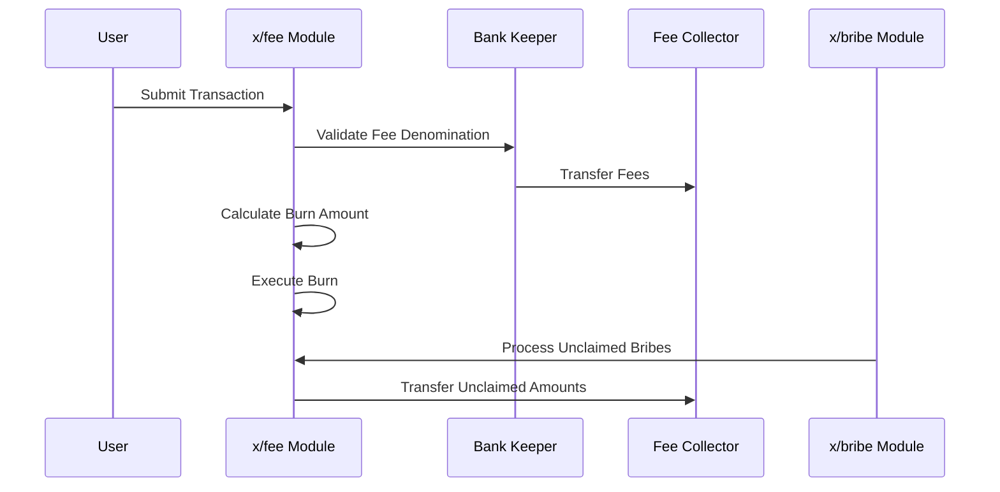

# Fee

The `x/fee` module is a core component of the Sunrise blockchain responsible for managing transaction fees. It introduces mechanisms for burning a portion of $RISE tokens used as fees, enforcing fee denominations, and providing flexibility through bypass denominations. This module supports deflationary tokenomics while maintaining an efficient fee system.

## Key Features of `x/fee`


**LEVEL 1: FOR APP DEVELOPERS**


1. **Burn Mechanism:**
    - A portion of $RISE tokens used as transaction fees is burned to reduce the circulating supply.
    - The burn ratio is determined by the `burn_ratio` parameter (default: 50%).
    - Burn operations are atomic and verified on-chain.

2. **Fee Denomination (`fee_denom`):**
    - Specifies the denomination required for transaction fees (default: **`"urise"`**).
    - Transactions must pay fees in this denomination unless bypassed.
    - Strict validation of fee denominations is enforced.

3. **Bypass Denominations (`bypass_denoms`):**
    - Allows certain denominations to bypass standard fee restrictions.
    - Default bypass denomination: **`"uvrise"`**.
    - Useful for specialized transaction scenarios.

4. **Dynamic Parameter Configuration:**
    - Developers can configure parameters dynamically with validation enforced by the module.
    - Parameters can be updated through governance proposals.

5. **Integration with Bribe System:**
    - Handles unclaimed bribes from expired epochs
    - Processes fees from bribe transactions
    - Manages fee collection for bribe operations

## Core Functionality


**LEVEL 3: FOR MODULE DEVELOPERS**


### Fee Collection and Processing

**Fee Collection Process:**

1. Fees are collected through the FeeCollector module account
2. The system validates:
   - Only one fee denomination per transaction
   - Fee denomination matches configured `fee_denom`
   - Fee amount is valid and non-zero

**Fee Processing Flow:**

```go
func (k Keeper) ProcessFees(ctx sdk.Context, fees sdk.Coins) error {
    // 1. Validate fees
    if err := k.ValidateFees(ctx, fees); err != nil {
        return err
    }
    
    // 2. Calculate burn amount
    burnAmount := k.CalculateBurnAmount(ctx, fees)
    
    // 3. Execute burn operation
    if err := k.Burn(ctx, burnAmount); err != nil {
        return err
    }
    
    return nil
}
```

### Integration with Bribe System

**Bribe Fee Handling:**

```go
type BribeFee struct {
    BribeId     uint64
    EpochId     uint64
    Amount      sdk.Coins
    Claimed     bool
}

func (k Keeper) ProcessBribeFees(ctx sdk.Context, bribeId uint64) error {
    // 1. Get bribe details
    bribe := k.GetBribe(ctx, bribeId)
    
    // 2. Calculate unclaimed amount
    unclaimed := bribe.Amount.Sub(bribe.ClaimedAmount)
    
    // 3. Process fees for unclaimed amount
    return k.ProcessFees(ctx, unclaimed)
}
```

### Key Data Structures

```go
type FeeParams struct {
    FeeDenom     string   `protobuf:"bytes,1,opt,name=fee_denom,json=feeDenom,proto3" json:"fee_denom,omitempty"`
    BurnRatio    string   `protobuf:"bytes,2,opt,name=burn_ratio,json=burnRatio,proto3" json:"burn_ratio,omitempty"`
    BypassDenoms []string `protobuf:"bytes,3,rep,name=bypass_denoms,json=bypassDenoms,proto3" json:"bypass_denoms,omitempty"`
}

type FeeCollector struct {
    Address string
    Balance sdk.Coins
}
```

## Parameter Configuration


**LEVEL 2: FOR ADVANCED USERS**


| Parameter | Description | Default Value | Constraints |
|-----------|-------------|---------------|-------------|
| `fee_denom` | Required denomination for transaction fees | `"urise"` | Must be a valid denomination |
| `burn_ratio` | Percentage of fees to burn | `0.5` | Must be between 0 and 1 |
| `bypass_denoms` | Denominations exempt from fee restrictions | `["uvrise"]` | List of valid denominations |

## Example Usage


**LEVEL 1: FOR APP DEVELOPERS**


Developers can query fee parameters using Sunrise Client JS:

```javascript
import { SunriseClient } from "@sunriselayer/client";

async function queryFeeParams() {
    const cometRpc = "https://sunrise-test-da-1.cauchye.net/";
    const client = await SunriseClient.connect(cometRpc);
    const queryClient = client.getQueryClient();

    if (!queryClient) {
        console.error("Query client not initialized");
        return;
    }

    const feeParams = await queryClient.fee.params({});
    console.log("Fee Parameters:", feeParams.params);
}
queryFeeParams();
```

**Example Output:**

```json
{
  "fee_denom": "urise",
  "burn_ratio": "0.5",
  "bypass_denoms": ["uvrise"]
}
```

## Workflow: Fee Processing


**LEVEL 2: FOR ADVANCED USERS**




For more details and implementation specifics, see the [GitHub repository](https://github.com/sunriselayer/sunrise/tree/main/x/fee).
