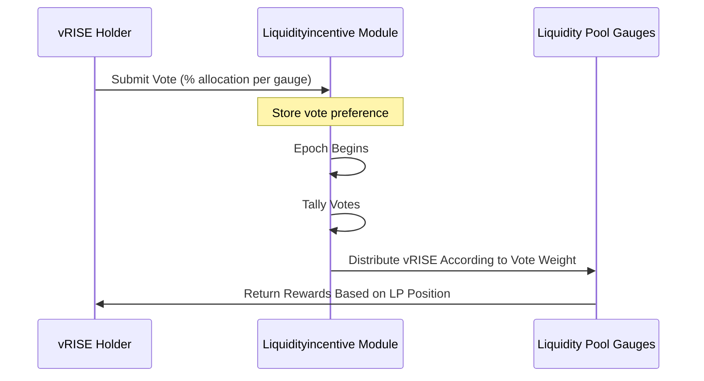

# Gauges Voting

## What is a Gauge?


**FOR APP DEVELOPERS**


A Gauge in the Sunrise ecosystem is a mechanism that governs the issuance of `vRISE` tokens. Currently, the primary gauge product is the Liquidity Pool system.

`vRISE` holders can vote to determine the allocation of newly minted `vRISE` tokens across different gauges. Liquidity pools that attract more voting power will receive a larger share of newly issued vRISE tokens, creating an incentive mechanism that aligns with community preferences.

## How the Voting System Works


**FOR ADVANCED USERS**


### Epoch-Based Voting

Gauge weight voting operates on an epoch system:

* Each epoch spans a predefined number of blocks (configurable via governance)
* Votes are tallied at the beginning of each new epoch
* Vote weight is determined by the voter's `vRISE` balance at epoch start
* Voting decisions persist across epochs until explicitly changed

### Eligibility Requirements


**FOR APP DEVELOPERS**


To participate in gauge voting:

* **Token Requirement**: You must earn `vRISE` tokens, primarily by providing liquidity to pools
* **Balance Timing:** Your valid `vRISE` balance at epoch start determines your voting power
* **Token Status:** Locked vRISE tokens are not counted toward voting power


You can submit your vote even before you have `vRISE` tokens. Your voting preferences will be applied based on whatever `vRISE` balance you have when the next epoch begins.


### Viewing Current Voting Status


**FOR ADVANCED USERS**


**System Parameters**

* **Epoch Blocks:** The number of blocks per epoch (governance parameter)
* **Staking Rewards Ratio:** Percentage of `vRISE` originally allocated to staking that is redirected to gauges
* **Votes Cast:** Total number of unique voters participating

**Current Epoch Data**

* **Total Votes:** Cumulative voting power across all gauges
* **Start/End:** Timestamp or block heights for the current epoch
* **Previous Epoch:** Historical data from the last epoch

**Gauge Distribution**

The complete list of voting gauges shows:

* Each gauge's total accumulated voting power
* Percentage of total votes directed to each gauge


The system only retains data for the current and previous epochs. Historical data from earlier epochs is pruned and cannot be retrieved from the blockchain.


## How to Vote


**FOR APP DEVELOPERS**


### Step 1: Access Your Voting Dashboard

Click **My Votes** to begin the voting process.

### Step 2: Select Gauges

1. Click "Select Pool" to open the pool selection interface
2. Choose the pools/gauges you wish to support
3. Your previous voting selections will be automatically loaded if applicable
4. Remove unwanted gauges by clicking the delete button

### Step 3: Allocate Voting Power

Specify what percentage of your voting power to allocate to each selected gauge:

- **Percentage-Based:** Allocations are specified as percentages rather than absolute amounts because:

  * Your vRISE balance may fluctuate between epochs
  * Percentage allocations automatically adjust to your current balance at epoch start
  * This approach eliminates the need to revote every epoch

### Step 4: Preview and Submit

1. Use the "Preview Vote" feature to see how your current vRISE balance would be distributed
2. Confirm your selections
3. Click Vote to submit your transaction
4. Your vote preferences will be applied to all future epochs until changed

### Step 5: Update (Optional)
You can modify your vote at any time:

* Your latest voting decision before an epoch begins will be applied
* Changes take effect at the next epoch boundary
* Simply repeat the voting process to update your preferences

## Strategic Voting Considerations


**FOR ADVANCED USERS**


* **Liquidity Incentives:** Pools with higher vote weight receive more vRISE emissions
* **Compounding Effect:** Providing liquidity earns vRISE, which can be used to vote for more rewards
* **Market Efficiency:** Voting helps direct liquidity to where it's most valued by the community
* **Long-Term Planning:** Vote allocations persist across epochs, allowing for strategic positioning